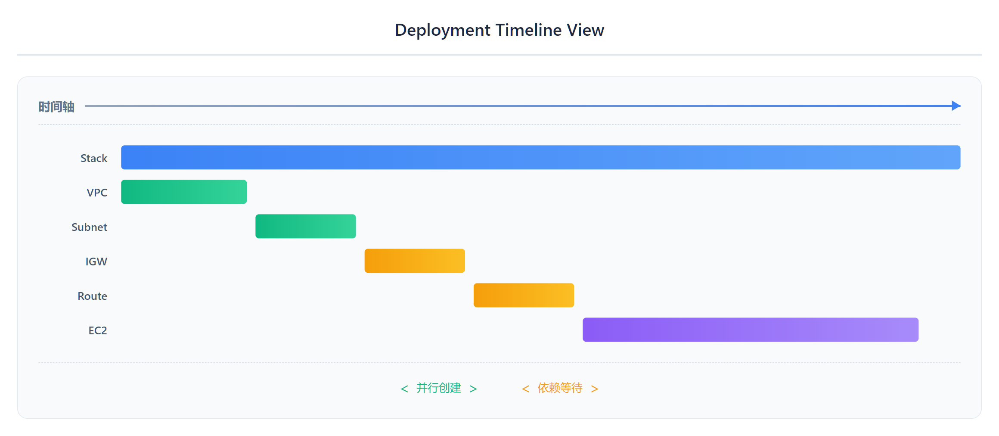

# 03 - 现代工具：Infrastructure Composer 与 IaC Generator

> **目标**：掌握 2024-2025 年 CloudFormation 新工具，可视化设计与逆向工程
> **时间**：45 分钟
> **费用**：Free Tier（VPC + EC2 t3.micro）
> **前置**：完成 [02 - 安全运维](../02-safe-operations/)

---

## 将学到的内容

1. 使用 **Infrastructure Composer** 可视化设计 CloudFormation 模板
2. 使用 **IaC Generator** 从现有 AWS 资源生成模板
3. 理解 **Deployment Timeline View** 调试技巧
4. 使用 **cfn-lint** 本地验证模板
5. 对比 CloudFormation Import vs Terraform Import

---

## Step 1 — 先跑起来！Infrastructure Composer（10 分钟）

> 先"尝到"可视化设计的魅力，再理解细节。

### 1.1 打开 Infrastructure Composer

1. 登录 AWS Console
2. 搜索 **CloudFormation**
3. 在左侧菜单点击 **Infrastructure Composer**

<!-- SCREENSHOT: infrastructure-composer-menu -->

或者直接访问：`https://console.aws.amazon.com/cloudformation/composer`

### 1.2 创建新项目

1. 点击 **Create project**
2. 选择 **Start with a blank canvas**
3. 点击 **Create**

<!-- SCREENSHOT: infrastructure-composer-blank-canvas -->

你会看到一个干净的画布（Canvas），左侧是资源面板。

### 1.3 拖拽创建 VPC + EC2 架构

**添加 VPC**：
1. 在左侧 Resource palette 搜索 `VPC`
2. 拖拽 **AWS::EC2::VPC** 到画布
3. 点击 VPC 资源，在右侧属性面板设置：
   - CidrBlock: `10.0.0.0/16`

**添加 Subnet**：
1. 搜索 `Subnet`
2. 拖拽 **AWS::EC2::Subnet** 到 VPC 内部
3. 设置属性：
   - CidrBlock: `10.0.1.0/24`

**添加 EC2**：
1. 搜索 `Instance`
2. 拖拽 **AWS::EC2::Instance** 到 Subnet 内部
3. 设置属性：
   - InstanceType: `t3.micro`
   - ImageId: （稍后用 SSM Parameter 替代）

<!-- SCREENSHOT: infrastructure-composer-drag-drop -->

### 1.4 观察自动生成的连接

Infrastructure Composer 会自动：
- 创建资源间的引用（`!Ref`）
- 生成依赖关系线条
- 推断所需的 IAM 权限

### 1.5 导出 YAML 模板

1. 点击右上角 **Template** 按钮切换到代码视图
2. 观察生成的 YAML 代码
3. 点击 **Export** → **Download YAML**

<!-- SCREENSHOT: infrastructure-composer-template-view -->

恭喜！你刚刚用可视化方式设计了一个 CloudFormation 模板！

---

## Step 2 — 发生了什么？（5 分钟）

### 2.1 Infrastructure Composer 是什么？


<details>
<summary>View ASCII source</summary>

```
┌─────────────────────────────────────────────────────────────────────────┐
│                    Infrastructure Composer 工作流                        │
├─────────────────────────────────────────────────────────────────────────┤
│                                                                         │
│   ┌──────────────┐      ┌──────────────┐      ┌──────────────┐         │
│   │   可视化画布   │─────▶│  YAML 模板   │─────▶│ CloudFormation│        │
│   │   拖拽设计    │◀─────│  自动生成    │      │   Stack       │        │
│   └──────────────┘      └──────────────┘      └──────────────┘         │
│        Canvas              Template              Deploy                │
│                                                                         │
│   双向同步：画布修改 ↔ YAML 代码修改                                      │
│                                                                         │
└─────────────────────────────────────────────────────────────────────────┘
```

</details>

**Infrastructure Composer（2024 增强版）** 的核心价值：

| 功能 | 说明 |
|------|------|
| **可视化设计** | 拖拽资源，自动生成代码 |
| **双向同步** | 修改 Canvas 或 YAML，另一侧自动更新 |
| **智能连接** | 自动推断资源依赖，生成 `!Ref` 和 `!GetAtt` |
| **AI 辅助（2024）** | 自然语言描述，生成资源配置 |

### 2.2 AI 辅助功能（2024 新功能）

Infrastructure Composer 集成了 AI 辅助功能：

1. 点击 **AI assistant** 按钮
2. 输入自然语言描述：
   > "Add an S3 bucket with versioning enabled and server-side encryption"
3. AI 自动生成资源配置

<!-- SCREENSHOT: infrastructure-composer-ai-assistant -->

> **注意**：AI 辅助功能可能需要在 us-east-1 区域使用，且需要账户启用相关功能。

---

## Step 3 — IaC Generator：从现有资源生成模板（15 分钟）

> 这是 2024 年 2 月发布的重磅功能！把现有 AWS 资源"逆向工程"成 CloudFormation 模板。

### 3.1 为什么需要 IaC Generator？

**真实场景**：

```
公司现状：
├── 生产环境有 50+ 个手动创建的资源
├── 想迁移到 IaC 管理
├── 但不想重建一切
└── 怎么办？

传统方案：                    IaC Generator：
手写 50 个资源的模板          扫描账户，自动生成模板
  ↓                            ↓
耗时数周，容易出错             几分钟，准确率高
```

### 3.2 扫描账户资源

1. 在 CloudFormation Console，点击 **IaC Generator**
2. 点击 **Start new scan**

<!-- SCREENSHOT: iac-generator-start-scan -->

3. 等待扫描完成（通常 1-5 分钟）
4. 查看扫描结果：发现的资源列表

<!-- SCREENSHOT: iac-generator-scan-results -->

### 3.3 选择资源生成模板

1. 在资源列表中，勾选要纳入管理的资源
   - 例如：选择一个 S3 Bucket + 相关的 IAM Role
2. 点击 **Generate template**
3. 预览生成的 YAML 模板

<!-- SCREENSHOT: iac-generator-select-resources -->

### 3.4 创建 Stack 或下载模板

你有两个选择：

**选项 A：直接创建 Stack**
- 点击 **Create Stack**
- 资源自动导入到 CloudFormation 管理

**选项 B：下载模板**
- 点击 **Download template**
- 本地编辑优化后再使用

### 3.5 实战练习

**场景**：手动创建的 S3 Bucket 纳入 CloudFormation 管理

1. **手动创建一个 S3 Bucket**：
   - S3 Console → Create bucket
   - Bucket name: `manual-bucket-test-{your-account-id}`

2. **运行 IaC Generator 扫描**：
   - CloudFormation → IaC Generator → Start new scan
   - 等待扫描完成

3. **选择刚创建的 Bucket**：
   - 在资源列表中找到并勾选
   - Generate template

4. **观察生成的模板**：
   ```yaml
   Resources:
     ManualBucketTest:
       Type: AWS::S3::Bucket
       Properties:
         BucketName: manual-bucket-test-123456789012
         # ... 其他自动检测的属性
   ```

5. **创建 Stack 导入资源**：
   - Create Stack
   - 现在这个 Bucket 由 CloudFormation 管理了！

---

## Step 4 — IaC Generator vs Terraform Import 对比


<details>
<summary>View ASCII source</summary>

```
┌─────────────────────────────────────────────────────────────────────────┐
│                 IaC Generator vs Terraform Import 对比                   │
├─────────────────────────────────────────────────────────────────────────┤
│                                                                         │
│   CloudFormation IaC Generator         Terraform Import                 │
│   ┌──────────────────────────┐        ┌──────────────────────────┐     │
│   │ 1. 扫描账户              │        │ 1. 手写资源配置          │     │
│   │    (自动发现资源)         │        │    (需要知道所有属性)     │     │
│   │ 2. 选择资源              │        │ 2. 运行 import 命令      │     │
│   │    (GUI 勾选)            │        │    (每个资源一条命令)     │     │
│   │ 3. 自动生成模板          │        │ 3. 手动补全配置          │     │
│   │    (完整 YAML)           │        │    (plan 显示差异)       │     │
│   │ 4. 一键创建 Stack        │        │ 4. 多次迭代调整          │     │
│   └──────────────────────────┘        └──────────────────────────┘     │
│                                                                         │
│   优势: 自动化程度高, GUI 友好        优势: 多云支持, 社区工具丰富         │
│   局限: 仅 AWS                       局限: 需要手动工作量大               │
│                                                                         │
└─────────────────────────────────────────────────────────────────────────┘
```

</details>

**对比表**：

| 维度 | IaC Generator | Terraform Import |
|------|---------------|------------------|
| **发现资源** | 自动扫描账户 | 需要手动指定资源 ID |
| **生成配置** | 自动生成完整模板 | 只导入状态，需手写配置 |
| **批量操作** | 支持多选批量导入 | 每个资源一条命令 |
| **GUI 支持** | Console 全程可视化 | 纯 CLI 操作 |
| **多云** | 仅 AWS | 支持多云 |

> 参考 [Terraform 系列](../../terraform/) 了解 `terraform import` 的详细用法。

---

## Step 5 — Deployment Timeline View（10 分钟）

> 2024 年 11 月发布的新功能，让 Stack 部署过程可视化。

### 5.1 什么是 Timeline View？

传统的 **Events** 列表是这样的：
```
12:00:01  Stack     CREATE_IN_PROGRESS
12:00:02  VPC       CREATE_IN_PROGRESS
12:00:05  VPC       CREATE_COMPLETE
12:00:06  Subnet    CREATE_IN_PROGRESS
...
```

**Timeline View** 把这些事件变成可视化时间线：



<details>
<summary>View ASCII source</summary>

```
┌─────────────────────────────────────────────────────────────────────────┐
│                    Deployment Timeline View                              │
├─────────────────────────────────────────────────────────────────────────┤
│                                                                         │
│   时间轴 ─────────────────────────────────────────────────────────────▶ │
│                                                                         │
│   Stack     ████████████████████████████████████████████████████████    │
│                                                                         │
│   VPC       ████████                                                    │
│                     │                                                   │
│   Subnet            ████████                                            │
│                             │                                           │
│   IGW                       ████████                                    │
│                                     │                                   │
│   Route                             ████████                            │
│                                             │                           │
│   EC2                                       ████████████████            │
│                                                                         │
│   ◀─────── 并行创建 ──────▶ ◀─────── 依赖等待 ──────▶                     │
│                                                                         │
└─────────────────────────────────────────────────────────────────────────┘
```

</details>

### 5.2 如何使用 Timeline View

1. 创建或更新一个 Stack
2. 在 Stack 详情页，点击 **Timeline** 标签

<!-- SCREENSHOT: deployment-timeline-tab -->

3. 观察可视化时间线：
   - **并行资源**：同时创建的资源显示在同一时间段
   - **依赖关系**：有依赖的资源按顺序排列
   - **耗时分析**：每个资源的创建时间一目了然

### 5.3 Timeline View 的调试价值

**场景 1：找出慢资源**

```
问题: Stack 创建需要 15 分钟，为什么这么慢？

Timeline View 一看：
  VPC: 2秒
  Subnet: 1秒
  RDS Instance: 12分钟 ← 就是你！
```

**场景 2：理解依赖阻塞**

```
问题: EC2 为什么等了 5 分钟才开始创建？

Timeline View 一看：
  NAT Gateway (5分钟) ─► Route Table ─► EC2
                         └── EC2 在等 Route Table
```

**场景 3：优化并行度**

```
优化前:  A ──► B ──► C ──► D   (串行 = 慢)
优化后:  A ──┬─► B ──► D
             └─► C ──┘         (并行 = 快)
```

### 5.4 实战练习

部署 `code/composer-export-example.yaml`，然后用 Timeline View 分析：

1. 哪些资源并行创建？
2. 哪个资源耗时最长？
3. 依赖关系是否合理？

---

## Step 6 — cfn-lint：本地模板验证（5 分钟）

> 在部署前发现错误，避免浪费时间等待失败。

### 6.1 什么是 cfn-lint？

**cfn-lint** 是 AWS 官方的 CloudFormation 模板检查工具：
- 语法检查
- 最佳实践验证
- 资源属性校验

### 6.2 安装 cfn-lint

```bash
# 使用 pip 安装（推荐）
pip install cfn-lint

# 或使用 Homebrew (macOS)
brew install cfn-lint

# 验证安装
cfn-lint --version
```

### 6.3 基本使用

```bash
# 检查单个文件
cfn-lint template.yaml

# 检查目录下所有模板
cfn-lint templates/*.yaml

# 输出 JSON 格式（CI/CD 集成用）
cfn-lint template.yaml -f json
```

### 6.4 常见错误示例

**错误 1：无效的资源属性**

```yaml
# 错误模板
Resources:
  MyBucket:
    Type: AWS::S3::Bucket
    Properties:
      BucketNam: my-bucket  # 拼写错误!
```

```bash
$ cfn-lint template.yaml
E3002 Invalid Property Resources/MyBucket/Properties/BucketNam
```

**错误 2：缺少必需属性**

```yaml
# 错误模板
Resources:
  MyFunction:
    Type: AWS::Lambda::Function
    Properties:
      FunctionName: my-function
      # 缺少 Runtime, Handler, Code
```

```bash
$ cfn-lint template.yaml
E3003 Required properties missing: ['Code', 'Handler', 'Runtime']
```

**错误 3：无效的引用**

```yaml
# 错误模板
Resources:
  MyEC2:
    Type: AWS::EC2::Instance
    Properties:
      SubnetId: !Ref NonExistentSubnet  # 引用不存在的资源!
```

```bash
$ cfn-lint template.yaml
E1012 Ref NonExistentSubnet not found as a resource or parameter
```

### 6.5 集成到开发流程

**VS Code 扩展**：
1. 安装 `CloudFormation Linter` 扩展
2. 编辑时实时显示错误

**Git Pre-commit Hook**：
```bash
# .pre-commit-config.yaml
repos:
  - repo: https://github.com/aws-cloudformation/cfn-lint
    rev: v0.83.0
    hooks:
      - id: cfn-lint
        files: .*\.ya?ml$
```

**CI/CD Pipeline**：
```yaml
# GitHub Actions 示例
- name: Lint CloudFormation
  run: |
    pip install cfn-lint
    cfn-lint templates/*.yaml
```

---

## Step 7 — Mini Project：可视化设计三层架构（10 分钟）

> 使用 Infrastructure Composer 设计 VPC + ALB + EC2 架构，导出模板。

### 7.1 架构目标


<details>
<summary>View ASCII source</summary>

```
┌─────────────────────────────────────────────────────────────────────────┐
│                          三层架构 (Mini Project)                          │
├─────────────────────────────────────────────────────────────────────────┤
│                                                                         │
│   VPC (10.0.0.0/16)                                                    │
│   ┌─────────────────────────────────────────────────────────────────┐  │
│   │                                                                 │  │
│   │   Public Subnet (10.0.1.0/24)        Public Subnet (10.0.2.0/24)│  │
│   │   ┌───────────────────────┐         ┌───────────────────────┐  │  │
│   │   │   ALB (Internet-facing)                                  │  │  │
│   │   │   ┌─────────────────────────────────────────────────┐   │  │  │
│   │   │   │        Application Load Balancer                 │   │  │  │
│   │   │   └─────────────────────────────────────────────────┘   │  │  │
│   │   └───────────────────────┘         └───────────────────────┘  │  │
│   │                    │                          │                 │  │
│   │                    ▼                          ▼                 │  │
│   │   Private Subnet (10.0.3.0/24)       Private Subnet (10.0.4.0/24) │
│   │   ┌───────────────────────┐         ┌───────────────────────┐  │  │
│   │   │      EC2 Instance     │         │      EC2 Instance     │  │  │
│   │   │      (App Server)     │         │      (App Server)     │  │  │
│   │   └───────────────────────┘         └───────────────────────┘  │  │
│   │                                                                 │  │
│   └─────────────────────────────────────────────────────────────────┘  │
│                                                                         │
└─────────────────────────────────────────────────────────────────────────┘
```

</details>

### 7.2 使用 Infrastructure Composer 设计

1. **创建 VPC**：
   - 拖拽 VPC 资源
   - CidrBlock: `10.0.0.0/16`

2. **创建 4 个 Subnet**：
   - 2 个 Public Subnet (10.0.1.0/24, 10.0.2.0/24)
   - 2 个 Private Subnet (10.0.3.0/24, 10.0.4.0/24)

3. **添加 Internet Gateway**：
   - 拖拽 InternetGateway
   - 连接到 VPC

4. **添加 Route Table**：
   - Public Route Table (0.0.0.0/0 → IGW)
   - 关联 Public Subnet

5. **添加 ALB**：
   - 拖拽 ElasticLoadBalancingV2::LoadBalancer
   - Type: application
   - Scheme: internet-facing
   - Subnets: 两个 Public Subnet

6. **添加 EC2 Instance**：
   - 拖拽两个 EC2 Instance 到 Private Subnet
   - InstanceType: t3.micro

7. **添加 Security Groups**：
   - ALB SG: 允许 80/443 from 0.0.0.0/0
   - EC2 SG: 允许 80 from ALB SG

### 7.3 导出并验证

1. 切换到 Template 视图
2. 下载 YAML 文件
3. 运行 cfn-lint 验证：
   ```bash
   cfn-lint three-tier-architecture.yaml
   ```

### 7.4 参考模板

课程代码 `code/composer-export-example.yaml` 提供了一个简化版本供参考。

---

## 职场小贴士

### 日本 IT 企业的工具使用场景

**1. Infrastructure Composer 的价值**

> "設計レビューで図が必要なんですが..."（设计评审需要图...）

Infrastructure Composer 的可视化视图可以直接用于：
- **設計書**（设计文档）：导出架构图
- **レビュー会議**（评审会议）：实时展示修改
- **新人教育**：可视化理解架构

**2. IaC Generator 的应用场景**

```
日本 IT 项目常见情况：
├── 既存システム（现有系统）：手动创建的资源
├── 移行プロジェクト（迁移项目）：需要 IaC 化
└── IaC Generator 节省大量手动工作
```

**3. cfn-lint 与品質管理**

在日本 SIer 项目中，代码审查（コードレビュー）很重要：

```
提交流程：
1. cfn-lint 自动检查 ← 减少人工审查负担
2. コードレビュー
3. 変更管理票
4. 承認 → デプロイ
```

### 常见日语术语

| 日语 | 读音 | 中文 | 英文 |
|------|------|------|------|
| 可視化 | kashika | 可视化 | Visualization |
| 逆引き | gyakubiki | 逆向工程 | Reverse Engineering |
| 既存リソース | kizon risoosu | 现有资源 | Existing Resources |
| テンプレート生成 | tenpureeto seisei | 模板生成 | Template Generation |
| 検証 | kenshou | 验证 | Validation |

---

## 检查清单

完成本课后，你应该能够：

- [ ] 使用 Infrastructure Composer 拖拽创建资源
- [ ] 理解 Canvas 和 Template 的双向同步
- [ ] 使用 IaC Generator 扫描账户资源
- [ ] 将现有资源导入 CloudFormation 管理
- [ ] 使用 Timeline View 分析部署过程
- [ ] 安装并使用 cfn-lint 验证模板
- [ ] 解释 IaC Generator vs Terraform Import 的区别

---

## Step 8 — 清理资源（重要！）

> **费用提醒**：完成学习后立即删除所有创建的资源！

### 8.1 删除 Mini Project Stack

如果你在 Step 7 部署了三层架构 Stack：

1. 进入 **CloudFormation Console**
2. 选择你创建的 Stack（如 `three-tier-demo`）
3. 点击 **Delete**
4. 确认删除

### 8.2 删除 IaC Generator 演示 Stack

如果你在 Step 3 使用 IaC Generator 创建了 Stack：

1. 找到 IaC Generator 创建的 Stack
2. 点击 **Delete**
3. 等待 `DELETE_COMPLETE`

### 8.3 清理 Infrastructure Composer 项目

Infrastructure Composer 项目本身不产生费用，但建议：

1. 删除不需要的项目
2. 或者保留用于后续学习

> **验证清理**：在 CloudFormation Console 确认没有遗留的 Stack。
> 如果使用 VPC，也检查 VPC Console 确认资源已删除。

---

## 面试准备

### よくある質問（常见面试题）

**Q: 既存リソースを CloudFormation 管理下に置く方法は？**

A: 主に 2 つの方法があります：
1. **IaC Generator**（2024 年新機能）：アカウントをスキャンし、自動でテンプレートを生成。複数リソースを一括で取り込み可能
2. **Resource Import**：テンプレートにリソース定義を追加し、物理 ID を指定して取り込む

IaC Generator の方が自動化されていて効率的です。

（主要有 2 种方法：
1. IaC Generator（2024 年新功能）：扫描账户，自动生成模板，可以批量导入多个资源
2. Resource Import：在模板中添加资源定义，指定物理 ID 导入

IaC Generator 更自动化，效率更高。）

**Q: Infrastructure Composer を使うメリットは？**

A: 主なメリットは 3 つ：
1. **視覚的設計**：ドラッグ＆ドロップでリソースを配置
2. **双方向同期**：Canvas と YAML が自動同期
3. **AI 支援**：自然言語でリソース設定を生成（2024 年新機能）

設計書作成やレビュー会議でも活用できます。

（主要优势有 3 个：
1. 可视化设计：拖拽放置资源
2. 双向同步：Canvas 和 YAML 自动同步
3. AI 辅助：用自然语言生成资源配置（2024 年新功能）

也可用于设计文档制作和评审会议。）

**Q: cfn-lint とは？なぜ使いますか？**

A: AWS 公式のテンプレート検証ツールです。デプロイ前に：
- 構文エラー検出
- ベストプラクティス違反の検出
- 必須プロパティの欠落チェック

CI/CD パイプラインに組み込むことで、品質を保証できます。

（是 AWS 官方的模板验证工具。在部署前可以检测：
- 语法错误
- 最佳实践违规
- 必需属性缺失

集成到 CI/CD 流水线可以保证质量。）

---

## 延伸阅读

- [Infrastructure Composer ユーザーガイド](https://docs.aws.amazon.com/AWSCloudFormation/latest/UserGuide/infrastructure-composer.html)
- [IaC Generator ドキュメント](https://docs.aws.amazon.com/AWSCloudFormation/latest/UserGuide/generate-IaC.html)
- [cfn-lint GitHub](https://github.com/aws-cloudformation/cfn-lint)
- [What's New - CloudFormation 2024](https://aws.amazon.com/about-aws/whats-new/2024/?whats-new-content-all.sort-by=item.additionalFields.postDateTime&whats-new-content-all.sort-order=desc&awsf.whats-new-categories=general-products%23aws-cloudformation)
- [Terraform Import](../../terraform/) - 对比学习 Terraform 的导入方式

---

## 下一步

你已经掌握了 CloudFormation 的现代工具。下一课我们将学习：

- 多栈架构设计
- Nested Stacks 模块化
- 跨栈引用（Exports/ImportValue）

→ [04 - 多栈架构与跨栈引用](../04-multi-stack/)

---

## 系列导航

[← 02 - 安全运维](../02-safe-operations/) | [Home](../) | [04 - 多栈架构 →](../04-multi-stack/)
