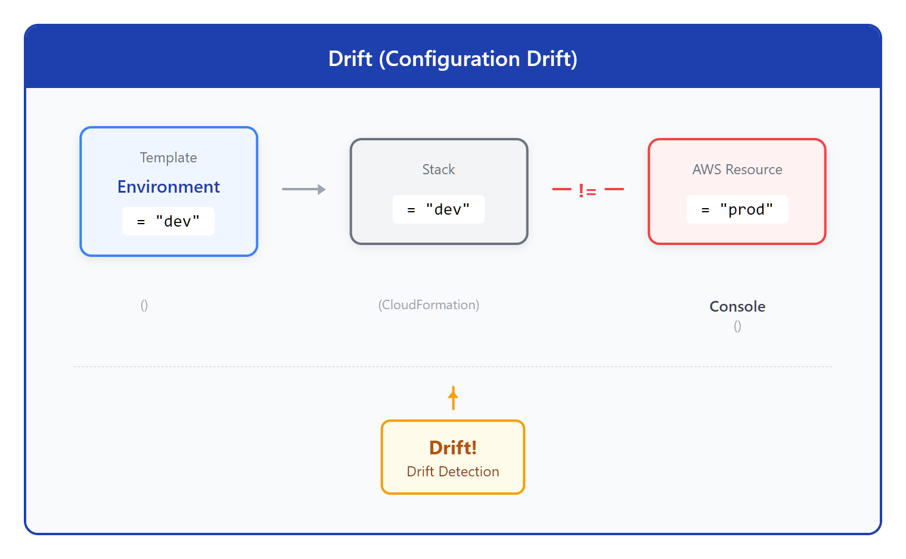
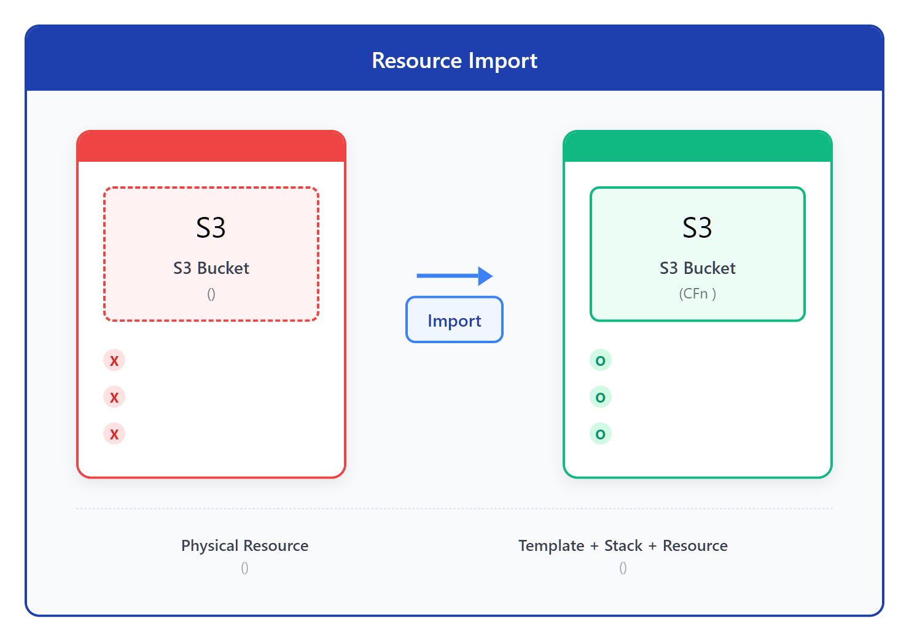

# 05 - Drift 检测与资源导入

> **目标**：理解配置漂移（Drift），掌握检测和修复方法，学会将现有资源导入 CloudFormation 管理  
> **时间**：45-50 分钟  
> **费用**：EC2 t3.micro（免费层 - 新账户前 12 个月 750 小时/月）+ S3（免费层）  
> **区域**：ap-northeast-1（Tokyo）推荐，或 us-east-1  
> **前置**：已完成 [04 - 多栈架构与跨栈引用](../04-multi-stack/)

---

## 将学到的内容

1. 理解 Drift（配置与现实不匹配）及其产生原因
2. 使用 Drift Detection 检测手动变更
3. 处理 Drift 的三种策略：修复、忽略、接受
4. 将现有资源导入（Import）到 CloudFormation Stack
5. 使用 Stack Refactoring 移动资源（2025 新功能）
6. 掌握 DeletionPolicy: Retain + Import 工作流

---

## Step 1 - 先跑起来：注入并检测 Drift（12 分钟）

> 先"尝到" Drift 的味道，再理解原理。

### 1.1 创建演示 Stack

创建一个简单的 EC2 Stack，用于演示 Drift Detection：

1. 登录 AWS Console，进入 **CloudFormation**
2. 点击 **Create stack** → **With new resources (standard)**
3. 选择 **Upload a template file**
4. 上传 `code/drift-demo.yaml`（或直接在 Console 使用 Designer 创建）

<!-- SCREENSHOT: cfn-drift-create-stack -->

5. **Stack name**: `drift-demo-stack`
6. **Parameters**:
   - **InstanceType**: 保持默认 `t3.micro`
   - **Environment**: 选择 `dev`
7. 点击 **Next** → **Next** → **Submit**

等待 `CREATE_COMPLETE`（约 2-3 分钟）。

### 1.2 验证资源已创建

1. 点击 **Resources** 标签页
2. 确认 EC2 实例状态为 `CREATE_COMPLETE`
3. 点击 Physical ID 链接，跳转到 EC2 Console

<!-- SCREENSHOT: cfn-drift-resources-tab -->

记下 EC2 实例的标签：

| Key | Value |
|-----|-------|
| Name | drift-demo-instance |
| Environment | dev |
| ManagedBy | CloudFormation |

### 1.3 手动制造 Drift

现在，我们故意在 Console 修改资源，模拟真实世界中"有人绕过 CloudFormation 直接改了资源"的情况：

1. 在 EC2 Console，选择 `drift-demo-instance`
2. 点击 **Actions** → **Instance settings** → **Manage tags**
3. 修改标签：
   - 将 `Environment` 从 `dev` 改为 `production`
   - 添加新标签 `ModifiedBy` = `console-user`
4. 点击 **Save**

<!-- SCREENSHOT: ec2-modify-tags -->

**这就是 Drift！** 模板说的是 `dev`，现实却是 `production`。

### 1.4 检测 Drift

1. 返回 CloudFormation Console
2. 选择 `drift-demo-stack`
3. 点击 **Stack actions** → **Detect drift**

<!-- SCREENSHOT: cfn-detect-drift-action -->

4. 等待检测完成（通常 10-30 秒）
5. 点击 **View drift results**

### 1.5 查看 Drift 结果

<!-- SCREENSHOT: cfn-drift-results -->

你会看到：

| Resource | Drift status | Differences |
|----------|--------------|-------------|
| DemoInstance | MODIFIED | Tags changed |

点击 **View drift details**，查看具体差异：

```
Property         Expected          Actual
Tags.Environment dev               production
Tags.ModifiedBy  (not set)         console-user
```

**恭喜！你刚刚检测到了 Drift！**

---

## Step 2 - 发生了什么？（5 分钟）

### 2.1 Drift 的本质



<details>
<summary>View ASCII source</summary>

```
┌─────────────────────────────────────────────────────────────────────┐
│                        Drift（配置漂移）的本质                        │
├─────────────────────────────────────────────────────────────────────┤
│                                                                     │
│   Template (模板)              Stack (栈)              AWS 资源      │
│   ┌─────────────┐           ┌─────────────┐         ┌──────────┐   │
│   │ Environment │           │ 期望状态    │         │ 实际状态  │   │
│   │ = "dev"     │──期望──▶│ = "dev"     │◀──不同──│ = "prod" │   │
│   └─────────────┘           └─────────────┘         └──────────┘   │
│                                    │                      ▲         │
│   你的代码                         │                      │         │
│   (声明 "应该是什么")               │            手动修改（Console） │
│                                    │                                │
│                              ┌─────┴─────┐                          │
│                              │  Drift!   │                          │
│                              │  漂移检测  │                          │
│                              └───────────┘                          │
│                                                                     │
└─────────────────────────────────────────────────────────────────────┘
```

</details>

**Drift 的定义**：CloudFormation 模板定义的状态与 AWS 实际资源状态不一致。

### 2.2 Drift 产生的常见原因

| 原因 | 场景 | 频率 |
|------|------|------|
| **手动修改** | 有人在 Console 改了配置 | 很常见 |
| **紧急修复** | 障害対応时直接改资源 | 常见 |
| **其他工具** | Ansible、脚本直接调 API | 偶尔 |
| **AWS 自动更新** | AMI 过期、安全组规则变化 | 偶尔 |
| **权限问题** | 部分资源被其他团队修改 | 罕见 |

### 2.3 CloudFormation vs Terraform 的 Drift 检测

| 特性 | CloudFormation | Terraform |
|------|----------------|-----------|
| 检测方式 | Console 手动触发 | `terraform plan` 自动检测 |
| 检测范围 | 仅支持部分资源属性 | 几乎所有属性 |
| 检测结果 | GUI 可视化差异 | CLI 文本输出 |
| 修复方式 | Update Stack | `terraform apply` |
| 自动化 | EventBridge + Lambda | CI/CD 集成 |

> **CloudFormation 优势**：Drift Detection 结果在 Console 可视化展示，适合向非技术人员演示变更差异。

---

## Step 3 - 修复 Drift 的三种策略（10 分钟）

### 策略 A：让 CloudFormation 修复（覆盖手动修改）

**⚠️ 重要理解**：CloudFormation 使用 **delta 更新**，不是完整状态同步！

> **常见误解**：很多人以为 "Use current template" 就能修复 Drift，但这是 **错误的**！
>
> CloudFormation 比较的是 **模板与模板**，不是 **模板与实际资源**。
> 如果模板没有变化，CloudFormation 不会执行任何更新。

**方法 1：使用 Drift-Aware Change Sets（推荐，2025 新功能）**

> **CLI 版本要求**：`--deployment-mode REVERT_DRIFT` 需要 AWS CLI **2.31.38** 或更高版本。
> 检查版本：`aws --version`
>
> 📖 **参考文档**：
> - [Using drift-aware change sets](https://docs.aws.amazon.com/AWSCloudFormation/latest/UserGuide/drift-aware-change-sets.html)
> - [AWS CLI Changelog - 2.31.38](https://github.com/aws/aws-cli/blob/v2/CHANGELOG.rst) (搜索 "DeploymentMode")

```bash
# 使用 REVERT_DRIFT 模式创建 ChangeSet
aws cloudformation create-change-set \
  --stack-name drift-demo-stack \
  --change-set-name fix-drift \
  --template-body file://drift-demo.yaml \
  --deployment-mode REVERT_DRIFT

# 执行 ChangeSet
aws cloudformation execute-change-set \
  --stack-name drift-demo-stack \
  --change-set-name fix-drift
```

`REVERT_DRIFT` 模式会进行 **三向比较**（新模板 vs 旧模板 vs 实际状态），真正将资源恢复到模板定义的状态。

**方法 2：强制触发更新（传统方法）**

如果不使用 Drift-Aware Change Sets，需要 **修改参数值** 来触发实际更新：

1. 选择 `drift-demo-stack` → **Update**
2. 选择 **Use current template**
3. 在 Parameters 页面，将 `Environment` 改为 `staging`
4. 执行更新（这会触发 Tags 的实际修改）
5. 再次更新，将 `Environment` 改回 `dev`

> **为什么要两步？** 因为第一次更新时 Environment 还是 "dev"（模板值），
> CloudFormation 看不到变化。必须先改成别的值，再改回来。

**验证修复：**

1. 再次 **Detect drift**
2. 结果应显示 `IN_SYNC`

> 📚 **深入理解**：关于 CloudFormation 的 delta 更新机制和不同资源/属性的 Drift 行为差异，
> 请参考补充材料：[Drift 深度解析](supplements/drift-deep-dive.md)

### 策略 B：更新模板接受现实

如果手动修改是正确的（例如紧急修复后决定保留），应该更新模板来匹配现实：

```yaml
# drift-demo.yaml - 更新模板接受新的值
Resources:
  DemoInstance:
    Type: AWS::EC2::Instance
    Properties:
      # ...
      Tags:
        - Key: Environment
          Value: production    # 改成实际值
        - Key: ModifiedBy
          Value: console-user  # 添加手动创建的标签
```

更新 Stack 使用新模板后，Drift Detection 应显示 `IN_SYNC`。

### 策略 C：忽略 Drift（不推荐）

**危险！谨慎使用。**

有些场景可能暂时选择忽略 Drift：

- 等待下一个维护窗口统一处理
- 已知的预期变更（如 Auto Scaling 的实例数量变化）

**但是**：长期忽略 Drift 会导致配置管理失控。

### 选择策略的决策树


<details>
<summary>View ASCII source</summary>

```
┌─────────────────────────────────────────────────────────────────────┐
│                        Drift 处理决策树                              │
├─────────────────────────────────────────────────────────────────────┤
│                                                                     │
│                        检测到 Drift                                  │
│                            │                                        │
│                            ▼                                        │
│                  ┌─────────────────┐                                │
│                  │ 手动修改是否正确？│                                │
│                  └────────┬────────┘                                │
│                           │                                         │
│            ┌──────────────┼──────────────┐                          │
│            ▼              ▼              ▼                          │
│         是（保留）       否（撤销）      不确定                       │
│            │              │              │                          │
│            ▼              ▼              ▼                          │
│     ┌──────────┐   ┌──────────┐   ┌──────────┐                      │
│     │ 更新模板  │   │ Update   │   │ 调查原因  │                      │
│     │ 接受现实  │   │ Stack    │   │ 联系修改者│                      │
│     └──────────┘   │ 覆盖修改  │   └──────────┘                      │
│                    └──────────┘                                     │
│                                                                     │
└─────────────────────────────────────────────────────────────────────┘
```

</details>

### 3.6 Drift-Aware Change Sets（2025 新功能）

> **2025 年 11 月发布**：创建 ChangeSet 时自动检测 Drift，避免覆盖手动修改。

**传统问题**：

```
1. 开发者手动修改了 EC2 的 Security Group（紧急修复）
2. 运维执行 Update Stack（按原模板）
3. 手动修改被覆盖！紧急修复失效！
```

**Drift-Aware Change Sets 解决方案**：

创建 ChangeSet 时，CloudFormation 会：
1. 自动运行 Drift Detection
2. 如果检测到 Drift，在 ChangeSet 中显示警告
3. 你可以选择：接受覆盖、更新模板接受修改、或取消操作

**Console 使用**：

1. Update Stack → Create ChangeSet
2. 如果资源有 Drift，会显示 **"Drift detected"** 警告
3. 点击详情查看具体的 Drift 差异
4. 决定是否继续执行

**CLI 使用**：

```bash
# 创建 ChangeSet 时会自动包含 Drift 信息
aws cloudformation create-change-set \
  --stack-name my-stack \
  --change-set-name update-with-drift-check \
  --template-body file://template.yaml

# 查看 ChangeSet 详情，包含 Drift 状态
aws cloudformation describe-change-set \
  --stack-name my-stack \
  --change-set-name update-with-drift-check \
  --include-property-values
```

> **推荐**：在生产环境 Update 前，始终使用 ChangeSet 并检查 Drift 状态。

---

## Step 4 - 资源导入（Import）基础（15 分钟）

> 目标：将手动创建的 S3 Bucket 导入 CloudFormation 管理

### 4.1 什么是 Resource Import？

当你有手动创建的 AWS 资源，想要纳入 CloudFormation 管理时，使用 Resource Import。



<details>
<summary>View ASCII source</summary>

```
┌─────────────────────────────────────────────────────────────────────┐
│                        Resource Import 概念                          │
├─────────────────────────────────────────────────────────────────────┤
│                                                                     │
│   导入前                               导入后                        │
│   ┌──────────────┐                    ┌──────────────┐              │
│   │  S3 Bucket   │                    │  S3 Bucket   │              │
│   │  (手动创建)   │                    │  (CFn 管理)  │              │
│   │              │     Import         │              │              │
│   │ ❌ 无版本控制 │ ─────────────────▶ │ ✓ 模板管理   │              │
│   │ ❌ 难以复现   │                    │ ✓ 可重复部署  │              │
│   │ ❌ 无审计日志 │                    │ ✓ 变更记录   │              │
│   └──────────────┘                    └──────────────┘              │
│                                                                     │
│   Physical Resource                   Template + Stack + Resource   │
│   (孤立存在)                           (统一管理)                    │
│                                                                     │
└─────────────────────────────────────────────────────────────────────┘
```

</details>

### 4.2 准备：手动创建 S3 Bucket

首先，创建一个"遗留"资源（模拟手动创建的资源）：

**方式 A：使用 Console**

1. 进入 S3 Console
2. 点击 **Create bucket**
3. **Bucket name**: `my-legacy-bucket-{你的账户ID}`（记下这个名称！）
4. **Region**: 选择与 CloudFormation Stack 相同的区域
5. 其他保持默认，点击 **Create bucket**

<!-- SCREENSHOT: s3-create-legacy-bucket -->

**方式 B：使用 AWS CLI**

```bash
# 获取账户 ID
ACCOUNT_ID=$(aws sts get-caller-identity --query Account --output text)

# 创建 S3 Bucket（模拟遗留资源）
aws s3 mb s3://my-legacy-bucket-${ACCOUNT_ID} --region ap-northeast-1

# 添加标签
aws s3api put-bucket-tagging \
  --bucket my-legacy-bucket-${ACCOUNT_ID} \
  --tagging 'TagSet=[{Key=CreatedBy,Value=manual},{Key=Environment,Value=legacy}]'
```

### 4.3 准备导入模板

> ⚠️ **CLI Import 注意**：使用 CLI 创建新 Stack 并导入资源时，模板不能包含 `Outputs`。
> 错误信息：`As part of the import operation, you cannot modify or add [Outputs]`
>
> 解决方案：使用两阶段工作流，或使用 Console（限制较少）。

查看 `code/import-s3.yaml`（Import 专用最小模板）：

```yaml
AWSTemplateFormatVersion: '2010-09-09'
Description: CloudFormation Resource Import Demo - S3 Bucket (Phase 1)

Resources:
  ImportedBucket:
    Type: AWS::S3::Bucket
    DeletionPolicy: Retain           # 重要！防止删除 Stack 时删除 Bucket
    UpdateReplacePolicy: Retain      # 重要！防止更新时替换 Bucket
    Properties:
      BucketName: !Sub 'my-legacy-bucket-${AWS::AccountId}'
```

**两阶段工作流**（CLI 推荐）：

1. **Phase 1**: 使用最小模板 `import-s3.yaml` 完成 Import
2. **Phase 2**: 更新 Stack 使用 `import-s3-complete.yaml` 添加 Outputs/Tags

**关键点**：

| 属性 | 作用 | 为什么重要 |
|------|------|------------|
| `DeletionPolicy: Retain` | 删除 Stack 时保留资源 | 防止误删重要数据 |
| `UpdateReplacePolicy: Retain` | 更新导致替换时保留原资源 | 防止数据丢失 |
| `BucketName` | 必须与现有 Bucket 名称匹配 | Import 需要精确匹配 |

### 4.4 执行 Import

1. 进入 CloudFormation Console
2. 点击 **Create stack** → **With existing resources (import resources)**

<!-- SCREENSHOT: cfn-import-option -->

3. 选择 **Upload a template file**
4. 上传 `code/import-s3.yaml`
5. 点击 **Next**

### 4.5 指定资源标识符

CloudFormation 会要求你指定要导入的现有资源：

<!-- SCREENSHOT: cfn-import-identifier -->

| Logical ID | Resource type | Identifier property | Identifier value |
|------------|---------------|--------------------|--------------------|
| ImportedBucket | AWS::S3::Bucket | BucketName | my-legacy-bucket-{账户ID} |

填入你的 Bucket 名称，点击 **Next**。

### 4.6 配置 Stack

1. **Stack name**: `imported-bucket-stack`
2. 点击 **Next** → **Next**
3. 查看 **Import overview**

<!-- SCREENSHOT: cfn-import-overview -->

```
Action          Logical ID      Physical ID                    Resource type
Import          ImportedBucket  my-legacy-bucket-123456789012  AWS::S3::Bucket
```

4. 点击 **Import resources**

### 4.7 验证导入成功

1. 等待 `IMPORT_COMPLETE`
2. 点击 **Resources** 标签页
3. 确认 `ImportedBucket` 状态为 `IMPORT_COMPLETE`
4. 运行 **Detect drift** 确认 `IN_SYNC`

<!-- SCREENSHOT: cfn-import-complete -->

**恭喜！你刚刚将一个"遗留"S3 Bucket 导入了 CloudFormation 管理！**

---

## Step 5 - Stack Refactoring（2025 新功能）（5 分钟）

> **2025 年 2 月发布的新功能**：在 Stack 之间移动资源，或重命名 Logical ID。

### 5.1 什么是 Stack Refactoring？

以前，如果你想把资源从一个 Stack 移动到另一个 Stack，需要：

1. 在原 Stack 设置 `DeletionPolicy: Retain`
2. 删除原 Stack（资源因 Retain 策略保留）
3. 在新 Stack 中用 Import 导入资源

现在，Stack Refactoring 允许你**一步完成无损移动**，无需删除再导入。

### 5.2 使用场景

| 场景 | 操作 |
|------|------|
| 重构模块架构 | 将资源移动到 Nested Stack |
| 团队拆分 | 将资源移交给另一个团队的 Stack |
| 重命名 Logical ID | 不重建资源的情况下改名 |

### 5.3 基本操作（Console）

**新版 Console（2025 年 11 月后）**：

1. 选择 Stack，点击 **Stack actions** → **Refactor stack**
2. 添加要涉及的源/目标 Stack
3. 上传更新后的模板
4. 预览 Refactoring 计划
5. 确认后执行

**旧版方式（仍可用）**：

1. 准备两个模板：源 Stack 模板（移除资源定义）和目标 Stack 模板（添加资源定义）
2. 选择目标 Stack，点击 **Stack actions** → **Create change set for current stack**
3. 上传更新后的目标模板，选择 **Import existing resources**
4. 在资源映射页面，指定要移动的资源的物理 ID
5. 预览 ChangeSet，确认后执行
6. 同样方式更新源 Stack（移除资源定义）

<!-- SCREENSHOT: cfn-stack-refactoring -->

> **注意**：Stack Refactoring 是 2025 年新功能。
> - **限制**：不能跨 Account 或跨 Region 移动资源
> - **资源限制**：仅支持 `provisioningType` 为 `FULLY_MUTABLE` 的资源类型
> - **推荐**：复杂场景使用 CLI/SDK 或 Infrastructure as Code Generator
> 请参考最新 AWS 文档：https://docs.aws.amazon.com/AWSCloudFormation/latest/UserGuide/stack-refactoring.html

### 5.4 CLI 操作（2025 新命令）

AWS 在 2025 年 2 月发布了专用的 Stack Refactoring 命令：

```bash
# Step 1: 准备模板文件
# - source-template.yaml: 源 Stack 模板（移除要转移的资源）
# - target-template.yaml: 目标 Stack 模板（添加要转移的资源）

# Step 2: 创建 Refactoring 操作（预览模式）
aws cloudformation create-stack-refactor \
  --stack-definitions '[
    {
      "StackName": "source-stack",
      "TemplateBody": "file://source-template.yaml"
    },
    {
      "StackName": "target-stack",
      "TemplateBody": "file://target-template.yaml"
    }
  ]' \
  --description "Move S3 bucket from source to target"

# 返回 StackRefactorId，用于后续操作

# Step 3: 查看 Refactoring 计划
aws cloudformation describe-stack-refactor \
  --stack-refactor-id <StackRefactorId>

# Step 4: 查看具体操作
aws cloudformation list-stack-refactor-actions \
  --stack-refactor-id <StackRefactorId>

# Step 5: 确认无误后执行
aws cloudformation execute-stack-refactor \
  --stack-refactor-id <StackRefactorId>

# Step 6: 监控执行状态
aws cloudformation describe-stack-refactor \
  --stack-refactor-id <StackRefactorId>
```

**主要命令：**

| 命令 | 用途 |
|------|------|
| `create-stack-refactor` | 创建重构操作并生成预览 |
| `describe-stack-refactor` | 查看重构状态和详情 |
| `list-stack-refactor-actions` | 列出计划执行的具体操作 |
| `execute-stack-refactor` | 执行重构操作 |
| `list-stack-refactors` | 列出所有重构操作 |

> **注意**：新命令比旧的 Import ChangeSet 方式更简洁，支持一次操作多个 Stack。
> 📖 参考：[AWS CloudFormation Stack Refactoring](https://docs.aws.amazon.com/AWSCloudFormation/latest/UserGuide/stack-refactoring.html)

<details>
<summary>📚 经典方式：Import ChangeSet（参考）</summary>

在 Stack Refactoring 命令发布前，移动资源需要使用 Import ChangeSet：

```bash
# Step 1: 在目标 Stack 创建 Import ChangeSet
aws cloudformation create-change-set \
  --stack-name target-stack \
  --change-set-name import-from-source \
  --change-set-type IMPORT \
  --template-body file://target-template.yaml \
  --resources-to-import '[
    {
      "ResourceType": "AWS::S3::Bucket",
      "LogicalResourceId": "MovedBucket",
      "ResourceIdentifier": {
        "BucketName": "my-bucket-name"
      }
    }
  ]'

# Step 2: 预览 ChangeSet
aws cloudformation describe-change-set \
  --stack-name target-stack \
  --change-set-name import-from-source

# Step 3: 执行 ChangeSet
aws cloudformation execute-change-set \
  --stack-name target-stack \
  --change-set-name import-from-source

# Step 4: 更新源 Stack 移除资源定义
aws cloudformation update-stack \
  --stack-name source-stack \
  --template-body file://source-template-updated.yaml
```

这种方式仍然有效，但新的 `create-stack-refactor` 命令更推荐。

</details>

### 5.5 与 Terraform 对比

| 操作 | CloudFormation | Terraform |
|------|----------------|-----------|
| 移动资源 | Stack Refactoring (2025) | `terraform state mv` |
| 声明式移动 | 不支持 | `moved` block (TF 1.1+) |
| 跨 Stack 移动 | 支持 | 需要手动操作 |

---

## Step 6 - DeletionPolicy + Import 工作流（3 分钟）

### 6.1 完整工作流

当你需要将资源从一个 Stack "转移"到另一个 Stack 时：


<details>
<summary>View ASCII source</summary>

```
┌─────────────────────────────────────────────────────────────────────┐
│              DeletionPolicy: Retain + Import 工作流                  │
├─────────────────────────────────────────────────────────────────────┤
│                                                                     │
│   Step 1: 设置 DeletionPolicy: Retain                               │
│   ┌─────────────┐                                                   │
│   │ 原 Stack    │  DeletionPolicy: Retain                           │
│   │ ResourceA   │  → 保护资源不被删除                                │
│   └─────────────┘                                                   │
│         │                                                           │
│         ▼                                                           │
│   Step 2: 删除原 Stack                                              │
│   ┌─────────────┐                                                   │
│   │ Stack 已删除 │  但 ResourceA 仍存在于 AWS                        │
│   │ (已清理)     │                                                   │
│   └─────────────┘                                                   │
│         │                                                           │
│         ▼                                                           │
│   Step 3: Import 到新 Stack                                         │
│   ┌─────────────┐                                                   │
│   │ 新 Stack    │  通过 Import 接管 ResourceA                        │
│   │ ResourceA   │  → 资源无损转移                                    │
│   └─────────────┘                                                   │
│                                                                     │
└─────────────────────────────────────────────────────────────────────┘
```

</details>

### 6.2 代码示例

**Step 1: 在原 Stack 设置 DeletionPolicy**

```yaml
# 原 Stack 模板
Resources:
  MyBucket:
    Type: AWS::S3::Bucket
    DeletionPolicy: Retain      # 添加这行
    UpdateReplacePolicy: Retain
    Properties:
      BucketName: my-important-bucket
```

**Step 2: 删除原 Stack**

删除 Stack 后，S3 Bucket 仍然存在于 AWS 中。

**Step 3: Import 到新 Stack**

使用新模板导入资源（如 Step 4 所示）。

---

## Step 7 - 动手练习：Drift 修复演练（5 分钟）

> 目标：完整体验 Drift 检测 → 分析 → 修复流程

### 7.1 练习步骤

1. 确保 `drift-demo-stack` 存在且状态为 `IN_SYNC`
2. 手动修改 EC2 实例标签：
   - 将 `Environment` 改为 `staging`
   - 添加 `Reviewer` = `your-name`
3. 运行 **Detect drift**
4. 记录 Drift 差异
5. 选择修复策略（推荐 Update Stack）
6. 验证修复结果

### 7.2 成功标准

- [ ] 成功检测到 Drift
- [ ] 理解 Drift 详情报告
- [ ] 成功修复 Drift
- [ ] 再次检测显示 `IN_SYNC`

---

## Step 8 - 清理资源（3 分钟）

> **重要**：完成学习后，立即清理！

### 8.1 清理 Stack

```bash
# 如果使用 CLI
# 注意：导入的 Bucket 设置了 Retain，不会被删除

# 删除 drift-demo-stack
aws cloudformation delete-stack --stack-name drift-demo-stack

# 删除 imported-bucket-stack
aws cloudformation delete-stack --stack-name imported-bucket-stack
```

**或在 Console**：

1. 选择 Stack → **Delete**
2. 等待 `DELETE_COMPLETE`

### 8.2 清理遗留资源

由于 `DeletionPolicy: Retain`，S3 Bucket 不会自动删除：

```bash
# 手动删除遗留 Bucket
ACCOUNT_ID=$(aws sts get-caller-identity --query Account --output text)
aws s3 rb s3://my-legacy-bucket-${ACCOUNT_ID}
```

### 8.3 验证清理

```bash
# 确认 Stack 已删除
aws cloudformation list-stacks \
  --stack-status-filter DELETE_COMPLETE \
  --query 'StackSummaries[?starts_with(StackName, `drift-`) || starts_with(StackName, `imported-`)].StackName'
```

---

## 本课小结

### Drift Detection 命令/操作速查表

| 操作 | Console | CLI |
|------|---------|-----|
| 检测 Drift | Stack actions → Detect drift | `aws cloudformation detect-stack-drift` |
| 查看结果 | View drift results | `aws cloudformation describe-stack-resource-drifts` |
| 修复 Drift | Update stack | `aws cloudformation update-stack` |

### Import 流程速查表

| 步骤 | 操作 |
|------|------|
| 1. 准备模板 | 编写包含要导入资源的模板 |
| 2. 设置 DeletionPolicy | 添加 `DeletionPolicy: Retain` |
| 3. 选择 Import | Create stack → With existing resources |
| 4. 指定标识符 | 填写资源物理 ID |
| 5. 验证 | Detect drift 确认 IN_SYNC |

### 核心理念

```
模板 = 期望状态
Stack = CloudFormation 管理单元
AWS 资源 = 真实状态

Drift = (模板定义 != AWS 实际状态)
```

---

## 职场小贴士

### 日本 IT 现场的 Drift 处理

在日本的运维现场（日语：運用現場），Drift 通常发生在：

1. **障害対応**（しょうがいたいおう）：紧急情况下直接在 Console 修改配置
2. **手作業**（てさぎょう）：没有 IaC 习惯的团队成员直接操作
3. **複数チーム管理**：多个团队管理同一资源

**典型场景**：

> 「夜間障害で Console から緊急変更 → 翌朝 Drift 検出 → 変更管理票で追認」  
>
> （夜间故障紧急在 Console 修改 → 第二天早上检测到 Drift → 通过变更管理单追认）

### Drift 作为审计证据

在日本的合规环境中，Drift Detection 历史记录可以作为**証跡**（しょうせき，audit trail）：

| 用途 | 说明 |
|------|------|
| **変更管理** | 谁、什么时候、改了什么 |
| **監査対応** | 配置变更的完整记录 |
| **障害分析** | 追溯配置变更导致的问题 |

### 常用日语术语

| 日语 | 读音 | 中文 | 英文 |
|------|------|------|------|
| 構成ドリフト | こうせいどりふと | 配置漂移 | Configuration Drift |
| 手作業 | てさぎょう | 手动操作 | Manual Operation |
| 緊急対応 | きんきゅうたいおう | 紧急应对 | Emergency Response |
| 証跡 | しょうせき | 审计日志 | Audit Trail |
| 既存リソース | きそんりそーす | 现有资源 | Existing Resource |
| 取り込み | とりこみ | 导入 | Import |

---

## 检查清单

在继续下一课之前，确认你已经：

- [ ] 理解 Drift 的概念和产生原因
- [ ] 能够使用 Drift Detection 检测配置变更
- [ ] 知道三种 Drift 处理策略及其适用场景
- [ ] 成功将现有资源 Import 到 CloudFormation Stack
- [ ] 理解 DeletionPolicy: Retain 的作用
- [ ] 了解 Stack Refactoring 功能（2025 新功能）
- [ ] 已清理所有实验资源

---

## 面试准备

### よくある質問（常见面试题）

**Q: Drift とは何ですか？どう対処しますか？**

A: テンプレートで定義した状態と実際のリソース状態の乖離です。Drift Detection で検出し、以下の方法で対処します：
1. Stack 更新でテンプレートの状態に戻す（最も一般的）
2. テンプレートを更新して現実を受け入れる
3. 一時的に無視（非推奨）

障害対応後は必ず変更管理票で追認し、IaC に反映することが重要です。

（Drift 是模板定义的状态与实际资源状态的差异。使用 Drift Detection 检测，有三种处理方式：1. Update Stack 恢复到模板状态 2. 更新模板接受现实 3. 暂时忽略。紧急处理后务必通过变更管理单追认并反映到 IaC。）

**Q: 既存リソースを CloudFormation に取り込む方法は？**

A: Resource Import 機能を使用します：
1. 取り込むリソースを定義したテンプレートを作成
2. DeletionPolicy: Retain を設定
3. Create stack → With existing resources を選択
4. リソース識別子（物理 ID）を指定
5. Import 完了後、Drift Detection で IN_SYNC を確認

（使用 Resource Import 功能：1. 创建定义要导入资源的模板 2. 设置 DeletionPolicy: Retain 3. 选择 Create stack → With existing resources 4. 指定资源标识符 5. Import 完成后用 Drift Detection 确认 IN_SYNC。）

**Q: DeletionPolicy: Retain を使う理由は？**

A: Stack 削除時にリソースを保護するため。以下のケースで使用：
1. 重要なデータを持つリソース（S3, RDS）
2. 別 Stack への移管予定のリソース
3. 削除コストが高いリソース

（为了在删除 Stack 时保护资源。以下情况使用：1. 有重要数据的资源 2. 计划移交到其他 Stack 的资源 3. 删除成本高的资源。）

---

## 延伸阅读

- [AWS CloudFormation Drift Detection](https://docs.aws.amazon.com/AWSCloudFormation/latest/UserGuide/using-cfn-stack-drift.html)
- [AWS CloudFormation Resource Import](https://docs.aws.amazon.com/AWSCloudFormation/latest/UserGuide/resource-import.html)
- [Terraform Drift Detection](../../terraform/10-drift/) - 对比学习 Terraform 的方式
- [Terraform Import](../../terraform/09-import/) - 对比学习 Terraform 的导入方式

---

## 下一步

你已经掌握了 Drift 检测和资源导入。下一课我们将学习：

- StackSets 多账户/多区域部署
- cfn-guard 策略检查
- 日本企业风格的变更管理流程
- 审计合规配置

-> [06 - 企业实战与日本 IT 运维](../06-enterprise-japan/)

---

## 系列导航

[<- 04 - 多栈架构](../04-multi-stack/) | [Home](../) | [06 - 企业实战 ->](../06-enterprise-japan/)
