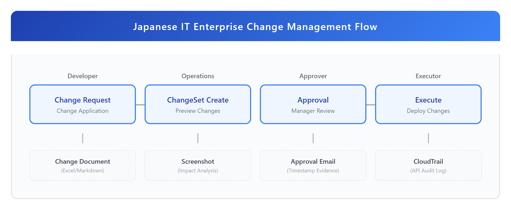
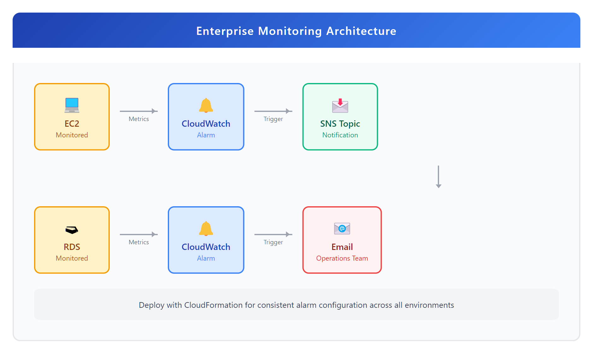
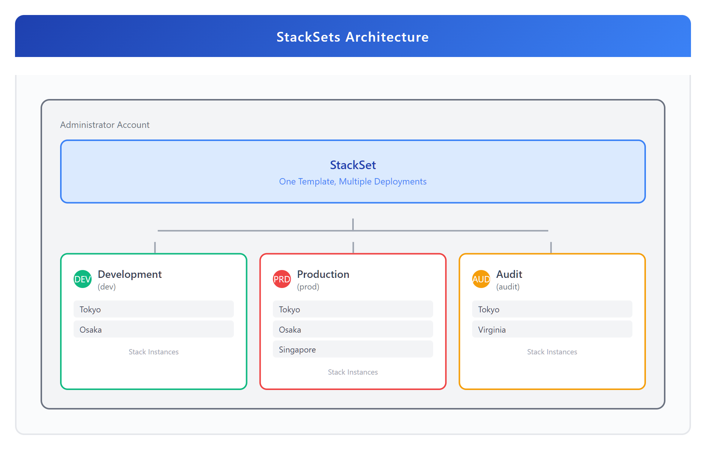
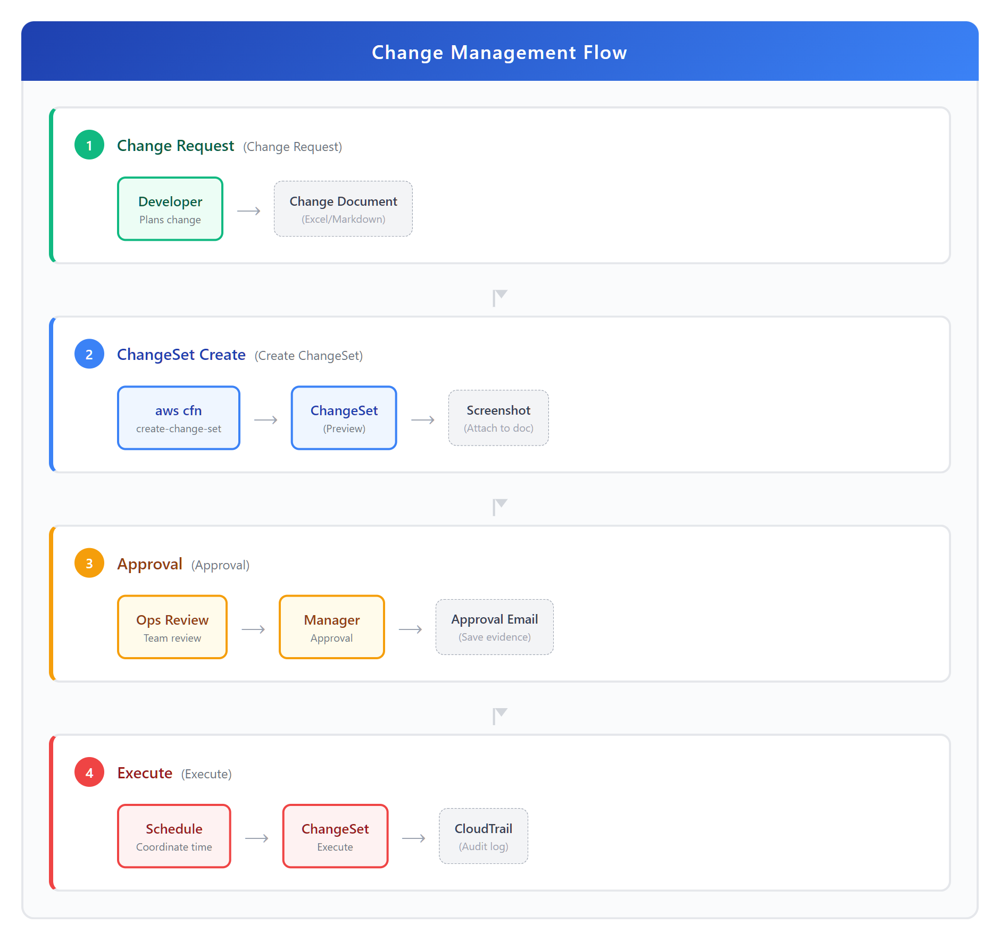

# 06 - 企业实战与日本 IT 运维

> **目标**：掌握 CloudFormation 企业级运维能力，理解日本 IT 职场的变更管理流程
> **时间**：90 分钟
> **费用**：$0.50-1.00（CloudTrail、Config、CloudWatch）
> **前置**：完成 [05 - Drift 检测与资源导入](../05-drift-import/)

---

## 将学到的内容

1. 使用 StackSets 实现多账户/多区域部署
2. 配置 cfn-guard 策略检查（Policy as Code）
3. 设计日本企业风格的変更管理流程
4. 配置审计合规（CloudTrail + Config）
5. 综合演练：监控基础设施 + 変更管理書

---

## 为什么学这个？（日本 IT 职场背景）

在日本的 SIer（System Integrator）和企业 IT 环境中，基础设施变更需要严格的流程：



<details>
<summary>📝 ASCII 源码（点击展开）</summary>

```
┌─────────────────────────────────────────────────────────────────────────────┐
│                    日本 IT 企业变更管理流程                                    │
├─────────────────────────────────────────────────────────────────────────────┤
│                                                                             │
│   開発担当         運用担当          承認者           実行者                   │
│   ┌──────┐       ┌──────┐       ┌──────┐       ┌──────┐                   │
│   │ 変更  │──────▶│ChangeSet│──────▶│ 承認  │──────▶│ 実行  │                   │
│   │ 申請  │       │ 作成   │       │      │       │      │                   │
│   └──────┘       └──────┘       └──────┘       └──────┘                   │
│       │              │              │              │                        │
│       ▼              ▼              ▼              ▼                        │
│   ┌──────┐       ┌──────┐       ┌──────┐       ┌──────┐                   │
│   │変更管理│       │影響範囲│       │承認記録│       │ 証跡  │                   │
│   │  票   │       │スクショ│       │タイムス│       │CloudT│                   │
│   │      │       │      │       │タンプ │       │rail  │                   │
│   └──────┘       └──────┘       └──────┘       └──────┘                   │
│                                                                             │
│   変更管理書      ChangeSet        承認メール      CloudTrail                   │
│   (Excel/Md)     screenshot       (エビデンス)     API ログ                    │
│                                                                             │
└─────────────────────────────────────────────────────────────────────────────┘
```

</details>

**日本企业的特点**：

| 日语术语 | 读音 | 含义 | CloudFormation 对应 |
|----------|------|------|---------------------|
| 変更管理 | へんこうかんり | 变更管理 | ChangeSet 审批流程 |
| 監査対応 | かんさたいおう | 审计合规 | CloudTrail + Config |
| 証跡 | しょうせき | 审计日志 | CloudTrail API 记录 |
| 運用監視 | うんようかんし | 运维监控 | CloudWatch Alarms |
| 設計書 | せっけいしょ | 设计文档 | CFn Template = 设计书 |

---

## Step 1 — 先跑起来！部署监控基础设施（15 分钟）

> 先体验企业级监控告警，再理解背后原理。

### 1.1 准备模板

本课提供两个完整模板：

```
code/
├── audit-infra.yaml         # CloudTrail + Config（审计合规）
├── monitoring-alarms.yaml   # CloudWatch Alarms（运维监控）
└── cfn-guard-rules/         # Policy as Code 规则
    ├── s3-encryption.guard
    └── required-tags.guard
```

### 1.2 部署 CloudWatch 监控告警

先从简单的监控告警开始：

1. 登录 AWS Console → CloudFormation
2. 点击 **Create stack** → **With new resources (standard)**
3. 选择 **Upload a template file**
4. 上传 `code/monitoring-alarms.yaml`
5. Stack name: `enterprise-monitoring`

<!-- SCREENSHOT: cfn-enterprise-monitoring-create -->

6. 参数设置：
   - **NotificationEmail**: 你的邮箱（接收告警）
   - **CPUThreshold**: 80（CPU 超过 80% 告警）
   - **MemoryThreshold**: 85（内存超过 85% 告警）

7. 点击 **Next** → **Next**
8. ⚠️ **重要**：在最后一页，你**必须**勾选以下复选框才能创建 Stack：
   - ☑️ **I acknowledge that AWS CloudFormation might create IAM resources.**

   > 这是因为模板中包含 SNS Topic Policy 等 IAM 相关资源。
   > 如果不勾选，Create 按钮会保持灰色无法点击！

9. 点击 **Submit**

### 1.3 确认 SNS 订阅

部署完成后，检查邮箱：

1. 找到来自 AWS 的订阅确认邮件
2. 点击 **Confirm subscription** 链接
3. 看到 "Subscription confirmed!" 页面

<!-- SCREENSHOT: sns-subscription-confirm -->

### 1.4 验证告警已创建

1. 进入 CloudWatch Console → **Alarms** → **All alarms**
2. 找到以 `enterprise-monitoring` 开头的告警
3. 状态应为 `INSUFFICIENT_DATA`（尚无监控数据）

恭喜！你已经部署了企业级监控基础设施！

---

## Step 2 — 发生了什么？（10 分钟）

### 2.1 监控架构



<details>
<summary>📝 ASCII 源码（点击展开）</summary>

```
┌─────────────────────────────────────────────────────────────────────────────┐
│                       Enterprise Monitoring Architecture                      │
├─────────────────────────────────────────────────────────────────────────────┤
│                                                                             │
│   ┌───────────┐         ┌───────────┐         ┌───────────┐                │
│   │   EC2     │         │CloudWatch │         │   SNS     │                │
│   │  (监控)    │────────▶│  Alarm    │────────▶│  Topic    │                │
│   │           │ Metrics │  (告警)    │ Trigger │  (通知)    │                │
│   └───────────┘         └───────────┘         └─────┬─────┘                │
│                                                       │                      │
│   ┌───────────┐         ┌───────────┐               │                      │
│   │   RDS     │         │CloudWatch │               ▼                      │
│   │  (监控)    │────────▶│  Alarm    │         ┌───────────┐               │
│   │           │ Metrics │  (告警)    │────────▶│   Email   │               │
│   └───────────┘         └───────────┘         │  (运维)    │               │
│                                                └───────────┘                │
│                                                                             │
│   通过 CloudFormation 一键部署，确保所有环境告警配置一致                          │
│                                                                             │
└─────────────────────────────────────────────────────────────────────────────┘
```

</details>

### 2.2 模板结构解析

打开 `monitoring-alarms.yaml`，关键组件：

```yaml
Resources:
  # 1. SNS Topic（通知渠道）
  AlertTopic:
    Type: AWS::SNS::Topic
    Properties:
      TopicName: !Sub '${AWS::StackName}-alerts'

  # 2. Email 订阅
  EmailSubscription:
    Type: AWS::SNS::Subscription
    Properties:
      TopicArn: !Ref AlertTopic
      Protocol: email
      Endpoint: !Ref NotificationEmail

  # 3. CloudWatch Alarm（告警规则）
  HighCPUAlarm:
    Type: AWS::CloudWatch::Alarm
    Properties:
      AlarmDescription: "CPU 使用率超过阈值 - 異常検知"
      MetricName: CPUUtilization
      Namespace: AWS/EC2
      Threshold: !Ref CPUThreshold
      AlarmActions:
        - !Ref AlertTopic  # 触发时发送通知
```

**日本 IT 场景**：这套架构在日本企业叫「運用監視」（うんようかんし）。告警邮件通常发送到运维团队的共享邮箱，由当值人员响应。

---

## Step 3 — 核心概念：企业级 CloudFormation（20 分钟）

### 3.1 StackSets：多账户/多区域部署

在大型企业，通常有多个 AWS 账户（开发、测试、生产、安全审计等）。StackSets 允许你用一个模板部署到多个账户/区域。



<details>
<summary>📝 ASCII 源码（点击展开）</summary>

```
┌─────────────────────────────────────────────────────────────────────────────┐
│                           StackSets 架构                                     │
├─────────────────────────────────────────────────────────────────────────────┤
│                                                                             │
│   管理账户 (Administrator Account)                                            │
│   ┌─────────────────────────────────────────────────────────────────────┐   │
│   │                         StackSet                                     │   │
│   │                    (一个模板, 多处部署)                                  │   │
│   │                           │                                          │   │
│   │        ┌──────────────────┼──────────────────┐                      │   │
│   │        ▼                  ▼                  ▼                      │   │
│   │   ┌────────┐         ┌────────┐         ┌────────┐                 │   │
│   │   │開発账户│         │本番账户│         │監査账户│                 │   │
│   │   │(dev)  │         │(prod)  │         │(audit) │                 │   │
│   │   │       │         │        │         │        │                 │   │
│   │   │Tokyo  │         │Tokyo   │         │Tokyo   │                 │   │
│   │   │Osaka  │         │Osaka   │         │Virginia│                 │   │
│   │   │       │         │Singapore│        │        │                 │   │
│   │   └────────┘         └────────┘         └────────┘                 │   │
│   │                                                                      │   │
│   │   Stack Instance    Stack Instance    Stack Instance                │   │
│   │   (各账户/区域)      (各账户/区域)      (各账户/区域)                   │   │
│   │                                                                      │   │
│   └─────────────────────────────────────────────────────────────────────┘   │
│                                                                             │
└─────────────────────────────────────────────────────────────────────────────┘
```

</details>

**两种部署模式**：

| 模式 | 名称 | 适用场景 | 配置复杂度 |
|------|------|----------|------------|
| Self-managed | 自管理 | 少量账户、非 Organizations | 需手动配置 IAM 角色 |
| Service-managed | 服务管理 | Organizations 环境 | 自动配置，推荐 |

**日本企业场景**：

```
典型多账户结构:
├── 管理账户 (root)
├── 開発 (Development)
├── ステージング (Staging)
├── 本番 (Production)
├── 監査・ログ (Audit/Logging)
└── セキュリティ (Security)
```

### 3.2 cfn-guard：Policy as Code

cfn-guard 是 AWS 开源工具，在部署前检查模板是否符合组织策略。

**安装**：

```bash
# macOS
brew install cloudformation-guard

# Linux
curl -L https://github.com/aws-cloudformation/cloudformation-guard/releases/latest/download/cfn-guard-v3-ubuntu-latest.tar.gz | tar xz
sudo mv cfn-guard /usr/local/bin/
```

**示例规则**（`cfn-guard-rules/s3-encryption.guard`）：

```ruby
# S3 Bucket 必须启用加密
# 日本企业安全基准：全ての S3 バケットは暗号化必須

let s3_buckets = Resources.*[ Type == 'AWS::S3::Bucket' ]

rule s3_encryption_enabled when %s3_buckets !empty {
    %s3_buckets.Properties.BucketEncryption exists
    <<
        [必須] S3 バケットには暗号化設定が必要です
        監査要件: データ暗号化は必須
    >>
}
```

**验证模板**：

```bash
cfn-guard validate \
  --data your-template.yaml \
  --rules cfn-guard-rules/s3-encryption.guard
```

### 3.3 CloudFormation Hooks

Hooks 在 Stack/ChangeSet 级别进行验证，比 cfn-guard 更强大但配置更复杂。

| 特性 | cfn-guard | CloudFormation Hooks |
|------|-----------|---------------------|
| 执行位置 | 本地/CI | AWS 服务端 |
| 强制力 | 取决于 CI 配置 | 可配置为强制阻止 |
| 支持资源 | CloudFormation 模板 | CloudFormation + 第三方 |
| 复杂度 | 低 | 中-高 |

**推荐方案**：
1. CI/CD 阶段使用 cfn-guard（快速反馈）
2. 生产账户配置 Hooks（最后防线）

---

## Step 4 — 动手实验：部署审计基础设施（15 分钟）

> 目标：部署 CloudTrail + Config，建立完整的审计体系。

### 4.1 部署 CloudTrail + Config

1. CloudFormation Console → **Create stack**
2. 上传 `code/audit-infra.yaml`
3. Stack name: `enterprise-audit`

<!-- SCREENSHOT: cfn-audit-infra-create -->

4. 参数设置：
   - **EnableCloudTrail**: true
   - **EnableConfig**: true
   - **RetentionDays**: 90（日志保留 90 天）

5. 点击 **Next** → **Next** → 勾选 **I acknowledge...** → **Submit**

### 4.2 验证 CloudTrail

1. 进入 CloudTrail Console
2. 点击左侧 **Trails**
3. 找到 `enterprise-audit-trail`
4. 状态应为 **Logging**

### 4.3 验证 Config

1. 进入 Config Console
2. 点击 **Rules**
3. 找到部署的合规规则：
   - `s3-bucket-server-side-encryption-enabled`
   - `ec2-instance-managed-by-systems-manager`

### 4.4 模拟审计场景

现在创建一个新 Stack，观察 CloudTrail 记录：

```bash
# 查看最近的 CloudFormation API 调用
aws cloudtrail lookup-events \
  --lookup-attributes AttributeKey=EventSource,AttributeValue=cloudformation.amazonaws.com \
  --max-results 5
```

输出示例：

```json
{
  "EventName": "CreateStack",
  "Username": "your-user",
  "EventTime": "2025-12-22T10:30:00Z",
  "Resources": [
    {
      "ResourceType": "AWS::CloudFormation::Stack",
      "ResourceName": "enterprise-monitoring"
    }
  ]
}
```

**日本审计场景**：当内部审计（内部監査）或外部审计（外部監査）来检查时，这些记录就是你的「証跡」（エビデンス）。

---

## Step 5 — 日本 IT 变更管理流程（15 分钟）

### 5.1 变更管理的完整流程

在日本企业，CloudFormation 变更通常需要遵循这个流程：



<details>
<summary>📝 ASCII 源码（点击展开）</summary>

```
┌─────────────────────────────────────────────────────────────────────────────┐
│                    変更管理フロー (Change Management Flow)                    │
├─────────────────────────────────────────────────────────────────────────────┤
│                                                                             │
│  ┌────────────────────────────────────────────────────────────────────┐    │
│  │  Phase 1: 変更申請 (Change Request)                                 │    │
│  │  ┌──────────────┐                                                  │    │
│  │  │  開発者が     │  ──────▶  変更管理書作成                          │    │
│  │  │  変更を計画   │           (Excel/Markdown)                       │    │
│  │  └──────────────┘                                                  │    │
│  └────────────────────────────────────────────────────────────────────┘    │
│                              │                                              │
│                              ▼                                              │
│  ┌────────────────────────────────────────────────────────────────────┐    │
│  │  Phase 2: ChangeSet 作成 (Create ChangeSet)                         │    │
│  │  ┌──────────────┐    ┌──────────────┐                              │    │
│  │  │  aws cfn     │───▶│  ChangeSet   │───▶  スクリーンショット取得   │    │
│  │  │  create-     │    │  (Preview)   │      (変更管理書に添付)       │    │
│  │  │  change-set  │    └──────────────┘                              │    │
│  │  └──────────────┘                                                  │    │
│  └────────────────────────────────────────────────────────────────────┘    │
│                              │                                              │
│                              ▼                                              │
│  ┌────────────────────────────────────────────────────────────────────┐    │
│  │  Phase 3: 承認 (Approval)                                           │    │
│  │  ┌──────────────┐    ┌──────────────┐    ┌──────────────┐         │    │
│  │  │  運用チーム   │───▶│  上長承認    │───▶│  承認メール   │         │    │
│  │  │  レビュー    │    │  (Manager)   │    │  (証跡保存)   │         │    │
│  │  └──────────────┘    └──────────────┘    └──────────────┘         │    │
│  └────────────────────────────────────────────────────────────────────┘    │
│                              │                                              │
│                              ▼                                              │
│  ┌────────────────────────────────────────────────────────────────────┐    │
│  │  Phase 4: 実行 (Execute)                                            │    │
│  │  ┌──────────────┐    ┌──────────────┐    ┌──────────────┐         │    │
│  │  │  作業日時    │───▶│  ChangeSet   │───▶│  CloudTrail   │         │    │
│  │  │  調整       │    │  Execute     │    │  証跡記録     │         │    │
│  │  └──────────────┘    └──────────────┘    └──────────────┘         │    │
│  └────────────────────────────────────────────────────────────────────┘    │
│                                                                             │
└─────────────────────────────────────────────────────────────────────────────┘
```

</details>

### 5.2 変更管理書テンプレート

本课提供了日本企业风格的変更管理書模板（见 `templates/変更管理書.md`）。

关键要素：

| 项目 | 日语 | 说明 |
|------|------|------|
| 変更概要 | へんこうがいよう | 变更内容概述 |
| 影響範囲 | えいきょうはんい | 影响范围分析 |
| 作業手順 | さぎょうてじゅん | 具体操作步骤 |
| 切り戻し手順 | きりもどしてじゅん | 回滚步骤 |
| 承認者 | しょうにんしゃ | 审批人 |

### 5.3 实践：创建 ChangeSet 并记录

**场景**：需要给监控 Stack 添加一个新的告警。

1. 修改 `monitoring-alarms.yaml`，添加磁盘监控：

```yaml
  DiskSpaceAlarm:
    Type: AWS::CloudWatch::Alarm
    Properties:
      AlarmDescription: "ディスク使用率超過 - 容量確認必要"
      MetricName: DiskSpaceUtilization
      Namespace: CWAgent
      Statistic: Average
      Period: 300
      EvaluationPeriods: 2
      Threshold: 90
      AlarmActions:
        - !Ref AlertTopic
```

2. 创建 ChangeSet（不执行）：

```bash
aws cloudformation create-change-set \
  --stack-name enterprise-monitoring \
  --change-set-name add-disk-alarm-$(date +%Y%m%d) \
  --template-body file://code/monitoring-alarms.yaml \
  --parameters ParameterKey=NotificationEmail,UsePreviousValue=true
```

3. 查看 ChangeSet 详情：

```bash
aws cloudformation describe-change-set \
  --stack-name enterprise-monitoring \
  --change-set-name add-disk-alarm-$(date +%Y%m%d)
```

4. **截图保存**：在 Console 查看 ChangeSet，截图作为変更管理書的附件。

5. 获得承认后执行：

```bash
aws cloudformation execute-change-set \
  --stack-name enterprise-monitoring \
  --change-set-name add-disk-alarm-$(date +%Y%m%d)
```

---

## Step 6 — cfn-guard 策略验证（10 分钟）

### 6.1 编写组织策略规则

本课提供两个示例规则：

**1. S3 加密必须（`cfn-guard-rules/s3-encryption.guard`）**

```ruby
# 全ての S3 バケットは暗号化が必須
let s3_buckets = Resources.*[ Type == 'AWS::S3::Bucket' ]

rule s3_encryption_enabled when %s3_buckets !empty {
    %s3_buckets.Properties.BucketEncryption exists
    <<
        [CRITICAL] S3 バケットの暗号化設定が必要です
        - BucketEncryption プロパティを追加してください
        - 参考: https://docs.aws.amazon.com/ja_jp/AWSCloudFormation/latest/UserGuide/aws-properties-s3-bucket-bucketencryption.html
    >>
}
```

**2. 必须标签（`cfn-guard-rules/required-tags.guard`）**

```ruby
# 日本企業タグ要件：Environment, Owner, Project は必須
let all_resources = Resources.*

rule required_tags {
    %all_resources.Properties.Tags exists
    %all_resources.Properties.Tags[ Key == 'Environment' ] !empty
    %all_resources.Properties.Tags[ Key == 'Owner' ] !empty
    <<
        [必須] 以下のタグが必要です:
        - Environment (dev/stg/prod)
        - Owner (担当者メールアドレス)

        タグは請求管理・リソース管理に必須です。
    >>
}
```

### 6.2 在 CI/CD 中使用

典型的 GitHub Actions 配置：

```yaml
name: CloudFormation Validation
on:
  pull_request:
    paths:
      - '**.yaml'
      - '**.yml'

jobs:
  validate:
    runs-on: ubuntu-latest
    steps:
      - uses: actions/checkout@v4

      - name: Install cfn-guard
        run: |
          curl -L https://github.com/aws-cloudformation/cloudformation-guard/releases/latest/download/cfn-guard-v3-ubuntu-latest.tar.gz | tar xz
          sudo mv cfn-guard /usr/local/bin/

      - name: Validate templates
        run: |
          for template in $(find . -name "*.yaml" -path "*/cloudformation/*"); do
            echo "Validating: $template"
            cfn-guard validate --data "$template" --rules cfn-guard-rules/
          done
```

---

## Step 7 — 清理资源（5 分钟）

> **重要**：CloudTrail 和 Config 会产生持续费用，实验完成后请删除！

### 7.1 删除顺序

由于资源依赖关系，按以下顺序删除：

```bash
# 1. 删除监控 Stack
aws cloudformation delete-stack --stack-name enterprise-monitoring

# 2. 等待删除完成
aws cloudformation wait stack-delete-complete --stack-name enterprise-monitoring

# 3. 删除审计 Stack
aws cloudformation delete-stack --stack-name enterprise-audit

# 4. 等待删除完成
aws cloudformation wait stack-delete-complete --stack-name enterprise-audit
```

### 7.2 验证清理

```bash
aws cloudformation list-stacks \
  --stack-status-filter DELETE_COMPLETE \
  --query "StackSummaries[?contains(StackName, 'enterprise')]"
```

### 7.3 手动检查

确保以下资源已删除：

- [ ] CloudWatch Alarms
- [ ] SNS Topics
- [ ] CloudTrail Trails
- [ ] Config Rules
- [ ] S3 Buckets（日志桶可能需要先清空）

---

## 职场小贴士

### 日本 IT 企业的变更管理文化

**1. 承認フロー（审批流程）**

日本企业的变更通常需要多级审批：

```
開発担当 → チームリーダー → 課長 → 部長（大型変更）
```

CloudFormation 的 ChangeSet 截图是重要的审批材料。

**2. 作業時間帯（工作时间窗口）**

```
通常変更: 平日 10:00-17:00
緊急変更: 要相談（承認者の許可必須）
定期メンテ: 毎月第2土曜 22:00-翌6:00
```

**3. 証跡管理（审计日志）**

日本的金融・医療・政府项目对审计要求很高：

- CloudTrail 日志保留 1-7 年
- 变更管理票需要长期保存
- 定期内部审计（年 1-2 回）

### 面试常见问题

**Q: StackSets と通常の Stack の違いは？**

A: StackSets は複数アカウント・リージョンに同一テンプレートを一括展開できる。Organizations と統合すると、新規アカウント作成時に自動的に Stack をデプロイ可能。ガバナンス強化に有効。

（StackSets 可以将同一模板一键部署到多个账户/区域。与 Organizations 集成后，创建新账户时可以自动部署 Stack。对治理很有帮助。）

**Q: CloudFormation の監査対応はどうしていますか？**

A: 3つの層で対応：
1. CloudTrail で全 API 操作を記録
2. Config で継続的なコンプライアンスチェック
3. ChangeSet のスクリーンショットを変更管理票に添付

（三层应对：1. CloudTrail 记录所有 API 操作 2. Config 持续合规检查 3. ChangeSet 截图附在变更管理票上）

**Q: cfn-guard は何に使いますか？**

A: デプロイ前のポリシーチェック。CI/CD パイプラインに組み込んで、暗号化必須・タグ必須などの組織ルールを強制。Shift-left セキュリティの実践。

（部署前的策略检查。集成到 CI/CD 流水线，强制执行加密必须、标签必须等组织规则。实践 Shift-left 安全。）

---

## 检查清单

完成本课后，你应该能够：

- [ ] 解释 StackSets 的用途和两种部署模式
- [ ] 使用 cfn-guard 验证模板是否符合组织策略
- [ ] 描述日本企业的变更管理流程（変更申請 → 承認 → 実行 → 証跡）
- [ ] 部署 CloudTrail + Config 审计基础设施
- [ ] 配置 CloudWatch Alarms 监控告警
- [ ] 创建 ChangeSet 并解释其在変更管理中的作用
- [ ] 填写変更管理書的关键项目

---

## 课程总结：CloudFormation 系列回顾

恭喜你完成了 CloudFormation 完整课程！回顾一下你学到的内容：

| 课程 | 主题 | 关键技能 |
|------|------|----------|
| 00 | 基础与第一个 Stack | Template, Stack, Resource 概念 |
| 01 | 模板语法与内置函数 | Parameters, Mappings, Conditions, !Ref, !Sub |
| 02 | 安全运维 | ChangeSet, DeletionPolicy, StackPolicy, 回滚 |
| 03 | 现代工具 | Infrastructure Composer, IaC Generator |
| 04 | 多栈架构 | Nested Stacks, Cross-stack References |
| 05 | Drift 与导入 | Drift Detection, Resource Import |
| **06** | **企业实战** | **StackSets, cfn-guard, 変更管理, 監査対応** |

### 下一步建议

1. **实践**：在个人项目中应用 CloudFormation
2. **认证**：考取 AWS SAA/SOA，CloudFormation 是重点考察内容
3. **深入**：学习 [Terraform 系列](../../terraform/)，掌握多云 IaC
4. **进阶**：探索 AWS CDK（用代码而非 YAML 定义基础设施）

---

## 延伸阅读

- [AWS StackSets ユーザーガイド](https://docs.aws.amazon.com/ja_jp/AWSCloudFormation/latest/UserGuide/what-is-cfnstacksets.html)
- [cfn-guard GitHub](https://github.com/aws-cloudformation/cloudformation-guard)
- [AWS CloudTrail ユーザーガイド](https://docs.aws.amazon.com/ja_jp/awscloudtrail/latest/userguide/)
- [AWS Config ルールリファレンス](https://docs.aws.amazon.com/ja_jp/config/latest/developerguide/managed-rules-by-aws-config.html)
- [Terraform 系列](../../terraform/) - 多云 IaC 对比学习

---

## 系列导航

[← 05 - Drift 检测与资源导入](../05-drift-import/) | [Home](../) | [Terraform 系列 →](../../terraform/)
