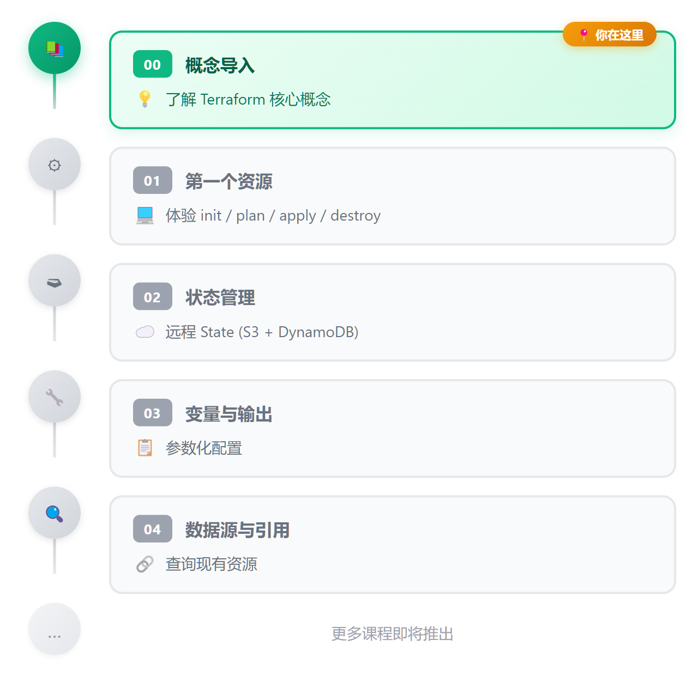

# 00 · 概念导入

> **目标**：理解 Terraform 是什么、为什么用它、它如何工作
> **时间**：10-15 分钟阅读
> **费用**：无（纯概念）

---

## 什么是 Infrastructure as Code (IaC)?

**传统方式**：登录 Console → 点击创建 → 手动配置 → 忘记做了什么

**IaC 方式**：写代码 → 版本控制 → 自动执行 → 可重复、可审计


<details>
<summary>View ASCII source</summary>

```
┌─────────────┐      ┌─────────────┐      ┌─────────────┐
│  代码文件    │      │  IaC 工具    │      │  云端资源    │
│  (.tf 文件)  │ ───▶ │ (Terraform) │ ───▶ │  (S3, EC2)  │
│  声明资源    │      │  下载Provider│      │             │
└─────────────┘      └─────────────┘      └─────────────┘
       ▲                                         │
       │         版本控制 (Git)                   │
       └─────────────────────────────────────────┘
```

</details>

**核心价值**：

| 问题 | IaC 解决方案 |
|------|-------------|
| "这个资源谁创建的？" | Git commit 记录 |
| "配置改了什么？" | `terraform plan` 显示差异 |
| "能再建一套一样的吗？" | 同样代码，另一个环境 |
| "出问题怎么回滚？" | `git revert` + `terraform apply` |

---

## Terraform 是什么？

**一句话**：HashiCorp 开发的开源 IaC 工具，用声明式代码管理云资源。

**声明式 vs 命令式**：

```
命令式（Shell 脚本）：
1. 创建 VPC
2. 如果 VPC 存在，跳过
3. 创建子网
4. 如果子网存在...

声明式（Terraform）：
"我要一个 VPC 和一个子网"
→ Terraform 自动判断需要创建/修改/删除什么
```

**Terraform 的位置**：


<details>
<summary>View ASCII source</summary>

```
┌─────────────────────────────────────────────────────────────┐
│                    IaC 工具生态                              │
│              Infrastructure as Code Ecosystem               │
├─────────────────────────────┬───────────────────────────────┤
│   云厂商原生 Cloud Native    │    第三方工具 Third Party      │
├─────────────────────────────┼───────────────────────────────┤
│                             │                               │
│  [AWS] CloudFormation       │  [TF] Terraform ← 本课程      │
│        AWS 专属 / YAML/JSON │       多云支持 / HCL 语法      │
│                             │                               │
│  [Az]  ARM / Bicep          │  [P]  Pulumi                  │
│        Azure 专属 / DSL     │       编程语言 / TS,Python,Go  │
│                             │                               │
│  [GCP] Deployment Manager   │  [A]  Ansible                 │
│        GCP 专属 / YAML      │       配置管理 / YAML Playbook │
│                             │                               │
└─────────────────────────────┴───────────────────────────────┘
```

</details>

---

## Terraform vs CloudFormation

| 维度 | Terraform | CloudFormation |
|------|-----------|----------------|
| 云支持 | **多云**（AWS, Azure, GCP...） | AWS 专用 |
| 语言 | HCL（更简洁） | YAML/JSON（更冗长） |
| 状态管理 | 需要自己配置 | AWS 自动管理 |
| 学习曲线 | 较平缓 | AWS 深度集成 |
| 社区生态 | 丰富的 Module | AWS 官方支持 |

**什么时候用什么？**

- **纯 AWS 项目** → 两者都可以，CloudFormation 集成更深
- **多云项目** → Terraform 是唯一选择
- **团队已有 Terraform 经验** → 继续用 Terraform
- **需要 AWS 最新功能** → CloudFormation 通常先支持

本课程选择 Terraform 因为：**市场需求大、技能可迁移**。

---

## Terraform 核心概念

### 1. Provider（提供者）

连接 Terraform 和云平台的"驱动程序"。

```hcl
provider "aws" {
  region = "ap-northeast-1"
}
```

**常用 Provider**：`aws`, `azurerm`, `google`, `kubernetes`

### 2. Resource（资源）

你要创建的东西。

```hcl
resource "aws_s3_bucket" "my_bucket" {
  bucket = "my-bucket-name"
}
```

**格式**：`resource "类型" "本地名称" { 配置 }`

### 3. State（状态）

Terraform 的"记忆"——记录它管理的资源。

```
terraform.tfstate → JSON 文件，记录资源 ID、属性等
```

**重要**：状态文件包含敏感信息，不要提交到 Git！

### 4. Plan & Apply

```
terraform plan  → 预览变更（Dry Run）
terraform apply → 执行变更
```

---

## Terraform 工作流


<details>
<summary>View ASCII source</summary>

```
                        Terraform 工作流

  编写代码      初始化       预览        执行        验证
┌─────────┐  ┌────────┐  ┌────────┐  ┌────────┐  ┌─────────┐
│.tf 文件  │─▶│  init  │─▶│  plan  │─▶│ apply  │─▶│检查资源  │
│         │  │        │  │        │  │        │  │         │
│ 声明资源 │  │下载     │  │ 对比   │  │调用 API │  │  AWS    │
│         │  │Provider│  │ 状态   │  │创建资源 │  │ Console │
└─────────┘  └────────┘  └───┬────┘  └───┬────┘  └─────────┘
                             │           │
                             └─────┬─────┘
                                   ▼
                          ┌──────────────────┐
                          │ terraform.tfstate │
                          └──────────────────┘
```

</details>

**关键点**：

1. `plan` 只是预览，不会真的创建资源
2. `apply` 会更新状态文件
3. 下次 `plan` 时，对比代码和状态的差异

---

## 课程路线图



<details>
<summary>View ASCII source</summary>

```
    ┌────────────────────────────────────┐
    │ 00  概念导入                  ← 你在这里
    │     了解 Terraform 核心概念
    └────────────────┬───────────────────┘
                     ▼
    ┌────────────────────────────────────┐
    │ 01  第一个资源
    │     体验 init / plan / apply / destroy
    └────────────────┬───────────────────┘
                     ▼
    ┌────────────────────────────────────┐
    │ 02  状态管理
    │     远程 State (S3 + DynamoDB)
    └────────────────┬───────────────────┘
                     ▼
    ┌────────────────────────────────────┐
    │ 03  变量与输出
    │     参数化配置
    └────────────────┬───────────────────┘
                     ▼
    ┌────────────────────────────────────┐
    │ 04  数据源与引用
    │     查询现有资源
    └────────────────┬───────────────────┘
                     ▼
                   ...
           更多课程即将推出
```

</details>

每课 25-35 分钟，包含：
- 概念讲解
- 动手实验
- 代码示例
- 面试准备

---

## 准备好了吗？

在开始动手之前，先准备好实验环境：

→ [环境准备](./lab-setup.md)

环境准备好后，开始第一课：

→ [01 · 安装配置与第一个资源](../01-first-resource/)

---

## 系列导航

[Home](../) | [环境准备 →](./lab-setup.md) | [01 · 第一个资源 →](../01-first-resource/)
