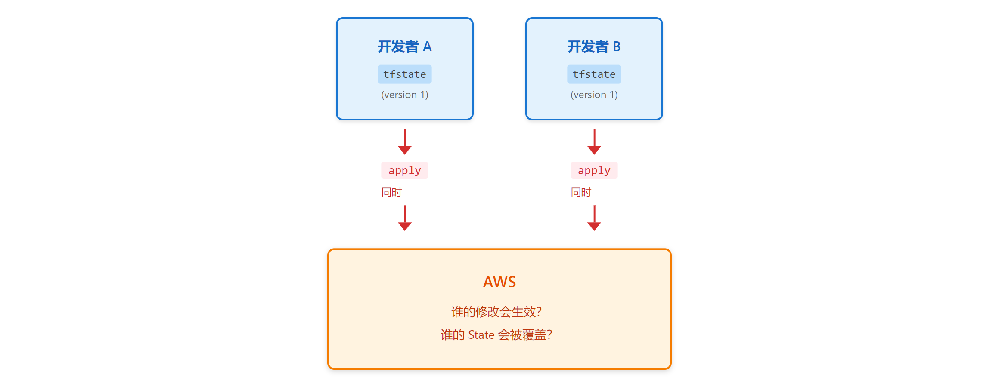
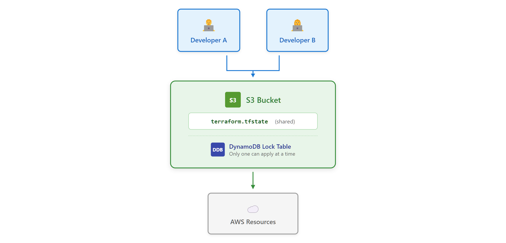

# 02 · 状态管理与远程后端

> **目标**：理解 State 的作用，配置 S3 远程后端，体验团队协作场景  
> **前置**：已完成 [01 · 安装配置与第一个资源](../01-first-resource/)  
> **时间**：30-35 分钟  
> **费用**：S3 Bucket + DynamoDB Table（免费层）

---

## 将学到的内容

1. 理解 State 文件的作用与重要性
2. 体验 Local State 在团队场景中的问题
3. 配置 S3 + DynamoDB 远程后端
4. 理解 State Locking 机制
5. 完成 Local → Remote 状态迁移

---

## Step 1 — 快速验证环境（2 分钟）

连接到你的 Terraform Lab 实例：

```bash
# VS Code Remote 用户：已连接则跳过
# SSM 用户：
aws ssm start-session --target i-你的实例ID --region ap-northeast-1
```

确认上一课的资源已清理：

```bash
cd ~/terraform-examples/01-first-resource/code
terraform state list
```

如果有输出，先清理：

```bash
terraform destroy -auto-approve
```

---

## Step 2 — 体验问题：Local State 的陷阱（5 分钟）

> 先"尝到"Local State 的问题，再学习解决方案。

### 2.1 创建资源（使用 Local State）

```bash
cd ~/terraform-examples/02-state/code/01-local-state
terraform init
terraform apply -auto-approve
```

```
Apply complete! Resources: 2 added, 0 changed, 0 destroyed.

Outputs:

bucket_name = "state-demo-local-a1b2c3d4"
```

### 2.2 检查 State 文件

```bash
ls -la
```

```
-rw-r--r-- 1 ec2-user ... terraform.tfstate
-rw-r--r-- 1 ec2-user ... terraform.tfstate.backup
```

查看 State 内容：

```bash
cat terraform.tfstate | head -30
```

```json
{
  "version": 4,
  "terraform_version": "1.9.x",
  "resources": [
    {
      "type": "aws_s3_bucket",
      "name": "demo",
      ...
    }
  ]
}
```

**问题来了**：这个文件只在你的机器上。

### 2.3 模拟团队冲突（思想实验）

想象这个场景：



**Local State 的致命问题**：

| 问题 | 后果 |
|------|------|
| 无锁机制 | 并发 apply 相互覆盖 |
| 无共享 | 每人一份 State，各行其是 |
| 敏感信息 | State 可能包含密码，本地存储不安全 |

---

## Step 3 — 体验解决方案：S3 远程后端（10 分钟）

> 现在让我们看看正确的做法。

### 3.1 准备远程后端基础设施

首先，我们需要创建存储 State 的 S3 Bucket 和 DynamoDB Table。

```bash
cd ~/terraform-examples/02-state/code/02-s3-backend

# 查看后端配置
cat backend-setup.tf
```

```hcl
# 这个文件创建远程后端需要的基础设施
# 注意：这些资源本身使用 local state（鸡生蛋问题）

resource "aws_s3_bucket" "tfstate" {
  bucket = "tfstate-${random_id.suffix.hex}"

  tags = {
    Name    = "Terraform State Bucket"
    Purpose = "terraform-state"
  }
}

resource "aws_dynamodb_table" "tflock" {
  name         = "terraform-lock"
  billing_mode = "PAY_PER_REQUEST"
  hash_key     = "LockID"

  attribute {
    name = "LockID"
    type = "S"
  }
}
```

创建后端基础设施：

```bash
terraform init
terraform apply -auto-approve
```

```
Outputs:

bucket_name   = "tfstate-a1b2c3d4"
dynamodb_table = "terraform-lock"
```

记下这些输出值！

### 3.2 配置使用远程后端

现在，让我们创建一个使用远程后端的新项目。

编辑 `main.tf`，添加 backend 配置：

```bash
cat main.tf
```

```hcl
terraform {
  required_version = ">= 1.0.0"

  # 远程后端配置（取消注释并填入你的值）
  # backend "s3" {
  #   bucket         = "tfstate-你的后缀"      # 上一步的输出
  #   key            = "lesson-02/terraform.tfstate"
  #   region         = "ap-northeast-1"
  #   dynamodb_table = "terraform-lock"       # 锁表名
  #   encrypt        = true                   # 加密 State
  # }

  required_providers {
    aws = {
      source  = "hashicorp/aws"
      version = "~> 5.0"
    }
  }
}
```

编辑并取消 backend 块的注释，填入你的 bucket 名称：

```bash
vim main.tf   # 或使用 VS Code
```

### 3.3 迁移到远程后端

重新初始化（Terraform 会检测 backend 变化）：

```bash
terraform init
```

```
Initializing the backend...
Do you want to copy existing state to the new backend?
  Enter a value: yes
```

输入 `yes`，Terraform 会自动迁移 State。

### 3.4 验证远程 State

```bash
# 本地 State 文件应该不存在了
ls terraform.tfstate 2>/dev/null || echo "Local state removed (expected)"

# 验证远程 State
aws s3 ls s3://tfstate-你的后缀/lesson-02/
```

```
2024-xx-xx xx:xx:xx     xxxx terraform.tfstate
```

---

## Step 4 — 发生了什么？（5 分钟）

### 4.1 远程后端架构



### 4.2 State Locking 机制

当你运行 `terraform apply`：

```
1. 获取锁（DynamoDB）
   → 如果已锁定，等待或失败

2. 读取 State（S3）
   → 获取最新资源状态

3. 执行变更
   → 调用 AWS API

4. 写入 State（S3）
   → 更新资源状态

5. 释放锁（DynamoDB）
   → 允许下一个操作
```

### 4.3 State 文件内容解剖

```bash
aws s3 cp s3://tfstate-你的后缀/lesson-02/terraform.tfstate - | head -50
```

State 文件包含：

| 字段 | 内容 | 敏感？ |
|------|------|--------|
| `version` | State 格式版本 | 否 |
| `terraform_version` | Terraform 版本 | 否 |
| `resources` | 资源映射 | **可能！** |
| `outputs` | 输出值 | **可能！** |

> **安全警告**：State 可能包含数据库密码、API 密钥等敏感信息！

---

## Step 5 — 动手实验：体验锁机制（8 分钟）

> 亲自感受 State Locking 如何防止冲突。

### 5.1 打开两个终端

**终端 1**：

```bash
cd ~/terraform-examples/02-state/code/02-s3-backend
```

**终端 2**（新开一个 SSH/VS Code 终端）：

```bash
cd ~/terraform-examples/02-state/code/02-s3-backend
```

### 5.2 模拟并发 Apply

在 `main.tf` 中添加一个需要时间创建的资源（如果没有的话）：

```hcl
resource "time_sleep" "wait" {
  create_duration = "30s"
}
```

**终端 1**：

```bash
terraform apply -auto-approve
```

立即在 **终端 2** 执行：

```bash
terraform apply -auto-approve
```

**终端 2 输出**：

```
Error: Error acquiring the state lock

Error message: ConditionalCheckFailedException: The conditional request failed
Lock Info:
  ID:        xxxxxxxx-xxxx-xxxx-xxxx-xxxxxxxxxxxx
  Path:      tfstate-xxx/lesson-02/terraform.tfstate
  Operation: OperationTypeApply
  Who:       ec2-user@ip-10-0-1-xxx
  Version:   1.9.x
  Created:   2024-xx-xx xx:xx:xx.xxx UTC

Terraform acquires a state lock to protect the state from being
written by multiple users at the same time.
```

**State Locking 生效了！** 第二个 apply 被阻止。

### 5.3 查看 DynamoDB 锁表

```bash
aws dynamodb scan --table-name terraform-lock
```

运行中会看到锁记录；完成后锁会释放。

---

## Step 6 — 深入理解 State（8 分钟）

### 6.1 为什么不能 commit State 到 Git？

```bash
cat terraform.tfstate | grep -A 5 "sensitive"
```

State 文件可能包含：

- 数据库密码（明文）
- API 密钥
- 私钥内容
- 其他敏感输出

**即使设置 `sensitive = true`**，数据仍然存在于 State 中！

```hcl
# 代码中标记为敏感
output "db_password" {
  value     = random_password.db.result
  sensitive = true   # 只是屏蔽 CLI 输出
}

# 但 State 中仍是明文！
```

### 6.2 State 操作命令

| 命令 | 用途 | 场景 |
|------|------|------|
| `terraform state list` | 列出资源 | 查看管理的资源 |
| `terraform state show <resource>` | 显示详情 | 调试资源属性 |
| `terraform state mv` | 移动/重命名 | 重构代码 |
| `terraform state rm` | 取消管理 | 移交资源 |
| `terraform state pull` | 下载 State | 备份 |
| `terraform state push` | 上传 State | 恢复（危险！） |

```bash
# 列出所有资源
terraform state list

# 查看资源详情
terraform state show aws_s3_bucket.demo
```

### 6.3 State 版本控制（S3 Versioning）

```bash
# 查看 State 历史版本
aws s3api list-object-versions \
  --bucket tfstate-你的后缀 \
  --prefix lesson-02/terraform.tfstate
```

S3 Versioning 提供 State 的历史记录，可用于：

- 审计变更
- 灾难恢复
- 回滚（需谨慎）

---

## Step 7 — 清理资源（3 分钟）

> 完成学习后，立即清理！

```bash
cd ~/terraform-examples/02-state/code/02-s3-backend

# 先删除使用远程后端的资源
terraform destroy -auto-approve

# 回到 01-local-state，清理那里的资源
cd ../01-local-state
terraform destroy -auto-approve
```

**保留还是删除后端基础设施？**

- **保留**：后续课程继续使用（推荐）
- **删除**：如果要彻底清理

```bash
# 如果要删除后端基础设施
# 警告：会删除所有 State 历史！
cd ~/terraform-examples/02-state/code/02-s3-backend
# 需要先清空 S3 bucket
aws s3 rm s3://tfstate-你的后缀 --recursive
terraform destroy -auto-approve
```

---

## 本课小结

| 概念 | 说明 |
|------|------|
| **State** | Terraform 的"记忆"，记录资源现状 |
| **Local State** | 单机使用，不适合团队 |
| **Remote Backend** | S3 存储 + DynamoDB 锁 |
| **State Locking** | 防止并发修改冲突 |

**反模式警告**：

| 不要这样做 | 为什么 |
|------------|--------|
| commit tfstate 到 Git | 敏感信息泄露 |
| 团队使用 Local State | 状态覆盖风险 |
| 共享 .terraform 目录 | 环境污染 |
| 不启用 State Locking | 并发冲突 |

---

## 下一步

State 安全存储了，但配置中还有硬编码的值。

→ [03 · HCL 语法与资源建模](../03-hcl/)

---

## 面试准备

💼 **よくある質問**

**Q: State ファイルとは何ですか？なぜ重要？**

A: Terraform が管理するリソースの現在状態を記録するファイル。Drift 検出、依存関係追跡、チーム協業に必須。State なしでは Terraform はリソースの存在を認識できない。

**Q: State Locking の目的は？**

A: 同時 apply による競合防止。DynamoDB で排他ロックを実現し、一人が apply 中は他の apply をブロック。

**Q: なぜ State を Git にコミットしない？**

A: 機密情報（パスワード、API キー等）が含まれる可能性。sensitive = true でも State には平文で保存される。S3 + IAM でアクセス制御するのがベストプラクティス。

**Q: State が壊れたらどうする？**

A: S3 Versioning で過去バージョンに復旧。または terraform state pull でバックアップしておく。

---

## トラブルシューティング

🔧 **よくある問題**

**State Lock が解放されない**

```bash
# ロック情報を確認
aws dynamodb scan --table-name terraform-lock

# 強制解除（危険！他に apply 中でないことを確認）
terraform force-unlock <LOCK_ID>
```

**Backend 設定変更時のエラー**

```bash
# backend を変更した場合は -reconfigure
terraform init -reconfigure

# または migrate（State を新しい場所にコピー）
terraform init -migrate-state
```

**S3 Access Denied**

```bash
# IAM 権限を確認
aws sts get-caller-identity

# Bucket policy を確認
aws s3api get-bucket-policy --bucket tfstate-xxx
```

---

## 系列导航

← [01 · 第一个资源](../01-first-resource/) | [Home](../) | [03 · HCL 语法 →](../03-hcl/)
