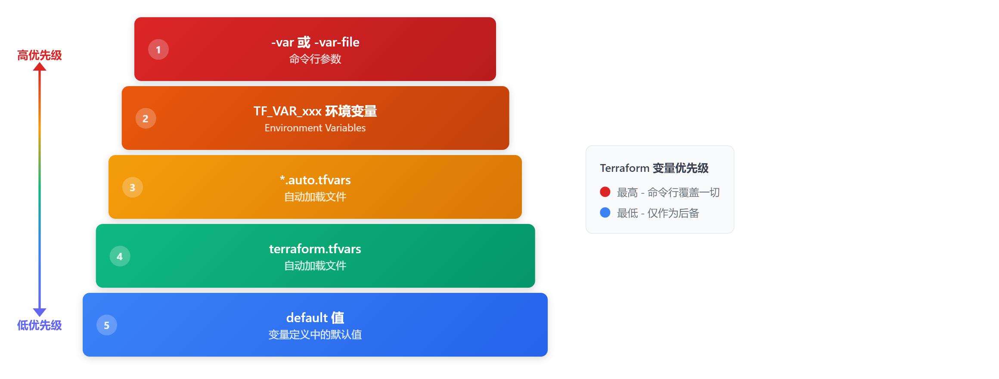

# 05 · 变量系统

> **目标**：掌握变量定义、类型系统与多环境配置  
> **前置**：已完成 [04 · Provider 策略与版本管理](../04-providers/)  
> **时间**：35-40 分钟  
> **费用**：S3 Bucket（免费层）

---

## 将学到的内容

1. 定义和使用 Input Variables
2. 掌握变量类型与验证规则
3. 使用 Local Values 减少重复
4. 使用 Output Values 导出数据
5. 理解变量优先级
6. 处理敏感变量

---

## Step 1 — 环境准备与连接（2 分钟）

连接到你的 Terraform Lab 实例。

**获取实例 ID：**

```bash
aws cloudformation describe-stacks \
  --stack-name terraform-lab \
  --region ap-northeast-1 \
  --query 'Stacks[0].Outputs[?OutputKey==`InstanceId`].OutputValue' \
  --output text
```

> **💡 连接方式**（选择你熟悉的）：
> - **AWS Console**：EC2 → 选择实例 → Connect → Session Manager
> - **AWS CLI**：`aws ssm start-session --target <实例ID> --region ap-northeast-1`
> - **VS Code**：Remote-SSH 连接（如已配置）
>
> **❓ 没有实例？** Stack 不存在或实例已终止？
> → [重新部署实验环境](../00-concepts/lab-setup.md)

连接后，切换到课程用户并同步代码：

```bash
sudo su - terraform
sync-course
```

确认上一课的资源已清理：

```bash
cd ~/cloud-atlas/iac/terraform/04-providers/code
terraform state list  # 应为空
```

---

## Step 2 — 立即体验：变量驱动的资源（5 分钟）

> 先"尝到"变量的灵活性。

### 2.1 进入示例代码目录

```bash
cd ~/cloud-atlas/iac/terraform/05-variables/code
ls -la
```

```
.
├── main.tf           # 主资源
├── variables.tf      # 变量定义
├── locals.tf         # 本地值
├── outputs.tf        # 输出值
├── providers.tf      # Provider 配置
├── terraform.tfvars  # 默认变量值
└── envs/
    ├── dev.tfvars    # 开发环境
    └── prod.tfvars   # 生产环境
```

### 2.2 使用开发环境配置

```bash
terraform init
terraform plan -var-file=envs/dev.tfvars
```

```
# aws_s3_bucket.app will be created
+ resource "aws_s3_bucket" "app" {
    + bucket = "myapp-dev-a1b2c3d4"
    + tags   = {
        + "Environment" = "dev"
        ...
    }
```

### 2.3 对比生产环境配置

```bash
terraform plan -var-file=envs/prod.tfvars
```

```
# aws_s3_bucket.app will be created
+ resource "aws_s3_bucket" "app" {
    + bucket = "myapp-prod-a1b2c3d4"
    + tags   = {
        + "Environment" = "prod"
        ...
    }
```

**同一套代码，不同的配置！**

### 2.4 创建开发环境

```bash
terraform apply -var-file=envs/dev.tfvars -auto-approve
```

```
Outputs:

bucket_name = "myapp-dev-a1b2c3d4"
environment = "dev"
```

---

## Step 3 — 发生了什么？（5 分钟）

### 3.1 变量定义结构

```hcl
variable "environment" {
  description = "部署环境（dev/staging/prod）"
  type        = string
  default     = "dev"

  validation {
    condition     = contains(["dev", "staging", "prod"], var.environment)
    error_message = "environment 必须是 dev、staging 或 prod"
  }
}
```

| 属性 | 作用 |
|------|------|
| `description` | 变量说明（文档用） |
| `type` | 类型约束 |
| `default` | 默认值（可选） |
| `validation` | 自定义验证规则 |
| `sensitive` | 标记为敏感（隐藏输出） |

### 3.2 变量优先级



<details>
<summary>View ASCII source</summary>

```
Terraform 变量优先级（从高到低）

  高优先级 ▲
           │   ┌─────────────────────────────────┐
         1 │   │  -var 或 -var-file 命令行参数    │
           │   └─────────────────────────────────┘
           │   ┌─────────────────────────────────┐
         2 │   │  *.auto.tfvars（字典序自动加载）  │
           │   └─────────────────────────────────┘
           │   ┌─────────────────────────────────┐
         3 │   │  terraform.tfvars.json          │
           │   └─────────────────────────────────┘
           │   ┌─────────────────────────────────┐
         4 │   │  terraform.tfvars               │
           │   └─────────────────────────────────┘
           │   ┌─────────────────────────────────┐
         5 │   │  TF_VAR_xxx 环境变量             │
           │   └─────────────────────────────────┘
           │   ┌─────────────────────────────────┐
         6 │   │  default 值（变量定义中的默认值） │
           │   └─────────────────────────────────┘
  低优先级 ▼
```

</details>

### 3.3 Local Values

```hcl
locals {
  # 计算值，避免重复
  name_prefix = "${var.project}-${var.environment}"

  # 合并标签
  common_tags = {
    Project     = var.project
    Environment = var.environment
    ManagedBy   = "terraform"
  }
}

# 使用 local
resource "aws_s3_bucket" "app" {
  bucket = "${local.name_prefix}-${random_id.suffix.hex}"
  tags   = local.common_tags
}
```

---

## Step 4 — 动手实验：变量类型（8 分钟）

> 探索 Terraform 的类型系统。

### 4.1 基本类型

查看 `variables.tf`：

```bash
cat variables.tf
```

```hcl
# 字符串
variable "project" {
  type    = string
  default = "myapp"
}

# 数字
variable "instance_count" {
  type    = number
  default = 1
}

# 布尔
variable "enable_versioning" {
  type    = bool
  default = true
}
```

### 4.2 复杂类型

```hcl
# 列表
variable "allowed_ips" {
  type    = list(string)
  default = ["10.0.0.0/8", "192.168.0.0/16"]
}

# Map
variable "instance_types" {
  type = map(string)
  default = {
    dev  = "t3.micro"
    prod = "t3.small"
  }
}

# Object
variable "bucket_config" {
  type = object({
    versioning = bool
    lifecycle_days = number
  })
  default = {
    versioning = true
    lifecycle_days = 90
  }
}
```

### 4.3 使用复杂类型

```bash
# 命令行传递 list
terraform plan -var='allowed_ips=["1.2.3.4/32"]'

# 命令行传递 map
terraform plan -var='instance_types={"dev":"t3.nano"}'
```

### 4.4 类型约束好处

```bash
# 尝试传递错误类型
terraform plan -var='enable_versioning="yes"'
```

```
Error: Invalid value for variable

  on variables.tf line XX:
  XX: variable "enable_versioning" {

This default value is not compatible with the variable's type constraint:
bool required.
```

**类型检查帮你在 apply 前发现问题！**

---

## Step 5 — 动手实验：变量验证（8 分钟）

> 添加自定义验证规则。

### 5.1 查看验证规则

```bash
grep -A 5 "validation" variables.tf
```

```hcl
variable "environment" {
  type = string

  validation {
    condition     = contains(["dev", "staging", "prod"], var.environment)
    error_message = "environment 必须是 dev、staging 或 prod"
  }
}
```

### 5.2 触发验证失败

```bash
terraform plan -var='environment=test'
```

```
Error: Invalid value for variable

  on variables.tf line XX:
  XX:   validation {

environment 必须是 dev、staging 或 prod

This was checked by the validation rule at variables.tf:XX,XX-XX.
```

### 5.3 常用验证模式

```hcl
# 正则匹配
validation {
  condition     = can(regex("^[a-z][a-z0-9-]*$", var.name))
  error_message = "name 必须以小写字母开头，只能包含小写字母、数字、连字符"
}

# 长度限制
validation {
  condition     = length(var.name) >= 3 && length(var.name) <= 63
  error_message = "name 长度必须在 3-63 字符之间"
}

# 范围检查
validation {
  condition     = var.instance_count >= 1 && var.instance_count <= 10
  error_message = "instance_count 必须在 1-10 之间"
}

# 跨变量验证（Terraform 1.9+）
validation {
  condition     = var.environment == "prod" ? var.instance_count >= 2 : true
  error_message = "生产环境至少需要 2 个实例"
}
```

> **Terraform 1.9+**：validation 块可引用其他变量和数据源，实现跨变量验证。

---

## Step 6 — 动手实验：敏感变量（5 分钟）

> 处理密码、密钥等敏感信息。

### 6.1 定义敏感变量

```hcl
variable "db_password" {
  type      = string
  sensitive = true
}
```

### 6.2 敏感变量的表现

```bash
# 设置环境变量
export TF_VAR_db_password="super-secret-123"

terraform plan
```

```
# In outputs or logs:
db_password = (sensitive value)
```

### 6.3 敏感变量的限制

```hcl
# 尝试在非敏感输出中使用敏感值
output "password_hint" {
  value = "Password starts with: ${substr(var.db_password, 0, 3)}"
}
```

```
Error: Output refers to sensitive values

  on outputs.tf line XX:
  XX: output "password_hint" {

This output value refers to sensitive value.
Add `sensitive = true` to the output to suppress this error.
```

### 6.4 安全警告

**`sensitive = true` 不是安全措施！**

- 只是隐藏 CLI 输出
- 值仍然**明文存储在 State 中**
- 真正的密钥应使用 SSM Parameter Store 或 Secrets Manager

```hcl
# 推荐：从 SSM 获取密钥
data "aws_ssm_parameter" "db_password" {
  name = "/myapp/db/password"
}

# 使用
password = data.aws_ssm_parameter.db_password.value
```

### 6.5 临时变量（Terraform 1.10+）

> **新功能**：Terraform 1.10 引入了 `ephemeral` 变量，值**不会存储在 State 中**。

```hcl
# Terraform 1.10+: 临时变量
variable "db_password" {
  type      = string
  ephemeral = true  # 值不会存储在 State！
}
```

**对比**：

| 特性 | `sensitive = true` | `ephemeral = true` |
|------|--------------------|--------------------|
| CLI 输出 | 隐藏 | 隐藏 |
| State 存储 | **明文存储** | **不存储** |
| TF 版本 | 任意 | 1.10+ |
| 用途 | 隐藏输出 | 真正的密钥保护 |

---

## Step 7 — 深入理解：环境管理（5 分钟）

### 7.1 文件结构

```
project/
├── main.tf
├── variables.tf
├── envs/
│   ├── dev.tfvars      # -var-file=envs/dev.tfvars
│   ├── staging.tfvars
│   └── prod.tfvars
└── terraform.tfvars    # 自动加载（共享默认值）
```

### 7.2 环境切换

```bash
# 开发环境
terraform plan -var-file=envs/dev.tfvars

# 生产环境
terraform plan -var-file=envs/prod.tfvars

# 使用环境变量
export TF_VAR_environment=prod
terraform plan
```

### 7.3 自动加载规则

| 文件 | 自动加载？ | 优先级 |
|------|------------|--------|
| `terraform.tfvars` | 是 | 低 |
| `terraform.tfvars.json` | 是 | 中 |
| `*.auto.tfvars` / `*.auto.tfvars.json` | 是（字典序） | 高 |
| `envs/dev.tfvars` | 否，需要 `-var-file` | 最高 |

---

## Step 8 — 清理资源（2 分钟）

```bash
cd ~/cloud-atlas/iac/terraform/05-variables/code
terraform destroy -var-file=envs/dev.tfvars -auto-approve
```

```
Destroy complete! Resources: 2 destroyed.
```

---

## 本课小结

| 概念 | 说明 |
|------|------|
| `variable` | 输入变量定义 |
| `type` | 类型约束（string, number, bool, list, map, object） |
| `validation` | 自定义验证规则 |
| `sensitive` | 隐藏输出（不是安全措施！） |
| `locals` | 本地计算值，减少重复 |
| `output` | 导出值供外部使用 |

**变量优先级**（高 → 低）：

```
-var > *.auto.tfvars > terraform.tfvars.json > terraform.tfvars > TF_VAR_ > default
```

---

## 下一步

变量系统掌握了，但如何批量创建资源？

→ [06 · 循环条件与表达式](../06-loops/)

---

## 面试准备

**よくある質問**

**Q: 変数の優先順位は？**

A: 高い順に：`-var`/`-var-file`（コマンドライン）> `*.auto.tfvars` > `terraform.tfvars.json` > `terraform.tfvars` > `TF_VAR_` 環境変数 > `default` 値。同じ変数が複数箇所で定義されている場合、優先度の高い方が使われる。

**Q: sensitive = true の効果と限界は？**

A: CLI 出力を隠すだけ。State ファイルには平文で保存される。本当のシークレットは SSM Parameter Store や Secrets Manager を使用すべき。

**Q: locals と variable の違いは？**

A: variable は外部から値を受け取る入力。locals は内部で計算する値（他の variable や resource から派生）。locals はコード内でのみ使用、外部からの上書きは不可。

**Q: 複雑な型（object, map）はいつ使う？**

A: 関連する設定をグループ化する場合。例えば EC2 インスタンス設定を object で定義し、環境ごとに異なる設定を map で管理。

---

## トラブルシューティング

**よくある問題**

**変数未定義エラー**

```
Error: No value for required variable
```

```bash
# 対処：デフォルト値を設定するか、-var で指定
terraform plan -var='variable_name=value'
```

**型不一致**

```
Error: Invalid value for variable
This default value is not compatible with the variable's type constraint
```

→ 変数の `type` と渡している値の型を確認。

**tfvars ファイルが読み込まれない**

```bash
# 自動読み込みは terraform.tfvars と *.auto.tfvars のみ
# その他は -var-file で明示的に指定
terraform plan -var-file=envs/dev.tfvars
```

---

## 系列导航

← [04 · Provider 策略](../04-providers/) | [Home](../) | [06 · 循環条件 →](../06-loops/)
