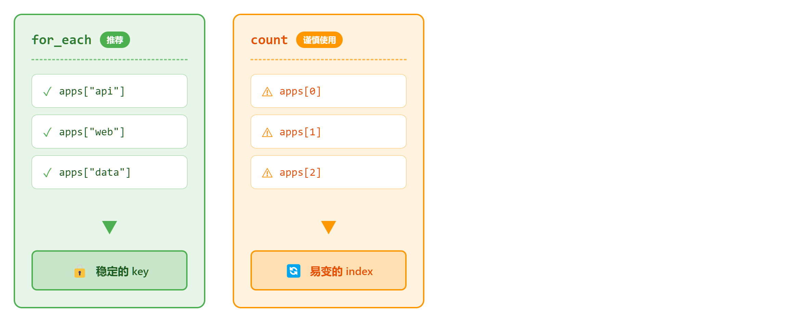

# 06 · 循环条件与表达式

> **目标**：掌握 count、for_each、dynamic blocks 与常用函数
> **前置**：已完成 [05 · 变量系统](../05-variables/)
> **时间**：40-45 分钟
> **费用**：S3 Bucket + IAM Users（免费层）

---

## 将学到的内容

1. 理解 count vs for_each 的选择
2. 体验 Index Shift 问题（count 的陷阱）
3. 使用 for 表达式处理集合
4. 使用 dynamic blocks 动态生成配置
5. 掌握常用内置函数

---

## Step 1 — 快速验证环境（2 分钟）

连接到你的 Terraform Lab 实例：

```bash
aws ssm start-session --target i-你的实例ID --region ap-northeast-1
```

确认上一课的资源已清理：

```bash
cd ~/cloud-atlas/iac/terraform/05-variables/code
terraform state list  # 应为空
```

---

## Step 2 — 立即体验：批量创建资源（5 分钟）

> 先"尝到" for_each 的便利，再理解原理。

### 2.1 进入示例代码目录

```bash
cd ~/cloud-atlas/iac/terraform/06-loops/code
ls -la
```

```
.
├── main.tf           # 主资源（for_each 示例）
├── count-demo.tf     # count 示例（反模式演示）
├── dynamic.tf        # dynamic blocks 示例
├── functions.tf      # 常用函数示例
├── variables.tf      # 变量定义
├── outputs.tf        # 输出值
└── providers.tf      # Provider 配置
```

### 2.2 创建多个 S3 Buckets

```bash
terraform init
terraform plan
```

观察输出——一次创建多个资源：

```
# aws_s3_bucket.apps["api"] will be created
# aws_s3_bucket.apps["web"] will be created
# aws_s3_bucket.apps["data"] will be created

Plan: 3 to add, 0 changed, 0 to destroy.
```

```bash
terraform apply -auto-approve
```

### 2.3 查看创建的资源

```bash
terraform state list
```

```
aws_s3_bucket.apps["api"]
aws_s3_bucket.apps["web"]
aws_s3_bucket.apps["data"]
```

注意资源地址：`aws_s3_bucket.apps["api"]`（带 key，不是 index）

---

## Step 3 — 发生了什么？（5 分钟）

### 3.1 for_each 语法

```hcl
variable "app_buckets" {
  type = map(object({
    versioning = bool
  }))
  default = {
    api  = { versioning = true }
    web  = { versioning = false }
    data = { versioning = true }
  }
}

resource "aws_s3_bucket" "apps" {
  for_each = var.app_buckets

  bucket = "myapp-${each.key}-${random_id.suffix.hex}"

  tags = {
    App = each.key
  }
}
```

| 变量 | 含义 |
|------|------|
| `each.key` | Map 的 key（"api", "web", "data"） |
| `each.value` | Map 的 value（整个 object） |
| `each.value.versioning` | Object 的属性 |

### 3.2 for_each vs count



**for_each 优势**：删除中间元素不影响其他资源

---

## Step 4 — 失败实验室：Index Shift（10 分钟）

> 亲自体验 count 的陷阱！

### 4.1 查看 count 示例

```bash
cat count-demo.tf
```

```hcl
variable "users" {
  type    = list(string)
  default = ["alice", "bob", "charlie"]
}

resource "aws_iam_user" "team" {
  count = length(var.users)
  name  = var.users[count.index]
}
```

### 4.2 创建初始资源

```bash
# 启用 count 示例（取消注释）
# 或直接 apply 当前配置
terraform apply -auto-approve
```

```
aws_iam_user.team[0] (alice)
aws_iam_user.team[1] (bob)
aws_iam_user.team[2] (charlie)
```

### 4.3 触发 Index Shift

编辑 `variables.tf`，在列表**中间**添加用户：

```hcl
variable "users" {
  default = ["alice", "david", "bob", "charlie"]
  #                    ^^^^^ 新增
}
```

```bash
terraform plan
```

**灾难发生！**

```
# aws_iam_user.team[1] must be replaced (bob → david)
# aws_iam_user.team[2] must be replaced (charlie → bob)
# aws_iam_user.team[3] will be created (charlie)

Plan: 1 to add, 0 to change, 2 to replace.
```

**bob 和 charlie 会被删除重建！** 这是因为：

```
之前:                    之后:
[0] alice               [0] alice      ✓ 不变
[1] bob                 [1] david      ✗ bob 被替换为 david
[2] charlie             [2] bob        ✗ charlie 被替换为 bob
                        [3] charlie    + 新建
```

### 4.4 for_each 解决方案

```hcl
variable "users" {
  type    = set(string)
  default = ["alice", "bob", "charlie"]
}

resource "aws_iam_user" "team" {
  for_each = var.users
  name     = each.key
}
```

现在添加 david：

```bash
terraform plan
```

```
# aws_iam_user.team["david"] will be created

Plan: 1 to add, 0 to change, 0 to destroy.
```

**只创建新用户，其他不受影响！**

---

## Step 5 — 动手实验：for 表达式（8 分钟）

> 使用 for 表达式转换数据。

### 5.1 基本语法

```hcl
# List → List
locals {
  upper_names = [for name in var.users : upper(name)]
  # ["ALICE", "BOB", "CHARLIE"]
}

# List → Map
locals {
  user_map = { for name in var.users : name => "${name}@example.com" }
  # {"alice" = "alice@example.com", ...}
}

# 带条件过滤
locals {
  long_names = [for name in var.users : name if length(name) > 3]
  # ["alice", "charlie"]
}
```

### 5.2 实际应用

```bash
terraform console
```

```hcl
> [for name in ["alice", "bob"] : upper(name)]
["ALICE", "BOB"]

> { for name in ["alice", "bob"] : name => "${name}@example.com" }
{"alice" = "alice@example.com", "bob" = "bob@example.com"}

> [for name in ["alice", "bob", "charlie"] : name if length(name) > 3]
["alice", "charlie"]
```

退出 console：`exit`

### 5.3 Splat 表达式

```hcl
# 获取所有 bucket 的 ARN
output "all_bucket_arns" {
  value = [for bucket in aws_s3_bucket.apps : bucket.arn]
}

# 等价的 splat 语法
output "all_bucket_arns_splat" {
  value = values(aws_s3_bucket.apps)[*].arn
}
```

---

## Step 6 — 动手实验：dynamic blocks（8 分钟）

> 动态生成嵌套块。

### 6.1 问题场景

```hcl
# 硬编码多个 ingress 规则 - 不灵活
resource "aws_security_group" "example" {
  ingress {
    from_port = 22
    to_port   = 22
    ...
  }
  ingress {
    from_port = 80
    to_port   = 80
    ...
  }
  ingress {
    from_port = 443
    to_port   = 443
    ...
  }
}
```

### 6.2 dynamic block 解决方案

```bash
cat dynamic.tf
```

```hcl
variable "ingress_rules" {
  type = list(object({
    port        = number
    description = string
  }))
  default = [
    { port = 22,  description = "SSH" },
    { port = 80,  description = "HTTP" },
    { port = 443, description = "HTTPS" }
  ]
}

resource "aws_security_group" "dynamic_demo" {
  name   = "dynamic-sg-demo"
  vpc_id = data.aws_vpc.default.id

  dynamic "ingress" {
    for_each = var.ingress_rules

    content {
      from_port   = ingress.value.port
      to_port     = ingress.value.port
      protocol    = "tcp"
      cidr_blocks = ["0.0.0.0/0"]
      description = ingress.value.description
    }
  }
}
```

### 6.3 dynamic block 语法

```hcl
dynamic "块名称" {
  for_each = 集合

  content {
    # 使用 块名称.key 和 块名称.value
    属性 = 块名称.value.xxx
  }
}
```

### 6.4 添加新规则

编辑 `variables.tf`，添加 8080 端口：

```hcl
{ port = 8080, description = "Custom App" }
```

```bash
terraform plan
```

```
# aws_security_group.dynamic_demo will be updated in-place
  + ingress {
      + from_port   = 8080
      + to_port     = 8080
      ...
    }
```

---

## Step 7 — 常用函数参考（5 分钟）

### 7.1 集合函数

```hcl
# lookup - 安全获取 map 值
lookup(var.instance_types, "dev", "t3.micro")

# merge - 合并 maps
merge(local.default_tags, var.extra_tags)

# flatten - 扁平化嵌套列表
flatten([[1, 2], [3, 4]])  # [1, 2, 3, 4]

# keys / values - 获取 map 的键/值
keys(var.app_buckets)    # ["api", "data", "web"]
values(var.app_buckets)  # [{...}, {...}, {...}]
```

### 7.2 字符串函数

```hcl
# format - 格式化字符串
format("bucket-%s-%s", var.env, var.region)

# join / split
join("-", ["a", "b", "c"])  # "a-b-c"
split("-", "a-b-c")         # ["a", "b", "c"]

# replace
replace("hello-world", "-", "_")  # "hello_world"
```

### 7.3 文件函数

```hcl
# file - 读取文件内容
file("${path.module}/scripts/init.sh")

# templatefile - 模板渲染
templatefile("${path.module}/templates/config.tpl", {
  db_host = var.db_host
  db_port = var.db_port
})

# jsonencode / yamlencode
jsonencode({ key = "value" })
```

---

## Step 8 — 清理资源（3 分钟）

```bash
cd ~/cloud-atlas/iac/terraform/06-loops/code
terraform destroy -auto-approve
```

```
Destroy complete! Resources: X destroyed.
```

---

## 本课小结

| 概念 | 说明 |
|------|------|
| `count` | 基于数量创建，index 易变 |
| `for_each` | 基于 key 创建，**推荐** |
| `for` | 表达式，转换集合 |
| `dynamic` | 动态生成嵌套块 |
| `splat [*]` | 批量获取属性 |

**反模式警告**：

| 不要这样做 | 为什么 |
|------------|--------|
| count + 可变列表 | Index Shift 破坏资源 |
| 不稳定的 for_each key | 同样导致重建 |
| 过度使用 dynamic | 降低可读性 |

---

## 下一步

代码越来越复杂，需要模块化封装。

→ [07 · 模块化设计](../07-modules/)

---

## 面试准备

**よくある質問**

**Q: count と for_each の使い分けは？**

A: `count` は同一リソースの複数作成（順序依存、index ベース）。`for_each` は各リソースに固有キー（安定、key ベース）。リストの途中に要素を追加しても他のリソースに影響しない `for_each` を推奨。

**Q: Index Shift とは？**

A: `count` 使用時、リストの途中に要素を追加/削除すると、後続のインデックスがずれてリソースが再作成される問題。例：`[alice, bob]` に `david` を挿入 → bob のインデックスが変わり再作成。

**Q: dynamic block はいつ使う？**

A: 可変数の嵌套ブロック（ingress ルール、タグ等）を動的に生成する場合。ただし過度な使用はコードの可読性を下げるため、シンプルな場合は静的定義を推奨。

---

## トラブルシューティング

**よくある問題**

**for_each に list を渡せない**

```
Error: Invalid for_each argument
The given "for_each" argument value is unsuitable
```

```hcl
# list を set に変換
for_each = toset(var.users)

# または map に変換
for_each = { for user in var.users : user => user }
```

**dynamic block で iterator 名を変更**

```hcl
dynamic "ingress" {
  for_each = var.rules
  iterator = rule  # デフォルトは "ingress"

  content {
    from_port = rule.value.port  # ingress.value ではなく rule.value
  }
}
```

**count と for_each の混在**

→ 同一リソースでは count と for_each を同時に使用できない。どちらか一方を選択。

---

## 系列导航

← [05 · 变量系统](../05-variables/) | [Home](../) | [07 · 模块化 →](../07-modules/)
