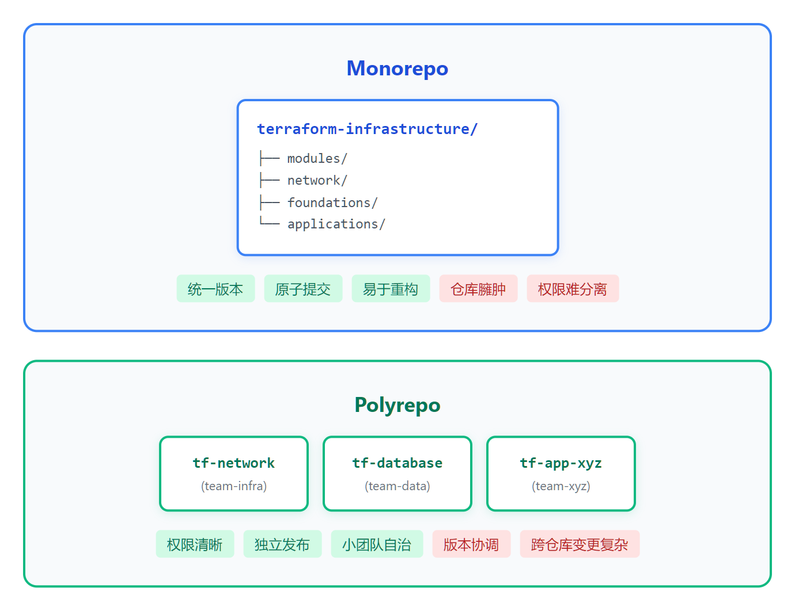

# 08 - 项目布局与多环境策略

> **目标**：设计 Terraform 项目的目录结构，实现多环境管理  
> **前置**：已完成 [07 - 模块化设计](../07-modules/)  
> **时间**：45-50 分钟  
> **费用**：S3 Bucket（免费层）

---

## 将学到的内容

1. Workspaces vs Directory 结构对比及选择
2. Monorepo vs Polyrepo 架构决策
3. 分层设计（Network / Foundations / Application）
4. 环境提升策略（Promotion）
5. DRY 模式介绍（Terragrunt 简介）

---

## Step 1 - 环境准备与连接（2 分钟）

连接到你的 Terraform Lab 实例。

**获取实例 ID：**

```bash
aws cloudformation describe-stacks \
  --stack-name terraform-lab \
  --region ap-northeast-1 \
  --query 'Stacks[0].Outputs[?OutputKey==`InstanceId`].OutputValue' \
  --output text
```

> **💡 连接方式**（选择你熟悉的）：  
> - **AWS Console**：EC2 → 选择实例 → Connect → Session Manager  
> - **AWS CLI**：`aws ssm start-session --target <实例ID> --region ap-northeast-1`  
> - **VS Code**：Remote-SSH 连接（如已配置）  
>
> **❓ 没有实例？** Stack 不存在或实例已终止？  
> → [重新部署实验环境](../00-concepts/lab-setup.md)

连接后，切换到课程用户并同步代码：

```bash
sudo su - terraform
sync-course
```

确认上一课的资源已清理：

```bash
cd ~/cloud-atlas/iac/terraform/07-modules/code/environments/dev
terraform state list  # 应为空
```

---

## Step 2 - 立即体验：Workspaces（5 分钟）

> 先"尝到" Workspaces 的便利，再理解其局限。

### 2.1 进入示例代码目录

```bash
cd ~/cloud-atlas/iac/terraform/08-layout/code/workspaces
ls -la
```

```
.
├── main.tf          # S3 Bucket 资源
├── variables.tf     # 输入变量
├── outputs.tf       # 输出值
└── providers.tf     # Provider 配置
```

### 2.2 创建和切换 Workspaces

```bash
# 初始化
terraform init

# 查看当前 workspace
terraform workspace list
```

```
* default
```

```bash
# 创建并切换到 dev workspace
terraform workspace new dev

# 创建 staging workspace
terraform workspace new staging

# 查看所有 workspaces
terraform workspace list
```

```
  default
* staging
  dev
```

### 2.3 在不同 Workspace 部署

```bash
# 切换到 dev
terraform workspace select dev

# 部署 dev 环境
terraform apply -auto-approve
```

```
Outputs:

bucket_name = "demo-bucket-dev-a1b2c3d4"
environment = "dev"
```

```bash
# 切换到 staging
terraform workspace select staging

# 部署 staging 环境
terraform apply -auto-approve
```

```
Outputs:

bucket_name = "demo-bucket-staging-e5f6g7h8"
environment = "staging"
```

**同一份代码，两个独立的 State！**

---

## Step 3 - 发生了什么？（5 分钟）

### 3.1 Workspaces 原理


<details>
<summary>View ASCII source</summary>

```
              ┌─────────────────────────┐
              │  同一份代码 (main.tf)    │
              └───────────┬─────────────┘
                          │
          ┌───────────────┼───────────────┐
          ▼               ▼               ▼
┌─────────────────┐ ┌─────────────────┐ ┌─────────────────┐
│  default state  │ │    dev state    │ │  staging state  │
│ terraform.tfstate│ │ terraform.tfstate│ │ terraform.tfstate│
│   .d/default    │ │     .d/dev      │ │   .d/staging    │
└────────┬────────┘ └────────┬────────┘ └────────┬────────┘
         ▼                   ▼                   ▼
┌─────────────────┐ ┌─────────────────┐ ┌─────────────────┐
│  AWS Resources  │ │  AWS Resources  │ │  AWS Resources  │
│  (default env)  │ │   (dev env)     │ │  (staging env)  │
└─────────────────┘ └─────────────────┘ └─────────────────┘
```

</details>

### 3.2 State 文件位置

```bash
# 查看本地 state 目录结构
ls -la terraform.tfstate.d/
```

```
drwxr-xr-x  dev/
drwxr-xr-x  staging/
```

每个 workspace 有独立的 state 文件。

### 3.3 在代码中使用 workspace

```hcl
resource "aws_s3_bucket" "demo" {
  bucket = "demo-bucket-${terraform.workspace}-${random_id.suffix.hex}"

  tags = {
    Environment = terraform.workspace
  }
}
```

`terraform.workspace` 变量自动获取当前 workspace 名称。

---

## Step 4 - Workspaces 的局限（5 分钟）

> Workspaces 适合简单场景，但企业级场景有明显局限。

### 4.1 局限性分析

| 局限 | 说明 | 风险 |
|------|------|------|
| **同代码约束** | 所有环境必须使用相同配置 | 无法为 prod 单独配置 |
| **切换风险** | 需手动切换 workspace | 误操作可能影响错误环境 |
| **权限难分离** | 同目录难以设置不同权限 | 难以限制 prod 访问 |
| **CI/CD 复杂** | 需在 pipeline 中切换 workspace | 增加出错可能 |

### 4.2 适用场景

| 场景 | 推荐 |
|------|------|
| 个人项目、小团队 | Workspaces |
| 需要环境差异化配置 | Directory |
| 严格权限分离（prod 隔离） | Directory |
| CI/CD 自动化 | Directory |

---

## Step 5 - Directory 结构（企业级）（10 分钟）

> 企业级推荐：每环境独立目录。

### 5.1 查看目录结构

```bash
cd ~/cloud-atlas/iac/terraform/08-layout/code/directory-structure
tree -L 3
```

```
.
├── modules/
│   └── s3-bucket/
│       ├── main.tf
│       ├── variables.tf
│       └── outputs.tf
├── environments/
│   ├── dev/
│   │   ├── main.tf
│   │   ├── variables.tf
│   │   ├── terraform.tfvars
│   │   └── backend.tf
│   ├── staging/
│   │   ├── main.tf
│   │   ├── variables.tf
│   │   ├── terraform.tfvars
│   │   └── backend.tf
│   └── prod/
│       ├── main.tf
│       ├── variables.tf
│       ├── terraform.tfvars
│       └── backend.tf
└── README.md
```

### 5.2 每环境独立 State

```hcl
# environments/dev/backend.tf
terraform {
  backend "s3" {
    bucket       = "my-terraform-state"
    key          = "dev/terraform.tfstate"    # dev 独立路径
    region       = "ap-northeast-1"
    use_lockfile = true  # Terraform 1.10+ 原生 S3 锁定
    encrypt      = true
  }
}

# environments/prod/backend.tf
terraform {
  backend "s3" {
    bucket       = "my-terraform-state"
    key          = "prod/terraform.tfstate"   # prod 独立路径
    region       = "ap-northeast-1"
    use_lockfile = true  # Terraform 1.10+ 原生 S3 锁定
    encrypt      = true
  }
}
```

### 5.3 环境差异化配置

```hcl
# environments/dev/terraform.tfvars
environment   = "dev"
instance_type = "t3.small"
min_capacity  = 1
max_capacity  = 2

# environments/prod/terraform.tfvars
environment   = "prod"
instance_type = "t3.large"
min_capacity  = 3
max_capacity  = 10
```

### 5.4 部署流程

```bash
# 部署 dev
cd environments/dev
terraform init
terraform apply

# 部署 prod（完全独立）
cd ../prod
terraform init
terraform apply
```

**无切换风险，不会误操作！**

---

## Step 6 - 分层设计（10 分钟）

> 大型项目需要分层管理，避免"一次 apply 全部"的风险。

### 6.1 分层原则


<details>
<summary>View ASCII source</summary>

```
┌─────────────────────────────────────────────────┐
│         Layer 3: Application                    │
│  ┌──────────┐  ┌──────────┐  ┌──────────┐      │
│  │   EC2    │  │   ECS    │  │  Lambda  │      │
│  │Instances │  │ Services │  │Functions │      │
│  └──────────┘  └──────────┘  └──────────┘      │
│            变更频繁 | 影响范围小                 │
└─────────────────────────┬───────────────────────┘
                          ▲ 依赖
┌─────────────────────────┴───────────────────────┐
│         Layer 2: Foundations                    │
│  ┌──────────┐  ┌────────────┐  ┌──────────┐    │
│  │   RDS    │  │ElastiCache │  │    S3    │    │
│  │Databases │  │  Clusters  │  │ Buckets  │    │
│  └──────────┘  └────────────┘  └──────────┘    │
│            变更中等 | 影响范围中                 │
└─────────────────────────┬───────────────────────┘
                          ▲ 依赖
┌─────────────────────────┴───────────────────────┐
│         Layer 1: Network                        │
│  ┌──────────┐  ┌──────────┐  ┌──────────┐      │
│  │   VPC    │  │ Subnets  │  │ Route53  │      │
│  │          │  │  NAT GW  │  │  Zones   │      │
│  └──────────┘  └──────────┘  └──────────┘      │
│            变更少 | 影响范围大                   │
└─────────────────────────────────────────────────┘
```

</details>

### 6.2 查看分层目录结构

```bash
cd ~/cloud-atlas/iac/terraform/08-layout/code/layered
tree -L 3
```

```
.
├── 01-network/
│   ├── dev/
│   │   ├── main.tf
│   │   ├── outputs.tf
│   │   └── backend.tf
│   └── prod/
│       └── ...
├── 02-foundations/
│   ├── dev/
│   │   ├── main.tf          # 引用 01-network 的 outputs
│   │   ├── data.tf          # remote_state 数据源
│   │   └── backend.tf
│   └── prod/
│       └── ...
├── 03-application/
│   ├── dev/
│   │   ├── main.tf          # 引用 01 和 02 的 outputs
│   │   ├── data.tf
│   │   └── backend.tf
│   └── prod/
│       └── ...
└── README.md
```

### 6.3 跨层数据共享

```hcl
# 02-foundations/dev/data.tf
# 读取 network 层的 outputs
data "terraform_remote_state" "network" {
  backend = "s3"
  config = {
    bucket = "my-terraform-state"
    key    = "dev/network/terraform.tfstate"
    region = "ap-northeast-1"
  }
}

# 使用 network 层的输出
resource "aws_db_instance" "main" {
  # 引用 network 层的 subnet IDs
  db_subnet_group_name = data.terraform_remote_state.network.outputs.db_subnet_group_name
  vpc_security_group_ids = [
    data.terraform_remote_state.network.outputs.db_security_group_id
  ]
  # ...
}
```

### 6.4 分层优势

| 优势 | 说明 |
|------|------|
| **降低爆炸半径** | 应用层变更不影响网络层 |
| **并行开发** | 不同团队管理不同层 |
| **审批分离** | 网络层变更需额外审批 |
| **恢复简单** | 只需回滚受影响的层 |

---

## Step 7 - Monorepo vs Polyrepo（5 分钟）

### 7.1 两种方式对比



<details>
<summary>View ASCII source</summary>

```
┌─────────────────────────────────────────────────┐
│                   Monorepo                      │
│  ┌───────────────────────────────────────────┐  │
│  │ terraform-infrastructure/                 │  │
│  │ ├── modules/                              │  │
│  │ ├── network/                              │  │
│  │ ├── foundations/                          │  │
│  │ └── applications/                         │  │
│  └───────────────────────────────────────────┘  │
│  [统一版本] [原子提交] [易于重构] [仓库臃肿] [权限难分离] │
└─────────────────────────────────────────────────┘

┌─────────────────────────────────────────────────┐
│                   Polyrepo                      │
│  ┌─────────────┐ ┌─────────────┐ ┌───────────┐  │
│  │ tf-network  │ │ tf-database │ │ tf-app-xyz│  │
│  │ (team-infra)│ │ (team-data) │ │ (team-xyz)│  │
│  └─────────────┘ └─────────────┘ └───────────┘  │
│  [权限清晰] [独立发布] [小团队自治] [版本协调] [跨仓库变更复杂] │
└─────────────────────────────────────────────────┘
```

</details>

### 7.2 选择建议

| 场景 | 推荐 | 理由 |
|------|------|------|
| 小型团队（<10人） | Monorepo | 简单、统一 |
| 大型组织 | Polyrepo | 权限、自治 |
| 平台团队 + 应用团队 | 混合 | 平台用 Monorepo，应用用 Polyrepo |

---

## Step 8 - 环境提升策略（5 分钟）

> 如何将变更从 dev 安全地推进到 prod？

### 8.1 两种策略


<details>
<summary>View ASCII source</summary>

```
┌─────────────────────────────────────────────────────────────┐
│         Strategy 1: Branch-based Promotion                  │
│                                                             │
│  feature ──PR──▶ develop ──PR──▶ staging ──PR──▶ main      │
│            (dev)    (dev)    (staging)   (prod)            │
│                                                             │
│          简单直观，但 main 可能与 develop 偏离               │
└─────────────────────────────────────────────────────────────┘

┌─────────────────────────────────────────────────────────────┐
│         Strategy 2: Artifact-based Promotion                │
│                                                             │
│              ┌───────────────────────┐                      │
│              │  main (single branch) │                      │
│              └───────────┬───────────┘                      │
│                          ▼                                  │
│    build ──▶ test ──▶ deploy dev ──▶ deploy prod           │
│                          │                                  │
│                          ▼                                  │
│               ┌──────────────────────┐                      │
│               │ [versioned artifact] │                      │
│               │       v1.2.3         │                      │
│               └──────────────────────┘                      │
│         单一分支，artifact 版本化，更可追溯                  │
└─────────────────────────────────────────────────────────────┘
```

</details>

### 8.2 日本企业常见流程

在日本 IT 现场，变更管理（変更管理）通常遵循严格的审批流程：

```
1. 开发者提交 PR（変更申請）
2. Plan 输出附到 PR（変更内容確認）
3. レビュー + 承認
4. dev 环境 Apply + 验证
5. 提交 staging 申请（本番前テスト）
6. staging 验证完成
7. 提交 prod 申请（本番適用）
8. 変更管理委員会承認
9. prod Apply（通常在業務時間外）
```

> 日本的运维现场，这叫做「変更管理」(henkou kanri)。  
> 每次 prod 变更都需要留下证迹（エビデンス）。

---

## Step 9 - DRY 模式：Terragrunt 简介（5 分钟）

> 当 Directory 结构导致大量重复时，Terragrunt 可以帮助保持 DRY。

### 9.1 问题：重复的 backend 配置

```hcl
# environments/dev/backend.tf
terraform {
  backend "s3" {
    bucket       = "my-terraform-state"
    key          = "dev/terraform.tfstate"     # 只有这里不同
    region       = "ap-northeast-1"
    use_lockfile = true
    encrypt      = true
  }
}

# environments/staging/backend.tf
terraform {
  backend "s3" {
    bucket       = "my-terraform-state"
    key          = "staging/terraform.tfstate" # 只有这里不同
    region       = "ap-northeast-1"
    use_lockfile = true
    encrypt      = true
  }
}

# environments/prod/backend.tf
# ... 同样的重复
```

### 9.2 Terragrunt 解决方案

```hcl
# terragrunt.hcl (根目录)
remote_state {
  backend = "s3"
  generate = {
    path      = "backend.tf"
    if_exists = "overwrite_terragrunt"
  }
  config = {
    bucket       = "my-terraform-state"
    key          = "${path_relative_to_include()}/terraform.tfstate"
    region       = "ap-northeast-1"
    use_lockfile = true  # Terraform 1.10+ 原生 S3 锁定
    encrypt      = true
  }
}

# environments/dev/terragrunt.hcl
include "root" {
  path = find_in_parent_folders()
}

inputs = {
  environment = "dev"
}
```

### 9.3 Terragrunt 功能概览

| 功能 | 说明 |
|------|------|
| **DRY Backend** | 自动生成 backend.tf |
| **DRY Inputs** | 继承和覆盖变量 |
| **依赖管理** | 自动检测层间依赖 |
| **run-all** | 一次部署多个环境 |

### 9.4 是否使用 Terragrunt？

| 场景 | 建议 |
|------|------|
| 2-3 个环境 | 原生 Terraform 足够 |
| 5+ 环境 + 分层 | 考虑 Terragrunt |
| 团队熟悉度低 | 先掌握原生 Terraform |

> 本课程不深入 Terragrunt，但了解它的存在对职业发展有帮助。  
> 官方文档：https://terragrunt.gruntwork.io/

---

## Step 10 - 动手练习：设计多环境目录布局（10 分钟）

> 运用本课所学，设计一个三环境目录结构。

### 10.1 需求

设计一个包含以下内容的目录结构：
- 三个环境：dev / staging / prod
- 共享模块：VPC、S3
- 两层架构：network + application

### 10.2 参考答案

```
my-infrastructure/
├── modules/
│   ├── vpc/
│   │   ├── main.tf
│   │   ├── variables.tf
│   │   └── outputs.tf
│   └── s3-bucket/
│       ├── main.tf
│       ├── variables.tf
│       └── outputs.tf
├── layers/
│   ├── 01-network/
│   │   ├── dev/
│   │   │   ├── main.tf
│   │   │   ├── variables.tf
│   │   │   ├── terraform.tfvars
│   │   │   └── backend.tf
│   │   ├── staging/
│   │   │   └── ...
│   │   └── prod/
│   │       └── ...
│   └── 02-application/
│       ├── dev/
│       │   ├── main.tf
│       │   ├── data.tf          # remote_state
│       │   ├── variables.tf
│       │   ├── terraform.tfvars
│       │   └── backend.tf
│       ├── staging/
│       │   └── ...
│       └── prod/
│           └── ...
└── README.md
```

---

> **🔬 进阶实验**：想动手部署 Directory Structure 和 Layered Architecture 示例？  
> → [进阶实验：多环境布局实践](./lab-advanced.md)（30-40 分钟，包含完整验证步骤）

---

## Step 11 - 清理资源（3 分钟）

```bash
# 清理 workspaces 示例
cd ~/cloud-atlas/iac/terraform/08-layout/code/workspaces

# 清理 staging
terraform workspace select staging
terraform destroy -auto-approve

# 清理 dev
terraform workspace select dev
terraform destroy -auto-approve

# 删除 workspaces
terraform workspace select default
terraform workspace delete staging
terraform workspace delete dev
```

```
Deleted workspace "staging"!
Deleted workspace "dev"!
```

---

## 本课小结

| 策略 | 适用场景 | 优势 | 劣势 |
|------|----------|------|------|
| **Workspaces** | 小型项目、个人 | 简单、快速 | 同代码约束、切换风险 |
| **Directory** | 企业级、多团队 | 隔离、权限分离 | 配置重复 |
| **分层设计** | 大型项目 | 降低爆炸半径 | 复杂度增加 |
| **Terragrunt** | 超多环境 | DRY 配置 | 学习成本 |

**核心决策流程**：


<details>
<summary>View ASCII source</summary>

```
                    ┌─────────────────┐
                    │  多环境需求?     │
                    └────────┬────────┘
                             │
            ┌────────────────┴────────────────┐
            ▼                                 ▼
    ┌───────────────┐                 ┌───────────────┐
    │ 环境配置相同?  │                 │ 配置需差异化?  │
    └───────┬───────┘                 └───────┬───────┘
            ▼                                 ▼
    ┌───────────────┐                 ┌───────────────┐
    │  Workspaces   │                 │ Directory 结构 │
    │  (简单场景)    │                 │   (企业级)     │
    └───────────────┘                 └───────┬───────┘
                                              │
                              ┌───────────────┴───────────────┐
                              ▼                               ▼
                      ┌─────────────┐                 ┌─────────────┐
                      │  2-3 个环境  │                 │  5+ 个环境   │
                      │ 原生 Terraform│                 │ 考虑 Terragrunt│
                      └─────────────┘                 └─────────────┘
```

</details>

---

## 下一步

项目布局设计好了，接下来学习如何将现有资源导入 Terraform 管理。

--> [09 - 既存基础设施导入 (Import)](../09-import/)

---

## 面试准备

**よくある質問**

**Q: Workspaces と Directory structure の使い分けは？**

A: Workspaces は同一コードベースで環境分離（小規模・個人）。Directory structure は環境ごとに異なる設定が可能で、権限分離も容易（大規模・企業級）。本番環境の誤操作防止には Directory を推奨。

**Q: 多環境の変更管理はどうしていますか？**

A: dev --> staging --> prod の順で段階的にデプロイ。各環境で plan 確認 + レビュー + 承認を経て apply。本番は変更管理委員会の承認後、業務時間外に実施。

**Q: 分層設計（Layering）の目的は？**

A: 爆発半径（Blast Radius）の縮小。アプリケーション層の変更がネットワーク層に影響しない。チーム間の責任分離も可能。

**Q: Terragrunt を使う判断基準は？**

A: 5環境以上 + 分層設計で設定の重複が顕著な場合に検討。まずは原生 Terraform をマスターすることを推奨。

---

## トラブルシューティング

**よくある問題**

**Workspace 切り替え忘れ**

```
Error: Resource already exists
```

```bash
# 現在の workspace を確認
terraform workspace show
```

**remote_state でデータが見つからない**

```
Error: Unable to find remote state
```

--> 依存する層が先にデプロイされているか確認。State パスが正しいか確認。

**Backend 設定の変更エラー**

```
Error: Backend configuration changed
```

```bash
# Backend 変更時は -reconfigure
terraform init -reconfigure
```

**S3 Lifecycle 配置警告（AWS Provider 5.x）**

```
Warning: Invalid Attribute Combination
No attribute specified when one (and only one) of
[rule[0].filter,rule[0].prefix] is required
```

这是 AWS Provider 5.x 的变更。即使规则适用于全桶对象，也需要显式指定 `filter {}`：

```hcl
resource "aws_s3_bucket_lifecycle_configuration" "example" {
  bucket = aws_s3_bucket.bucket.id
  rule {
    id     = "cleanup"
    status = "Enabled"
    filter {}  # ← 必须添加，即使是空的
    expiration {
      days = 30
    }
  }
}
```

> **背景**：2024年9月 Amazon S3 更新了小对象的默认转换行为。AWS Provider 在 v5.70.0 后调整了实现，要求显式指定 filter 以避免意外行为。  
> 参考：[GitHub Issue #41710](https://github.com/hashicorp/terraform-provider-aws/issues/41710)

---

## 职场小贴士

在日本的 IT 现场，多环境管理通常涉及以下概念：

| 日本語 | 中文 | 说明 |
|--------|------|------|
| 開発環境 | 开发环境 | 开发者自由使用 |
| 検証環境 | 验证环境 | 功能测试 |
| ステージング | Staging | 本番同等環境での最終確認 |
| 本番環境 | 生产环境 | 实际运行 |
| 変更管理 | 变更管理 | 变更审批流程 |
| 承認フロー | 审批流程 | 多级审批 |

大企业通常要求：
- 本番変更は事前申請必須
- 変更内容の証跡（エビデンス）保存
- 業務時間外での作業
- 障害時の切り戻し手順書

---

## 系列导航

← [07 · 模块化设计](../07-modules/) | [Home](../) | [09 · Import →](../09-import/)
