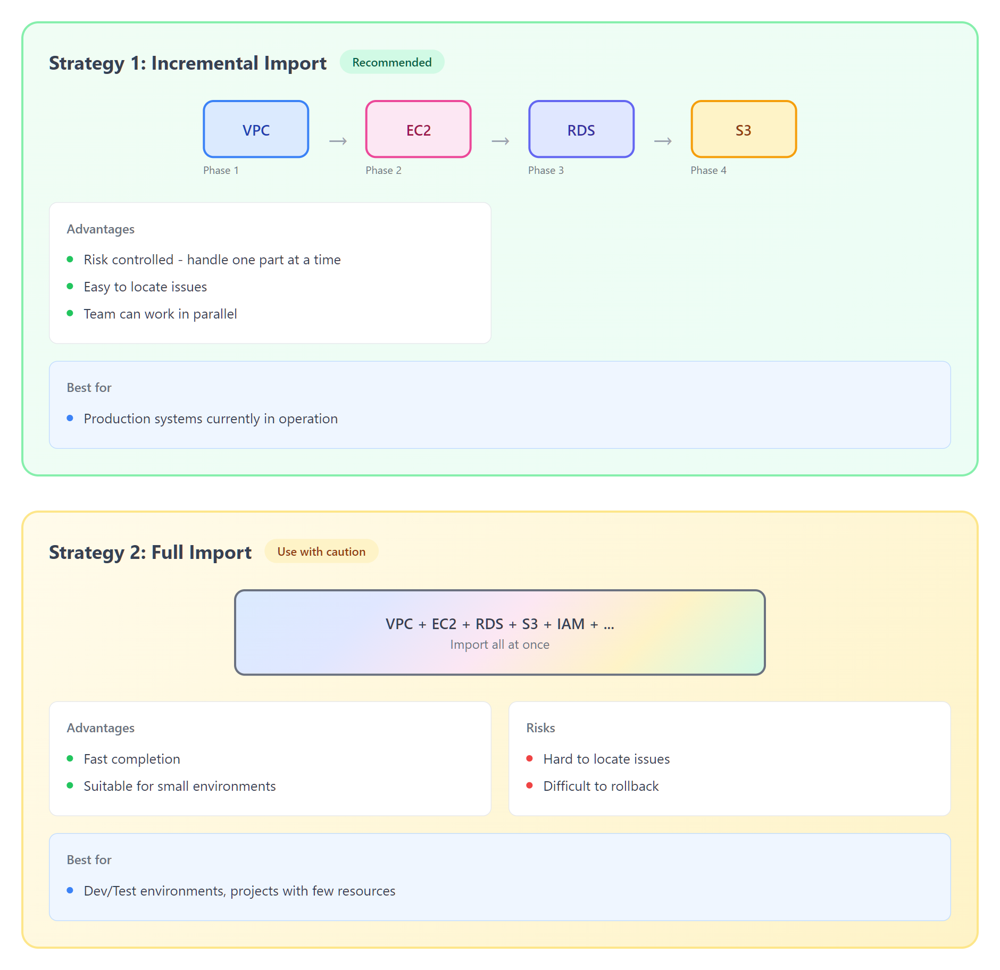
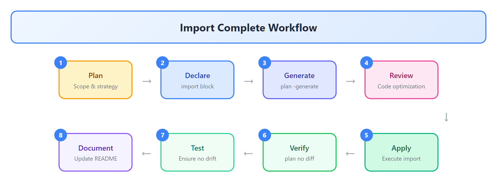

# 09 - 既存インフラ導入（Import）

> **目标**：将手动创建的 AWS 资源导入 Terraform 管理
> **前置**：已完成 [08 - 项目布局与多环境策略](../08-layout/)
> **时间**：45-50 分钟
> **费用**：EC2 t3.micro（免费层）

---

## 将学到的内容

1. 理解为什么需要 Import（既存资源纳入管理）
2. 使用 `terraform import` 命令（传统方式）
3. 使用 Import blocks（TF 1.5+ 声明式方式）
4. 使用 `terraform plan -generate-config-out` 自动生成代码
5. Import 策略与规划（增量 vs 全量）
6. 处理部分导入场景

---

## Step 1 - 快速验证环境（2 分钟）

连接到你的 Terraform Lab 实例：

```bash
aws ssm start-session --target i-你的实例ID --region ap-northeast-1
```

确认 Terraform 版本（需要 1.5+）：

```bash
terraform version
```

```
Terraform v1.14.x
on linux_amd64
```

> Import blocks 需要 Terraform 1.5+，本课推荐使用最新版本。

---

## Step 2 - 立即体验：导入现有 EC2（10 分钟）

> 先"尝到" Import 的效果，再理解原理。

### 2.1 创建"遗留"资源

首先，我们用 AWS CLI 模拟手动创建的资源（代表遗留系统）：

```bash
cd ~/cloud-atlas/iac/terraform/09-import/code

# 运行脚本创建 EC2 实例（模拟手动创建）
./setup-existing-resources.sh
```

```
Creating a "legacy" EC2 instance via AWS CLI...
Instance ID: i-0abc123def456789
Instance is now running.
Please note this Instance ID for import.
```

**记下这个 Instance ID！**

### 2.2 使用 Import Block 导入（推荐方式）

```bash
cd import-block

# 查看代码结构
ls -la
```

```
.
├── import.tf        # Import block 定义
├── main.tf          # 资源定义（初始为空）
├── providers.tf     # Provider 配置
└── outputs.tf       # 输出值
```

编辑 `import.tf`，填入你的 Instance ID：

```bash
vim import.tf
```

```hcl
# import.tf
# 声明式导入 - Terraform 1.5+

import {
  # 要导入的 AWS 资源 ID
  id = "i-0abc123def456789"  # <-- 替换为你的 Instance ID

  # 导入到的 Terraform 资源地址
  to = aws_instance.imported_legacy
}
```

### 2.3 生成配置代码

```bash
# 初始化
terraform init

# 使用 -generate-config-out 自动生成配置！
terraform plan -generate-config-out=generated.tf
```

```
Planning...

Terraform will perform the following actions:

  # aws_instance.imported_legacy will be imported
  # (config will be generated)
    resource "aws_instance" "imported_legacy" {
        ami                          = "ami-0abcd1234efgh5678"
        instance_type                = "t3.micro"
        ...
    }

Plan: 1 to import, 0 to add, 0 to change, 0 to destroy.

─────────────────────────────────────────────────────────────

Terraform has generated configuration and written it to generated.tf.
```

### 2.4 查看生成的代码

```bash
cat generated.tf
```

```hcl
# __generated__ by Terraform
# Please review this file and move the resource to main.tf

resource "aws_instance" "imported_legacy" {
  ami                         = "ami-0abcd1234efgh5678"
  instance_type              = "t3.micro"
  subnet_id                  = "subnet-12345678"
  vpc_security_group_ids     = ["sg-12345678"]

  tags = {
    Name = "legacy-manual-instance"
  }

  # ... 其他自动生成的属性
}
```

### 2.5 执行导入

```bash
terraform apply
```

```
aws_instance.imported_legacy: Importing... [id=i-0abc123def456789]
aws_instance.imported_legacy: Import complete

Apply complete! Resources: 1 imported, 0 added, 0 changed, 0 destroyed.
```

### 2.6 验证导入成功

```bash
# 查看 state
terraform state list
```

```
aws_instance.imported_legacy
```

```bash
# 确认 plan 无变更（状态与代码一致）
terraform plan
```

```
No changes. Your infrastructure matches the configuration.
```

**恭喜！你刚刚将一个"手动创建"的 EC2 导入了 Terraform 管理！**

---

## Step 3 - 发生了什么？（5 分钟）

### 3.1 Import 的本质


<details>
<summary>View ASCII source</summary>

```
┌─────────────────────────────────────────────────────────────────┐
│  BEFORE Import                                                  │
│  ┌─────────────────┐                    ┌─────────────────────┐ │
│  │    main.tf      │    -- no link --   │     AWS Cloud       │ │
│  │  (empty/none)   │                    │   EC2: i-abc123     │ │
│  ├─────────────────┤                    │ (manually created)  │ │
│  │     State       │                    └─────────────────────┘ │
│  │    (empty)      │                                            │
│  └─────────────────┘                                            │
└─────────────────────────────────────────────────────────────────┘
                              │
                              ▼
                    terraform import / apply
                              │
                              ▼
┌─────────────────────────────────────────────────────────────────┐
│  AFTER Import                                                   │
│  ┌─────────────────┐    ← mapping →     ┌─────────────────────┐ │
│  │    main.tf      │                    │     AWS Cloud       │ │
│  │resource "imported"│                   │   EC2: i-abc123     │ │
│  └────────┬────────┘                    │ (Terraform managed) │ │
│           │                             └─────────────────────┘ │
│           ▼                                       ▲             │
│  ┌─────────────────┐                              │             │
│  │     State       │──────────────────────────────┘             │
│  │   Records ID    │                                            │
│  └─────────────────┘                                            │
└─────────────────────────────────────────────────────────────────┘
```

</details>

### 3.2 Import 做了什么

| 步骤 | 说明 |
|------|------|
| 1. 读取 AWS 资源 | 通过 API 获取资源当前状态 |
| 2. 写入 State | 将资源 ID 和属性记录到 state |
| 3. 关联代码 | 将 state 中的资源映射到 `.tf` 代码 |

**注意**：Import 本身**不修改**实际资源，只是建立管理关系。

### 3.3 两种 Import 方式对比

| 特性 | `terraform import` 命令 | Import Block (1.5+) |
|------|------------------------|---------------------|
| 语法 | 命令行执行 | 声明式（`.tf` 文件） |
| 代码生成 | 手动编写 | 可自动生成 |
| 可重复性 | 低（命令历史可能丢失） | 高（代码即文档） |
| CI/CD 友好 | 差 | 好 |
| 推荐程度 | 旧项目维护 | **新项目首选** |

---

## Step 4 - 传统方式：terraform import 命令（8 分钟）

> 了解传统方式有助于维护旧项目。

### 4.1 查看示例

```bash
cd ~/cloud-atlas/iac/terraform/09-import/code/import-command
cat main.tf
```

```hcl
# main.tf
# 传统 import 方式：先写代码，再执行 import 命令

resource "aws_instance" "legacy" {
  # 必须手动编写！Import 命令不生成代码
  ami           = "ami-0abcd1234efgh5678"  # 需要填入正确值
  instance_type = "t3.micro"               # 需要填入正确值

  tags = {
    Name = "legacy-manual-instance"
  }

  # 其他属性需要一个个查询并填入...
}
```

### 4.2 执行 Import 命令

```bash
terraform init

# 语法: terraform import <资源地址> <资源ID>
terraform import aws_instance.legacy i-0abc123def456789
```

```
aws_instance.legacy: Importing from ID "i-0abc123def456789"...
aws_instance.legacy: Import prepared!
aws_instance.legacy: Refreshing state...

Import successful!
```

### 4.3 验证并补全代码

```bash
terraform plan
```

通常会看到差异：

```
  # aws_instance.legacy will be updated in-place
  ~ resource "aws_instance" "legacy" {
      ~ subnet_id     = "subnet-12345678" -> null
      ~ vpc_security_group_ids = [
          - "sg-12345678",
        ]
      # ...很多差异
    }
```

**这是传统方式最大的痛点**：需要逐个对齐属性。

### 4.4 对比两种方式


<details>
<summary>View ASCII source</summary>

```
┌─────────────────────────────────────┐  ┌─────────────────────────────────────┐
│ Traditional: terraform import cmd   │  │ Recommended: Import Block (TF 1.5+) │
├─────────────────────────────────────┤  ├─────────────────────────────────────┤
│                                     │  │                                     │
│ 1. Query AWS resource attributes    │  │ 1. Declare import block [Declarative]│
│    aws ec2 describe-instances ...   │  │    import {                         │
│              │                      │  │      id = "i-xxx"                   │
│              ▼                      │  │      to = aws_instance.legacy       │
│ 2. Manually write main.tf [Manual]  │  │    }                                │
│    resource "aws_instance" "legacy" │  │              │                      │
│    { ami = "..." # fill manually }  │  │              ▼                      │
│              │                      │  │ 2. Auto-generate code [Automated]   │
│              ▼                      │  │    terraform plan -generate...      │
│ 3. Execute import command           │  │              │                      │
│    terraform import aws_instance... │  │              ▼                      │
│              │                      │  │ 3. Review + Apply [One-shot]        │
│              ▼                      │  │    terraform apply                  │
│ 4. Iterate plan/adjust [Repetitive] │  │                                     │
│    terraform plan # fix, repeat...  │  │ Advantages: Automated, reviewable   │
│                                     │  │                                     │
│ Pain: Manual, error-prone, slow     │  └─────────────────────────────────────┘
└─────────────────────────────────────┘
```

</details>

---

## Step 5 - 代码生成详解（8 分钟）

### 5.1 进入示例目录

```bash
cd ~/cloud-atlas/iac/terraform/09-import/code/generated-config
ls -la
```

```
.
├── import.tf        # Import blocks
├── providers.tf     # Provider 配置
└── README.md        # 说明文档
```

### 5.2 配置多个 Import

```hcl
# import.tf
# 可以同时导入多个资源

import {
  id = "i-0abc123def456789"
  to = aws_instance.web_server
}

import {
  id = "sg-0123456789abcdef0"
  to = aws_security_group.web_sg
}

import {
  id = "subnet-0fedcba9876543210"
  to = aws_subnet.main
}
```

### 5.3 生成并审查

```bash
terraform init
terraform plan -generate-config-out=generated.tf
```

### 5.4 审查生成的代码

**重要**：生成的代码需要人工审查和优化！

```hcl
# generated.tf (自动生成，需要审查)

resource "aws_instance" "web_server" {
  ami                         = "ami-0abcd1234efgh5678"
  instance_type              = "t3.micro"

  # 生成的代码可能包含很多不必要的属性
  # 以下属性可能需要删除或调整：

  credit_specification {
    cpu_credits = "standard"   # 可能是默认值，可删除
  }

  metadata_options {
    http_endpoint               = "enabled"
    http_tokens                 = "optional"  # 安全考虑：改为 "required"
  }

  # 可能需要参数化的硬编码值：
  subnet_id                  = "subnet-12345678"  # → 改为 var.subnet_id
  vpc_security_group_ids     = ["sg-12345678"]    # → 改为 var.sg_ids
}
```

### 5.5 最佳实践：审查清单

| 检查项 | 处理方式 |
|--------|----------|
| 硬编码 ID | 改为变量或 data source |
| 默认值属性 | 删除（减少代码噪音） |
| 敏感属性 | 确认无密码等敏感值 |
| 命名规范 | 调整为团队规范 |
| 依赖关系 | 添加必要的引用 |

---

## Step 6 - Import 策略与规划（5 分钟）

### 6.1 两种策略对比



<details>
<summary>View ASCII source</summary>

```
┌─────────────────────────────────────────────────────────────────┐
│  Strategy 1: Incremental Import  [Recommended]                  │
│                                                                 │
│  ┌─────┐    ┌─────┐    ┌─────┐    ┌─────┐                      │
│  │ VPC │ ─▶ │ EC2 │ ─▶ │ RDS │ ─▶ │ S3  │                      │
│  │Phase1│   │Phase2│   │Phase3│   │Phase4│                      │
│  └─────┘    └─────┘    └─────┘    └─────┘                      │
│                                                                 │
│  Advantages:                                                    │
│  • Risk controlled - handle one part at a time                  │
│  • Easy to locate issues                                        │
│  • Team can work in parallel                                    │
│                                                                 │
│  Best for: Production systems currently in operation            │
└─────────────────────────────────────────────────────────────────┘

┌─────────────────────────────────────────────────────────────────┐
│  Strategy 2: Full Import  [Use with caution]                    │
│                                                                 │
│  ┌─────────────────────────────────────────┐                    │
│  │  VPC + EC2 + RDS + S3 + IAM + ...       │                    │
│  │          Import all at once             │                    │
│  └─────────────────────────────────────────┘                    │
│                                                                 │
│  Advantages: Fast completion, suitable for small environments   │
│  Risks: Hard to locate issues, difficult to rollback            │
│                                                                 │
│  Best for: Dev/Test environments, projects with few resources   │
└─────────────────────────────────────────────────────────────────┘
```

</details>

### 6.2 导入优先级

按依赖顺序导入：

```
1. 基础设施层（先导入）
   └── VPC, Subnet, Route Table, Internet Gateway

2. 安全层
   └── Security Groups, NACLs, IAM Roles

3. 计算/存储层
   └── EC2, RDS, S3, EBS

4. 应用层（后导入）
   └── ALB, Target Groups, Lambda
```

### 6.3 部分导入场景

有时不需要导入所有资源：

| 场景 | 策略 |
|------|------|
| 共享 VPC（其他团队管理） | 使用 data source 引用，不导入 |
| 即将废弃的资源 | 不导入，让其自然下线 |
| 手动管理的特殊资源 | 保持手动，添加文档说明 |

---

## Step 7 - 日本企业案例（5 分钟）

> 日本 IT 现场的实际 Import 经验分享

### 7.1 案例一览

| 公司 | 场景 | 工具 |
|------|------|------|
| **LayerX** | 既存 AWS 资源导入 | terraform import |
| **クラウドワークス** | Serverless Framework → Terraform 迁移 | Import blocks |
| **FiNC** | 数千资源批量导入 | terraformer |

### 7.2 LayerX 的经验

> "terraform import 是 IaC 化的第一步。我们按照 VPC → Security Group → EC2 的顺序，逐步将生产环境纳入 Terraform 管理。"

**关键做法**：
- 增量导入，每次 PR 只导入一类资源
- 导入后立即 `terraform plan` 确认无差异
- 所有 Import 记录在 PR 中作为证迹（エビデンス）

### 7.3 FiNC 的批量导入

当资源数量庞大时，手动导入不现实。FiNC 使用了 terraformer 工具：

```bash
# terraformer 可以批量导出现有资源为 Terraform 代码
# 注意：这是第三方工具，需要额外安装

terraformer import aws --resources=ec2_instance,s3 --regions=ap-northeast-1
```

> terraformer 官方文档：https://github.com/GoogleCloudPlatform/terraformer
>
> **注意**：本课程重点是 Terraform 原生 Import 功能。
> terraformer 适合大规模迁移项目，建议单独学习。

### 7.4 日本企业导入检查清单

在日本的変更管理流程中，Import 通常需要：

| 项目 | 内容 |
|------|------|
| **事前確認** | 对象リソースの一覧、影響範囲 |
| **変更申請** | Import 計画書（PR 形式） |
| **実施手順** | コマンド + 期待される出力 |
| **確認手順** | terraform plan の差分なし確認 |
| **切り戻し** | terraform state rm で管理解除 |

---

## Step 8 - 动手练习：完整 Import 流程（10 分钟）

### 8.1 练习目标

将 Step 2 中创建的 EC2 实例**重新导入**（假设之前清理过 state）。

### 8.2 步骤

```bash
cd ~/cloud-atlas/iac/terraform/09-import/code/import-block

# 1. 清理之前的 state（模拟"遗失"状态）
rm -rf .terraform terraform.tfstate* generated.tf

# 2. 重新初始化
terraform init

# 3. 确认 import.tf 中的 Instance ID 正确

# 4. 生成配置
terraform plan -generate-config-out=generated.tf

# 5. 审查生成的代码
cat generated.tf

# 6. 执行导入
terraform apply

# 7. 验证
terraform state list
terraform plan  # 应无差异
```

### 8.3 成功标准

- [ ] `terraform state list` 显示导入的资源
- [ ] `terraform plan` 显示 "No changes"
- [ ] 生成的代码已审查并理解

---

## Step 9 - 清理资源（3 分钟）

> 完成学习后，立即清理！

### 9.1 通过 Terraform 销毁

```bash
cd ~/cloud-atlas/iac/terraform/09-import/code/import-block

# 销毁导入的资源
terraform destroy
```

```
Plan: 0 to add, 0 to change, 1 to destroy.

Do you really want to destroy all resources?
  Enter a value: yes

aws_instance.imported_legacy: Destroying...
aws_instance.imported_legacy: Destruction complete after 30s

Destroy complete! Resources: 1 destroyed.
```

### 9.2 验证清理

```bash
aws ec2 describe-instances \
  --filters "Name=tag:Name,Values=legacy-manual-instance" \
  --query 'Reservations[*].Instances[*].State.Name' \
  --output text
```

```
terminated
```

### 9.3 清理其他目录

```bash
# 清理 import-command 目录
cd ~/cloud-atlas/iac/terraform/09-import/code/import-command
rm -rf .terraform terraform.tfstate*

# 清理 generated-config 目录
cd ~/cloud-atlas/iac/terraform/09-import/code/generated-config
rm -rf .terraform terraform.tfstate* generated.tf
```

---

## 本课小结

| 方式 | 语法 | 代码生成 | 推荐场景 |
|------|------|----------|----------|
| `terraform import` | 命令行 | 手动编写 | 旧项目维护、单个资源 |
| Import Block | 声明式 | 可自动生成 | **新项目首选**、CI/CD |

**Import 流程核心步骤**：



<details>
<summary>View ASCII source</summary>

```
                    Import Complete Workflow

┌─────────┐   ┌─────────┐   ┌──────────┐   ┌─────────┐
│ 1. Plan │ → │2.Declare│ → │3.Generate│ → │4.Review │
│  Scope  │   │ import  │   │   plan   │   │  Code   │
│& strategy│   │  block  │   │-generate │   │optimize │
└─────────┘   └─────────┘   └──────────┘   └────┬────┘
                                                │
                                                ▼
┌──────────┐   ┌─────────┐   ┌──────────┐   ┌─────────┐
│8.Document│ ← │ 7. Test │ ← │6. Verify │ ← │5. Apply │
│  Update  │   │  Ensure │   │  plan    │   │ Execute │
│  README  │   │ no drift│   │  no diff │   │ import  │
└──────────┘   └─────────┘   └──────────┘   └─────────┘
```

</details>

**最佳实践**：

1. **优先使用 Import Block** - 声明式、可追溯、CI/CD 友好
2. **自动生成代码后要审查** - 删除默认值、参数化硬编码
3. **增量导入** - 按依赖顺序，小步快跑
4. **验证 plan 无差异** - 确保代码与实际资源一致
5. **记录 Import 历史** - PR 即文档

---

## 下一步

资源已导入 Terraform 管理，但如果有人手动修改了 AWS Console 里的资源呢？

--> [10 - 漂移检测与状态操作](../10-drift/)

---

## 面试准备

**よくある質問**

**Q: 既存リソースを Terraform 管理下に置く方法は？**

A: `terraform import` コマンド、または import block (TF 1.5+) で State に追加し、対応するコードを書く。1.5+ では `-generate-config-out` オプションでコード自動生成が可能。

**Q: Import 時の注意点は？**

A:
1. Import 前に必ずバックアップ（State のバージョン管理）
2. Import 後に `terraform plan` で差分なしを確認
3. 生成されたコードは必ずレビュー・最適化
4. 依存関係のある資源は順番に Import

**Q: 大量のリソースを Import する際のベストプラクティスは？**

A:
1. 依存関係順（VPC → SG → EC2）で段階的に
2. 各フェーズで plan 確認
3. PR ベースで変更履歴を残す
4. 大規模なら terraformer 等のツール検討

**Q: Import と新規作成の違いは？**

A: Import は既存リソースの ID を State に記録するだけ。リソース自体は変更しない。新規作成は AWS API を呼び出して実際にリソースを作成する。

---

## トラブルシューティング

**よくある問題**

**Import 時に「Resource already managed」エラー**

```
Error: Resource already managed by Terraform
```

→ 既に State に存在。`terraform state list` で確認し、必要なら `terraform state rm` で削除後に再 Import。

**生成されたコードに unknown 属性**

```
Error: Unsupported attribute
```

→ Provider バージョンが古い可能性。`terraform init -upgrade` を試す。

**Import 後に plan で差異が出る**

```
  # aws_instance.legacy will be updated in-place
  ~ tags = {
      + "ManagedBy" = "Terraform"
    }
```

→ 正常な場合もある（タグ追加など意図的な変更）。差異の内容を確認し、意図しない変更がないか確認。

**Security Group の Import でエラー**

```
Error: importing sg-xxx: security group rules must be imported separately
```

→ SG と SG Rules は別々に Import が必要。`aws_security_group_rule` リソースも Import する。

---

## 职场小贴士

在日本的 IT 现场，既存システム（レガシーシステム）の IaC 化は重要なプロジェクトです：

| 日本語 | 中文 | 说明 |
|--------|------|------|
| 既存システム | 现有系统 | 手動構築された環境 |
| IaC 化 | IaC 化 | Terraform 等でコード管理 |
| 移行計画 | 迁移计划 | 段階的な Import 計画 |
| エビデンス | 证迹 | Import 実施記録 |
| 切り戻し手順 | 回滚流程 | 問題時の復旧方法 |

**日本企业的典型要求**：

- Import 前に「変更影響調査」
- Import 計画書の作成・承認
- 作業エビデンスの保存（スクリーンショット、ログ）
- 切り戻し手順の事前確認

---

## 延伸阅读

- [Terraform Import 官方文档](https://developer.hashicorp.com/terraform/language/import)
- [Import Block (TF 1.5+) 官方文档](https://developer.hashicorp.com/terraform/language/import#import-block-syntax)
- [terraformer GitHub](https://github.com/GoogleCloudPlatform/terraformer)
- [LayerX Tech Blog - Terraform 导入实践](https://tech.layerx.co.jp/)

---

## 系列导航

← [08 · 项目布局](../08-layout/) | [Home](../) | [10 · 漂移検知 →](../10-drift/)
