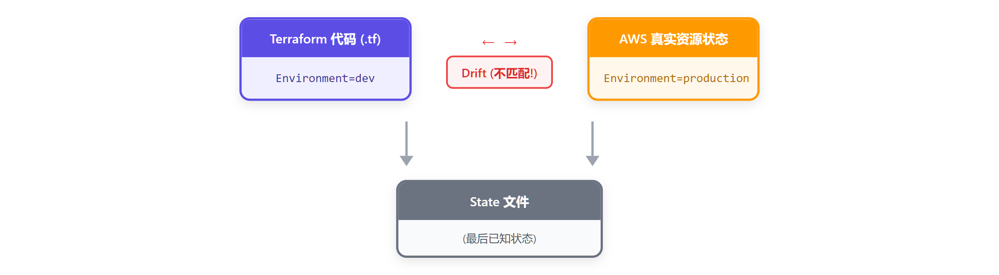

# 10 - 漂移检测与状态操作

> **目标**：理解 Drift（配置与现实不匹配），掌握检测和修复方法，熟练使用 State 操作命令
> **前置**：已完成 [09 - 既存インフラ導入](../09-import/)
> **时间**：40-50 分钟
> **费用**：EC2 t3.micro（免费层）+ S3

---

## 将学到的内容

1. 理解什么是 Drift（漂移）以及它为什么会发生
2. 使用 `terraform plan` 检测 Drift
3. 使用 `terraform apply -refresh-only` 安全刷新 State
4. 掌握 State 操作命令：`mv`、`rm`、`replace`
5. 使用 `moved` blocks 实现代码重构（TF 1.1+）
6. 处理孤立资源和 State 恢复场景

---

## Step 1 - 先跑起来：注入并检测 Drift（10 分钟）

> **目标**：先体验 Drift 是什么，再理解原理。

### 1.1 进入示例代码目录

```bash
cd ~/terraform-examples/lesson-10-drift/code/drift-detect
ls -la
```

```
.
├── main.tf           # EC2 实例定义
├── providers.tf      # Provider 配置
├── outputs.tf        # 输出值
└── variables.tf      # 变量定义
```

### 1.2 创建基础设施

```bash
# 初始化
terraform init

# 创建资源
terraform apply -auto-approve
```

观察输出：

```
Apply complete! Resources: 1 added, 0 changed, 0 destroyed.

Outputs:

instance_id = "i-0abc123def456789"
instance_tags = {
  "Environment" = "dev"
  "Name" = "drift-demo"
  "Owner" = "terraform-course"
}
```

记下 `instance_id`，接下来我们要"破坏"它。

### 1.3 手动制造 Drift

现在，我们故意在 AWS Console 修改资源，模拟真实世界中"有人绕过 Terraform 直接改了资源"的情况：

```bash
# 使用 AWS CLI 直接修改标签（模拟 Console 操作）
INSTANCE_ID=$(terraform output -raw instance_id)

aws ec2 create-tags \
  --resources $INSTANCE_ID \
  --tags Key=Environment,Value=production Key=ModifiedBy,Value=console-user
```

你刚刚做了什么？

- 把 `Environment` 标签从 `dev` 改成了 `production`
- 添加了一个新标签 `ModifiedBy=console-user`

**这就是 Drift！** 代码说的是 `dev`，现实却是 `production`。

### 1.4 检测 Drift

```bash
terraform plan
```

**观察输出：**

```
aws_instance.demo: Refreshing state...

Terraform detected the following changes made outside of Terraform
since the last "terraform apply":

  # aws_instance.demo has changed
  ~ resource "aws_instance" "demo" {
        id                           = "i-0abc123def456789"
      ~ tags                         = {
          ~ "Environment" = "production" -> "dev"
          - "ModifiedBy"  = "console-user"
            # (2 unchanged elements hidden)
        }
      ~ tags_all                     = {
          ~ "Environment" = "production" -> "dev"
          - "ModifiedBy"  = "console-user"
            # (2 unchanged elements hidden)
        }
        # (29 unchanged attributes hidden)
    }

Plan: 0 to add, 1 to change, 0 to destroy.
```

Terraform 告诉你：

- `~` = 会被修改
- `-` = 会被删除
- 箭头 `->` 显示从当前值变回代码定义的值

**恭喜！你刚刚检测到了 Drift！**

---

## Step 2 - 发生了什么？（5 分钟）

### 2.1 Drift 的本质



**Drift 的定义**：Terraform 代码定义的状态与 AWS 实际资源状态不一致。

### 2.2 Drift 产生的常见原因

| 原因 | 场景 | 频率 |
|------|------|------|
| 手动修改 | 有人在 Console 改了配置 | 很常见 |
| 紧急修复 | 障害対応时直接改资源 | 常见 |
| 其他工具 | Ansible、脚本直接调 API | 偶尔 |
| AWS 自动更新 | AMI 过期、安全组规则变化 | 偶尔 |
| 权限问题 | 部分资源被其他账号修改 | 罕见 |

### 2.3 检测 Drift 的时机

```bash
# 每次 apply 前都应该 plan
terraform plan

# 定期检测（CI/CD 中配置）
terraform plan -detailed-exitcode
# 退出码: 0=无变化, 1=错误, 2=有变化
```

---

## Step 3 - 修复 Drift 的三种策略（10 分钟）

### 策略 A：让 Terraform 修复（覆盖手动修改）

**最常用！** 把资源恢复到代码定义的状态。

```bash
terraform apply
```

输入 `yes`，观察：

```
aws_instance.demo: Modifying...
aws_instance.demo: Modifications complete

Apply complete! Resources: 0 to add, 1 to changed, 0 to destroy.
```

验证：

```bash
aws ec2 describe-tags --filters "Name=resource-id,Values=$INSTANCE_ID" \
  --query 'Tags[*].[Key,Value]' --output table
```

标签已恢复为代码定义的值。

### 策略 B：接受现实（更新代码）

如果手动修改是正确的，应该更新代码来匹配现实。

```hcl
# main.tf - 更新代码接受新的值
resource "aws_instance" "demo" {
  # ...
  tags = {
    Name        = "drift-demo"
    Environment = "production"    # 改成实际值
    Owner       = "terraform-course"
  }
}
```

然后：

```bash
terraform plan   # 应该显示 No changes
```

### 策略 C：刷新 State（仅更新状态，不改代码）

**危险！谨慎使用。** 告诉 Terraform "以现实为准"。

```bash
# Terraform 1.4+ 推荐方式
terraform apply -refresh-only
```

这会：

1. 读取 AWS 真实状态
2. 更新 State 文件
3. **不会修改任何代码**

**使用场景**：

- 知道某些变化是预期的（如 AWS 自动更新的属性）
- 需要临时接受 Drift，稍后再修复代码

---

## Step 4 - State 操作命令（15 分钟）

进入 state-operations 目录：

```bash
cd ~/terraform-examples/lesson-10-drift/code/state-operations
terraform init && terraform apply -auto-approve
```

### 4.1 terraform state list - 查看管理的资源

```bash
terraform state list
```

```
aws_s3_bucket.logs
aws_s3_bucket.data
aws_s3_bucket_versioning.logs
aws_s3_bucket_versioning.data
```

### 4.2 terraform state show - 查看资源详情

```bash
terraform state show aws_s3_bucket.logs
```

```
# aws_s3_bucket.logs:
resource "aws_s3_bucket" "logs" {
    arn                         = "arn:aws:s3:::demo-logs-xxx"
    bucket                      = "demo-logs-xxx"
    bucket_domain_name          = "demo-logs-xxx.s3.amazonaws.com"
    ...
}
```

### 4.3 terraform state mv - 重命名/移动资源

**场景**：重构代码时，资源名称或模块结构变化。

```bash
# 重命名资源（不会重建！）
terraform state mv aws_s3_bucket.logs aws_s3_bucket.log_bucket
```

```
Move "aws_s3_bucket.logs" to "aws_s3_bucket.log_bucket"
Successfully moved 1 object(s).
```

**重要**：执行后必须同步修改代码！

```hcl
# 代码也要改
resource "aws_s3_bucket" "log_bucket" {   # 原来是 "logs"
  # ...
}
```

验证：

```bash
terraform plan   # 应该显示 No changes
```

### 4.4 terraform state rm - 取消管理（不删除资源）

**场景**：想让 Terraform "忘记"某个资源，但资源继续存在于 AWS。

```bash
# 查看当前状态
terraform state list

# 取消管理 data bucket
terraform state rm aws_s3_bucket.data
terraform state rm aws_s3_bucket_versioning.data
```

```
Removed aws_s3_bucket.data
Removed aws_s3_bucket_versioning.data
Successfully removed 2 resource instance(s).
```

**结果**：

- State 中不再有这个资源
- AWS 中的 Bucket 仍然存在
- 代码中仍有定义 -> 下次 `plan` 会显示要创建

**使用场景**：

- 将资源转移给另一个 Terraform 项目管理
- 将资源转为手动管理
- 清理孤立的 State 记录

### 4.5 terraform apply -replace - 强制重建

**场景**：资源状态不正常，需要强制重建。

```bash
# 强制重建某个资源（TF 1.0+）
terraform apply -replace="aws_s3_bucket.log_bucket"
```

**旧版替代**（Terraform < 1.0）：

```bash
# 已废弃，但可能在老项目中看到
terraform taint aws_s3_bucket.log_bucket
terraform apply
```

---

## Step 5 - moved blocks：优雅的重构（5 分钟）

> **TF 1.1+ 特性**：在代码中声明资源移动，比 `state mv` 更安全。

进入 moved-blocks 目录：

```bash
cd ~/terraform-examples/lesson-10-drift/code/moved-blocks
terraform init && terraform apply -auto-approve
```

### 5.1 问题场景

假设你需要重构代码：把 `aws_instance.web` 移动到模块内 `module.compute.aws_instance.main`。

### 5.2 传统方式（容易出错）

```bash
# 手动操作 State（每个环境都要做！）
terraform state mv aws_instance.web module.compute.aws_instance.main
```

问题：

- 每个环境（dev/staging/prod）都要手动操作
- 容易遗漏或出错
- 没有版本控制

### 5.3 moved block 方式（推荐）

```hcl
# main.tf

# 告诉 Terraform：old_address 已移动到 new_address
moved {
  from = aws_instance.web
  to   = module.compute.aws_instance.main
}

# 新的资源定义
module "compute" {
  source = "./modules/compute"
  # ...
}
```

运行 `terraform plan`：

```
Terraform will perform the following actions:

  # aws_instance.web has moved to module.compute.aws_instance.main
    resource "aws_instance" "main" {
        id                           = "i-0abc123def456789"
        # (all attributes unchanged)
    }

Plan: 0 to add, 0 to change, 0 to destroy.
```

**优点**：

- 代码即文档，变更有版本控制
- 所有环境运行 `apply` 时自动迁移
- Plan 清晰显示移动操作

### 5.4 moved block 保留策略

重构完成后，`moved` block 可以：

1. **保留**：作为历史记录，新环境部署时自动处理
2. **删除**：确认所有环境已迁移后可删除

---

## Step 6 - 失败实验室：Drift 注入演练

> **目标**：使用脚本批量注入 Drift，练习检测和修复流程。

### 6.1 运行注入脚本

```bash
cd ~/terraform-examples/lesson-10-drift/code/drift-detect

# 确保有资源存在
terraform apply -auto-approve

# 运行 Drift 注入脚本
../drift-inject.sh
```

脚本会：

1. 修改 EC2 标签
2. 添加额外标签
3. 报告修改内容

### 6.2 检测 Drift

```bash
terraform plan
```

观察 plan 输出，识别所有被修改的属性。

### 6.3 修复 Drift

```bash
# 方式 A：恢复到代码定义
terraform apply

# 方式 B：接受现实（如果需要）
# 先 refresh-only，再更新代码
```

### 6.4 验证修复

```bash
terraform plan
# 应该显示: No changes. Your infrastructure matches the configuration.
```

---

## Step 7 - 清理资源

> **重要**：完成学习后，立即清理！

```bash
# 清理 drift-detect
cd ~/terraform-examples/lesson-10-drift/code/drift-detect
terraform destroy -auto-approve

# 清理 state-operations
cd ~/terraform-examples/lesson-10-drift/code/state-operations
terraform destroy -auto-approve

# 清理 moved-blocks
cd ~/terraform-examples/lesson-10-drift/code/moved-blocks
terraform destroy -auto-approve
```

---

## 本课小结

### 命令速查表

| 命令 | 作用 | 使用场景 |
|------|------|----------|
| `terraform plan` | 检测 Drift | 每次 apply 前 |
| `terraform apply` | 修复 Drift（恢复代码定义） | 最常用 |
| `terraform apply -refresh-only` | 接受现实（更新 State） | 谨慎使用 |
| `terraform state list` | 列出管理的资源 | 调试 |
| `terraform state show` | 查看资源详情 | 调试 |
| `terraform state mv` | 重命名/移动资源 | 重构 |
| `terraform state rm` | 取消管理（不删除） | 转移资源 |
| `terraform apply -replace` | 强制重建 | 状态异常 |

### Drift 处理策略


### 核心理念

```
代码 = 期望状态
State = 最后已知状态
AWS = 真实状态

Drift = (代码 != AWS) 或 (State != AWS)
```

---

## 职场小贴士

### 日本 IT 现场的 Drift 处理

在日本的运维现场，Drift 通常发生在：

1. **障害対応**：紧急情况下直接在 Console 修改配置
2. **手作業**：没有 IaC 习惯的团队成员直接操作
3. **複数チーム**：多个团队管理同一资源

**最佳实践**：

- 在「変更管理書」中记录手动修改
- 事后及时更新 Terraform 代码
- 定期运行 Drift 检测（可以放入 CI/CD）

### 常用日语术语

| 日本語 | 中文 | 英文 |
|--------|------|------|
| 構成ドリフト | 配置漂移 | Configuration Drift |
| 手作業 | 手动操作 | Manual Operation |
| 緊急対応 | 紧急对应 | Emergency Response |
| 棚卸し | 盘点/清理 | Inventory/Cleanup |

---

## 检查清单

在继续下一课之前，确认你已经：

- [ ] 理解 Drift 的概念和产生原因
- [ ] 能够使用 `terraform plan` 检测 Drift
- [ ] 知道三种 Drift 处理策略
- [ ] 掌握 `state mv`、`state rm`、`-replace` 命令
- [ ] 理解 `moved` blocks 的用途
- [ ] 已清理所有实验资源

---

## 面试准备

**よくある質問**

**Q: Drift とは何ですか？どう対処しますか？**

A: コードと実際のリソース状態の乖離です。`terraform plan` で検出し、`apply` でコード定義に戻すか、コードを更新して現実を受け入れます。緊急対応後は必ず IaC に反映することが重要です。

**Q: terraform state rm と destroy の違いは？**

A: `state rm` は State から削除（リソースは残る）、`destroy` は実際にリソースを削除。リソースを別プロジェクトに移管する時に `state rm` を使います。

**Q: moved block を使う利点は？**

A: コードで移動を宣言できるため、全環境で plan/apply 時に自動適用。手動の state mv より安全で、変更履歴も Git に残ります。

---

## 延伸阅读

- [Terraform State 管理](../02-state/) - State 基础知识
- [Import 既存基础设施](../09-import/) - 导入现有资源
- [官方文档：State Commands](https://developer.hashicorp.com/terraform/cli/commands/state)
- [官方文档：moved blocks](https://developer.hashicorp.com/terraform/language/modules/develop/refactoring)

---

## 系列导航

[09 - Import](../09-import/) | [Home](../) | [11 - CI/CD](../11-cicd/)
