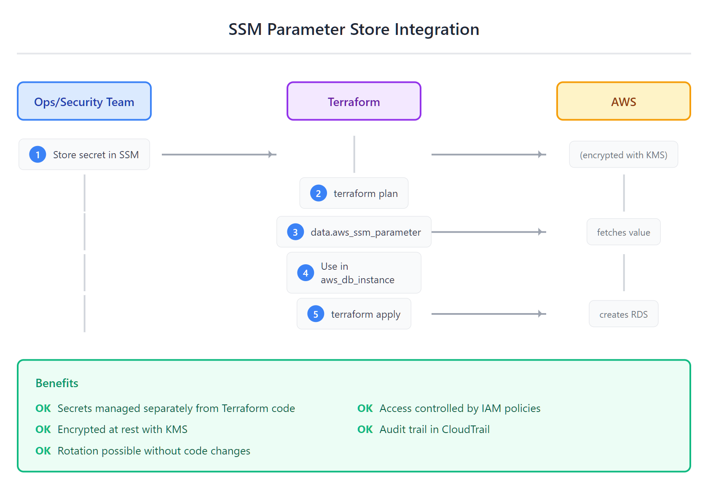
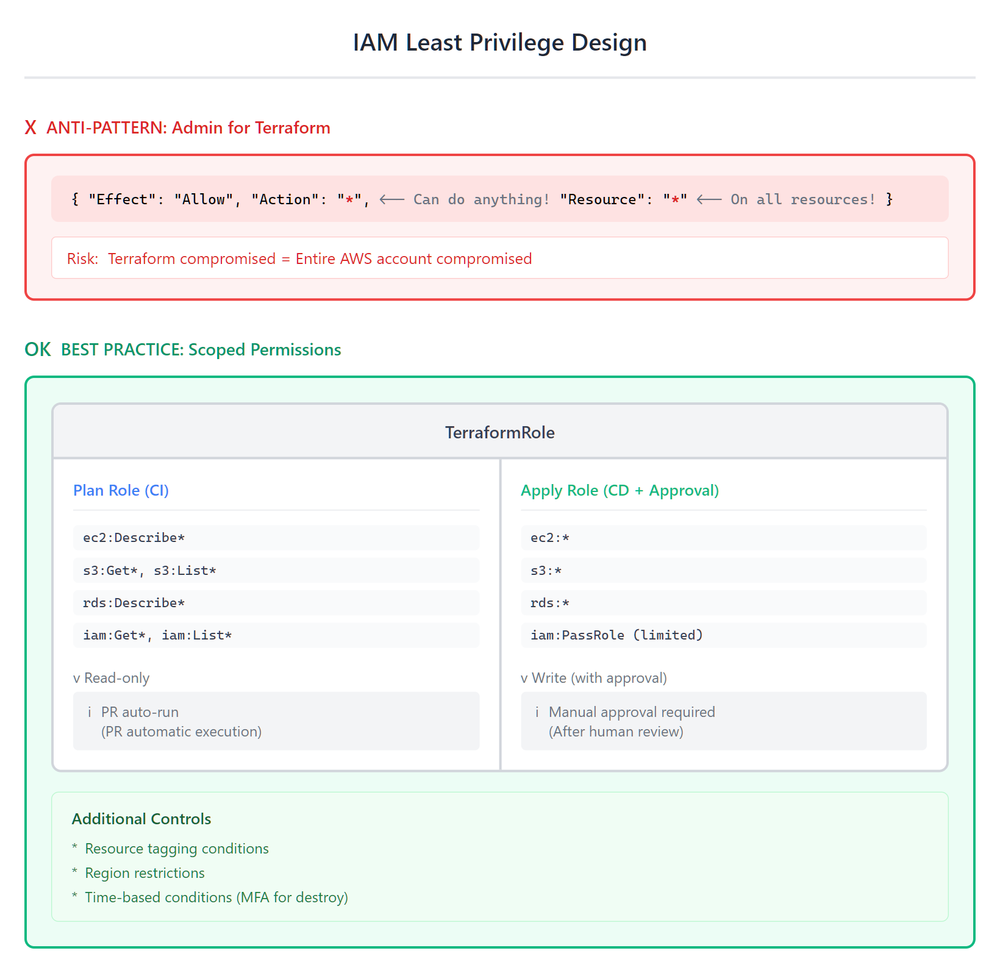

# 12 - 安全与机密管理

> **目标**：掌握 Terraform 中的安全最佳实践，包括密钥管理、安全扫描、IAM 最小权限和 State 文件保护  
> **前置**：已完成 [11 - CI/CD 集成](../11-cicd/)  
> **时间**：45-60 分钟  
> **费用**：SSM Parameter Store（免费层）、S3 + KMS（极低成本）

---

## 将学到的内容

1. 理解 `sensitive = true` 的**局限性**（仍在 State 中明文存储）
2. 使用 SSM Parameter Store / Secrets Manager 动态获取密钥
3. 使用 Trivy 和 checkov 进行安全扫描
4. 设计最小权限 IAM Role
5. 保护 State 文件（加密、访问控制、审计日志）

---

## Step 1 — 环境准备与连接（2 分钟）

连接到你的 Terraform Lab 实例。

**获取实例 ID：**

```bash
aws cloudformation describe-stacks \
  --stack-name terraform-lab \
  --region ap-northeast-1 \
  --query 'Stacks[0].Outputs[?OutputKey==`InstanceId`].OutputValue' \
  --output text
```

> **💡 连接方式**（选择你熟悉的）：  
> - **AWS Console**：EC2 → 选择实例 → Connect → Session Manager  
> - **AWS CLI**：`aws ssm start-session --target <实例ID> --region ap-northeast-1`  
> - **VS Code**：Remote-SSH 连接（如已配置）  
>
> **❓ 没有实例？** Stack 不存在或实例已终止？  
> → [重新部署实验环境](../00-concepts/lab-setup.md)

连接后，切换到课程用户并同步代码：

```bash
sudo su - terraform
sync-course
```

确认上一课的资源已清理：

```bash
cd ~/cloud-atlas/iac/terraform/11-cicd/code
terraform state list  # 应为空
```

---

## Step 2 — 先跑起来：5 分钟发现安全问题

> 先体验安全扫描工具发现问题，再学习如何修复。

### 2.1 进入示例目录

```bash
cd ~/cloud-atlas/iac/terraform/12-security/code
```

查看文件结构：

```
code/
├── bad/                    # 反模式：硬编码密钥
│   ├── main.tf
│   └── variables.tf
├── good/                   # 最佳实践：SSM 动态获取
│   ├── main.tf
│   ├── variables.tf
│   └── outputs.tf
├── scanning-demo/          # 安全扫描演示（Trivy / checkov）
│   ├── main.tf
│   └── .trivyignore        # Trivy 忽略配置
└── state-security/         # State 安全配置
    ├── main.tf
    ├── bucket-policy.tf
    └── kms.tf
```

### 安装安全扫描工具

```bash
# 推荐：安装 Trivy（Aqua Security，tfsec 的继承者）
# macOS
brew install trivy

# Linux
curl -sfL https://raw.githubusercontent.com/aquasecurity/trivy/main/contrib/install.sh | sh -s -- -b /usr/local/bin

# Windows (使用 scoop 或 chocolatey)
scoop install trivy

# 备用：tfsec（仍可用但不再积极开发）
# brew install tfsec

# 安装 checkov（Bridgecrew/Palo Alto）
pip install checkov
```

> **注意**: tfsec 已被 Aqua Security 合并到 Trivy 中。新项目推荐使用 Trivy。  
> 迁移指南: https://github.com/aquasecurity/tfsec/blob/master/tfsec-to-trivy-migration-guide.md

### 扫描不安全的代码

```bash
cd ~/cloud-atlas/iac/terraform/12-security/code/bad

# 运行 Trivy（推荐）
trivy config .
```

**输出示例**：

```
Result #1 HIGH Database password is hardcoded
─────────────────────────────────────────────────────
  main.tf:15
─────────────────────────────────────────────────────
   12 │   resource "aws_db_instance" "main" {
   13 │     identifier = "myapp-db"
   14 │     ...
   15 │     password   = "SuperSecret123!"  # ← HIGH RISK!
   16 │   }
─────────────────────────────────────────────────────
  Impact:     Secrets in source code can be leaked
  Resolution: Reference a secret store or environment variable

Result #2 MEDIUM State file contains sensitive data
...

3 potential problems detected.
```

**安全扫描工具发现了你的密码硬编码在代码中！**

---

## 发生了什么？安全风险解析

### 密钥在 Terraform 中的生命周期


<details>
<summary>View ASCII source</summary>

```
                 Secrets in Terraform Lifecycle

  ┌───────────────────────────────────────────────────────────┐
  │ ✗ Anti-Pattern: Hardcoded Secrets                         │
  ├───────────────────────────────────────────────────────────┤
  │                                                           │
  │  main.tf                    terraform.tfstate             │
  │  ┌─────────────────┐        ┌─────────────────┐           │
  │  │ password =      │  plan  │ "password":     │           │
  │  │ "Secret123!"    │ ─────▶ │ "Secret123!"    │           │
  │  └─────────────────┘  apply └─────────────────┘           │
  │        ▲                           ▲                      │
  │        │                           │                      │
  │   ⚠️ In Git!                  ⚠️ In S3!                   │
  │                                                           │
  └───────────────────────────────────────────────────────────┘

  ┌───────────────────────────────────────────────────────────┐
  │ ✓ Best Practice: Dynamic Secrets via Data Source          │
  ├───────────────────────────────────────────────────────────┤
  │                                                           │
  │  main.tf                    SSM Parameter Store           │
  │  ┌─────────────────┐        ┌─────────────────┐           │
  │  │ data "aws_ssm"  │  API   │ /myapp/db/pass  │           │
  │  │ { name = "..." }│ ─────▶ │ SecureString    │           │
  │  └─────────────────┘        └─────────────────┘           │
  │        │                           │                      │
  │        │                           │                      │
  │   ✓ No secrets                ✓ KMS encrypted             │
  │     in code                     + IAM access              │
  │                                                           │
  └───────────────────────────────────────────────────────────┘
```

</details>

### sensitive = true 的真相

```hcl
variable "db_password" {
  type      = string
  sensitive = true   # 这只是屏蔽 CLI 输出！
}
```

**`sensitive = true` 做了什么**：
- 在 `terraform plan/apply` 输出中显示 `(sensitive value)`
- 在 `terraform output` 中隐藏值

**`sensitive = true` 没有做的**：
- **不会加密 State 文件中的值**
- **不会阻止值被写入 State**
- **不会阻止值被传递给其他资源**

```bash
# 验证：sensitive 变量仍在 State 中
terraform state pull | grep -A 5 "password"

# 你会看到明文密码！
```

---

## 核心概念

### 1. 动态获取密钥：SSM Parameter Store



<details>
<summary>View ASCII source</summary>

```
           SSM Parameter Store Integration

  ┌─────────────┐                              ┌─────────────┐
  │  Ops Team   │                              │     AWS     │
  │  (人間)      │                              │             │
  └──────┬──────┘                              └──────▲──────┘
         │                                            │
       1 │ aws ssm put-parameter                      │
         │ --name "/app/db/pass"                      │
         │ --type SecureString                        │
         ▼                                            │
  ┌─────────────────────────────────────────────────────────┐
  │                  SSM Parameter Store                     │
  │  ┌─────────────────────────────────────────────────┐    │
  │  │ /myapp/prod/db/password  [SecureString, KMS]    │    │
  │  │ /myapp/prod/db/username  [String]               │    │
  │  │ /myapp/prod/api/key      [SecureString, KMS]    │    │
  │  └─────────────────────────────────────────────────┘    │
  └─────────────────────────────────────────────────────────┘
         ▲                                            │
       2 │ data "aws_ssm_parameter"                   │
         │ with_decryption = true                   3 │
         │                                            │
  ┌──────┴──────┐                              ┌──────┴──────┐
  │  Terraform  │──── terraform apply ────────▶│  RDS / EC2  │
  │   (CI/CD)   │         (runtime)            │  (resources)│
  └─────────────┘                              └─────────────┘
```

</details>

**SSM Parameter Store vs Secrets Manager**：

| 特性 | SSM Parameter Store | Secrets Manager |
|------|---------------------|-----------------|
| 成本 | 标准参数免费 | $0.40/secret/月 |
| 自动轮换 | 手动实现 | 内置支持 |
| 跨账户共享 | 需要 RAM | 原生支持 |
| 版本历史 | 支持 | 支持 |
| 适用场景 | 配置、简单密钥 | 数据库凭证、API 密钥 |

**推荐**：
- **SSM Parameter Store**：配置值、非关键密钥（免费）
- **Secrets Manager**：数据库密码、需要自动轮换的密钥

### 2. 安全扫描工具

#### Trivy（静态安全分析）

> **注意**：Trivy 是 Aqua Security 推出的统一安全扫描工具，已整合 tfsec 功能。  
> 新项目请使用 Trivy；tfsec 仍可用但不再积极开发。

```bash
# 基本扫描（IaC 配置文件）
trivy config .

# 输出 JSON 格式（CI/CD 集成）
trivy config . --format json

# 只显示 HIGH 和 CRITICAL
trivy config . --severity HIGH,CRITICAL

# 使用配置文件
trivy config . --config trivy.yaml

# 旧版 tfsec 命令（仍可用）
# tfsec .
```

**常见检查项**：

| 检查 ID | 严重性 | 说明 |
|---------|--------|------|
| `AVD-AWS-0057` | MEDIUM | SSM 使用客户管理密钥 |
| `AVD-AWS-0090` | LOW | S3 启用版本控制 |
| `AVD-AWS-0088` | HIGH | S3 使用 KMS 加密 |
| `AVD-AWS-0057` | HIGH | IAM 不使用通配符 |

#### checkov（合规性检查）

```bash
# 扫描目录
checkov -d .

# 只检查 Terraform 文件
checkov -d . --framework terraform

# 输出 SARIF 格式（GitHub Security）
checkov -d . -o sarif

# 检查特定 benchmark
checkov -d . --check CKV_AWS_18,CKV_AWS_19
```

**checkov 支持的 Benchmark**：

| Framework | 说明 |
|-----------|------|
| CIS AWS | AWS CIS Benchmark |
| SOC2 | SOC 2 Type II |
| HIPAA | 医疗数据合规 |
| PCI-DSS | 支付卡行业标准 |

### 3. IAM 最小权限原则



<details>
<summary>View ASCII source</summary>

```
                IAM Least Privilege Design

  ┌───────────────────────────────────────────────────────────┐
  │ ✗ Anti-Pattern: Admin Role for Terraform                  │
  ├───────────────────────────────────────────────────────────┤
  │                                                           │
  │  ┌─────────────┐     ┌─────────────────────────────────┐  │
  │  │  Terraform  │────▶│  AdministratorAccess            │  │
  │  │   (CI/CD)   │     │  ⚠️ Full AWS access             │  │
  │  └─────────────┘     │  ⚠️ Can do anything             │  │
  │                      └─────────────────────────────────┘  │
  │                                                           │
  └───────────────────────────────────────────────────────────┘

  ┌───────────────────────────────────────────────────────────┐
  │ ✓ Best Practice: Separate Plan vs Apply Roles             │
  ├───────────────────────────────────────────────────────────┤
  │                                                           │
  │  ┌─────────────┐     ┌─────────────────────────────────┐  │
  │  │  Plan Job   │────▶│  TerraformPlanRole              │  │
  │  │   (PR)      │     │  ✓ ReadOnlyAccess               │  │
  │  └─────────────┘     │  ✓ s3:GetObject (state)         │  │
  │                      └─────────────────────────────────┘  │
  │                                                           │
  │  ┌─────────────┐     ┌─────────────────────────────────┐  │
  │  │  Apply Job  │────▶│  TerraformApplyRole             │  │
  │  │  (main)     │     │  ✓ Scoped write access          │  │
  │  └─────────────┘     │  ✓ Only needed services         │  │
  │                      │  ✓ MFA required (optional)      │  │
  │                      └─────────────────────────────────┘  │
  │                                                           │
  └───────────────────────────────────────────────────────────┘
```

</details>

### 4. State 文件安全

**State 安全三要素**：

| 要素 | 实现方式 | 说明 |
|------|----------|------|
| **加密** | SSE-KMS | 静态加密，使用客户管理密钥 |
| **访问控制** | S3 Bucket Policy + IAM | 限制谁可以读写 State |
| **审计** | S3 Access Logs + CloudTrail | 记录所有访问 |

---

## 动手实践：安全重构

### Step 1：创建 SSM Parameter（运维人员操作）

首先，安全团队或运维人员将密钥存储到 SSM：

```bash
# 存储数据库密码（SecureString 类型，自动 KMS 加密）
aws ssm put-parameter \
  --name "/myapp/prod/db/password" \
  --value "RealSecretPassword123!" \
  --type "SecureString" \
  --description "Production database password" \
  --tags "Key=Environment,Value=prod" "Key=Application,Value=myapp"

# 验证
aws ssm get-parameter \
  --name "/myapp/prod/db/password" \
  --with-decryption
```

### Step 2：对比 Bad vs Good 代码

**Bad（反模式）**：

```bash
cat ~/cloud-atlas/iac/terraform/12-security/code/bad/main.tf
```

```hcl
# ❌ 不要这样做！密码硬编码在代码中
resource "aws_db_instance" "main" {
  identifier     = "myapp-db"
  engine         = "mysql"
  engine_version = "8.0"  # Note: MySQL 8.0 EOL April 2026, consider 8.4+ for new projects
  instance_class = "db.t3.micro"

  username = "admin"
  password = "SuperSecret123!"  # ← 硬编码密码！

  # ... 其他配置
}
```

**Good（最佳实践）**：

```bash
cat ~/cloud-atlas/iac/terraform/12-security/code/good/main.tf
```

```hcl
# ✓ 从 SSM Parameter Store 动态获取密钥
data "aws_ssm_parameter" "db_password" {
  name            = "/myapp/${var.environment}/db/password"
  with_decryption = true
}

resource "aws_db_instance" "main" {
  identifier     = "myapp-db-${var.environment}"
  engine         = "mysql"
  engine_version = "8.0"  # Note: MySQL 8.0 EOL April 2026, consider 8.4+ for new projects
  instance_class = "db.t3.micro"

  username = "admin"
  password = data.aws_ssm_parameter.db_password.value  # ← 运行时获取

  # ... 其他配置
}
```

### Step 3：运行安全扫描

```bash
# 扫描 bad 代码
cd ~/cloud-atlas/iac/terraform/12-security/code/bad
trivy config .

# 输出：3 issues (HIGH: 1, MEDIUM: 2)

# 扫描 good 代码
cd ~/cloud-atlas/iac/terraform/12-security/code/good
trivy config .

# 输出：0 issues
```

### Step 4：配置 State 安全

```bash
cd ~/cloud-atlas/iac/terraform/12-security/code/state-security
cat main.tf
```

**State Bucket 安全配置**：

```hcl
# S3 Bucket for State（启用加密和版本控制）
resource "aws_s3_bucket" "tfstate" {
  bucket = "tfstate-${var.project}-${random_id.suffix.hex}"

  tags = {
    Purpose = "terraform-state"
    Project = var.project
  }
}

# 启用版本控制（State 历史记录）
resource "aws_s3_bucket_versioning" "tfstate" {
  bucket = aws_s3_bucket.tfstate.id

  versioning_configuration {
    status = "Enabled"
  }
}

# KMS 加密
resource "aws_kms_key" "tfstate" {
  description             = "KMS key for Terraform state encryption"
  deletion_window_in_days = 7
  enable_key_rotation     = true

  policy = jsonencode({
    Version = "2012-10-17"
    Statement = [
      {
        Sid    = "Enable IAM policies"
        Effect = "Allow"
        Principal = {
          AWS = "arn:aws:iam::${data.aws_caller_identity.current.account_id}:root"
        }
        Action   = "kms:*"
        Resource = "*"
      }
    ]
  })
}

# S3 服务端加密
resource "aws_s3_bucket_server_side_encryption_configuration" "tfstate" {
  bucket = aws_s3_bucket.tfstate.id

  rule {
    apply_server_side_encryption_by_default {
      kms_master_key_id = aws_kms_key.tfstate.arn
      sse_algorithm     = "aws:kms"
    }
  }
}

# 阻止公开访问
resource "aws_s3_bucket_public_access_block" "tfstate" {
  bucket = aws_s3_bucket.tfstate.id

  block_public_acls       = true
  block_public_policy     = true
  ignore_public_acls      = true
  restrict_public_buckets = true
}

# 启用访问日志
resource "aws_s3_bucket_logging" "tfstate" {
  bucket = aws_s3_bucket.tfstate.id

  target_bucket = aws_s3_bucket.logs.id
  target_prefix = "tfstate-access-logs/"
}
```

### Step 5：在 CI/CD 中集成安全扫描

**GitHub Actions 示例**：

```yaml
name: Security Scan

on:
  pull_request:
    paths:
      - 'terraform/**'

jobs:
  trivy:
    runs-on: ubuntu-latest
    steps:
      - uses: actions/checkout@v6

      - name: Trivy IaC Scan
        uses: aquasecurity/trivy-action@0.33.1
        with:
          scan-type: 'config'
          scan-ref: 'terraform/'
          severity: 'HIGH,CRITICAL'

  checkov:
    runs-on: ubuntu-latest
    steps:
      - uses: actions/checkout@v6

      - name: checkov
        uses: bridgecrewio/checkov-action@v12
        with:
          directory: terraform/
          framework: terraform
```

---

## 职场小贴士

### 日本 IT 企业的安全文化

在日本企业，安全（セキュリティ）非常重视：

| 日本术语 | 说明 | Terraform 对应 |
|----------|------|---------------|
| 機密情報管理 | 密钥管理 | SSM / Secrets Manager |
| 最小権限の原則 | 最小权限 | IAM Role 设计 |
| 監査ログ | 审计日志 | CloudTrail + S3 Logs |
| 暗号化 | 加密 | KMS + S3 SSE |

### 常见的安全审计问题

在日本企业的安全审计（セキュリティ監査）中，常见问题：

```
Q: パスワードはどこに保存していますか？
A: SSM Parameter Store に SecureString として保存し、
   KMS で暗号化しています。Terraform コードには含まれていません。

Q: State ファイルのアクセス制御は？
A: S3 Bucket Policy + IAM で制限し、アクセスログを有効化。
   KMS で暗号化し、バージョニングで履歴を保持しています。

Q: 脆弱性スキャンは実施していますか？
A: CI/CD で Trivy と checkov を実行し、
   HIGH/CRITICAL の issue がある場合は PR をブロックします。
```

### 障害対応シナリオ

**シナリオ**：State ファイルに機密情報が含まれていた

```bash
# 1. 影響範囲の特定
terraform state pull | grep -i "password\|secret\|key"

# 2. 機密情報のローテーション
aws secretsmanager rotate-secret --secret-id /myapp/db/password

# 3. State の再作成（必要に応じて）
# - 既存リソースを import し直す
# - 新しい State に移行

# 4. 監査ログの確認
aws s3api list-object-versions \
  --bucket tfstate-bucket \
  --prefix path/to/terraform.tfstate
```

---

## 检查清单

完成以下检查项，确认你已掌握本课内容：

- [ ] 理解 `sensitive = true` 的局限性（值仍在 State 中）
- [ ] 能使用 SSM Parameter Store 动态获取密钥
- [ ] 能运行 Trivy 并解读输出
- [ ] 能运行 checkov 并解读输出
- [ ] 理解 IAM 最小权限原则（Plan Role vs Apply Role）
- [ ] 能配置 S3 State Bucket 安全设置（KMS、版本控制、访问日志）
- [ ] 理解日本企业的安全审计要求

---

## 面试准备

**Q: Secrets を Terraform でどう扱う？**

A: コードに平文で書かない。SSM Parameter Store または Secrets Manager から data source で取得。sensitive = true は出力抑制のみで、State には平文で残るので注意。State は必ず暗号化。

**Q: Trivy と checkov の違いは？**

A: Trivy は Aqua Security のオープンソース、Terraform + コンテナ + IaC の統合スキャナ（tfsec を統合）。checkov は Bridgecrew（Palo Alto）製で、マルチフレームワーク対応（Terraform、CloudFormation、K8s）。どちらも CI/CD に統合可能。

**Q: Terraform 用 IAM Role の設計方針は？**

A: 最小権限の原則。Plan 用（読み取り専用）と Apply 用（書き込み可）を分離。本番環境は更に制限。MFA 要求や IP 制限も検討。

**Q: State ファイルのセキュリティ対策は？**

A: S3 バックエンド（原生ロック）、KMS 暗号化、バケットポリシーでアクセス制限、バージョニングで履歴保持、アクセスログで監査。

---

## トラブルシューティング

### SSM Parameter 取得エラー

```
Error: error reading SSM Parameter: AccessDeniedException
```

**確認ポイント**：
1. IAM Role に `ssm:GetParameter` 権限があるか
2. KMS キーへのアクセス権限があるか
3. パラメータ名が正しいか（先頭の `/` を忘れがち）

```bash
# 権限確認
aws ssm get-parameter --name "/myapp/prod/db/password" --with-decryption

# IAM ポリシー例
{
  "Effect": "Allow",
  "Action": [
    "ssm:GetParameter",
    "ssm:GetParameters"
  ],
  "Resource": "arn:aws:ssm:*:*:parameter/myapp/*"
}
```

### Trivy の False Positive

```bash
# 特定のチェックを無視（コード内コメント）
resource "aws_s3_bucket" "logs" {
  # trivy:ignore:AVD-AWS-0090
  bucket = "access-logs-bucket"
}

# 設定ファイルで無視
# trivy.yaml
misconfiguration:
  scanners:
    - config
  terraform:
    exclude-rules:
      - avd_id: AVD-AWS-0090  # S3 versioning
```

### State に機密情報が残っている

```bash
# 1. State から値を確認
terraform state pull | jq '.resources[] | select(.type == "aws_db_instance")'

# 2. 機密情報をローテーション
aws secretsmanager rotate-secret ...

# 3. State を更新（apply で新しい値を反映）
terraform apply -target=aws_db_instance.main
```

---

## 延伸阅读

- [Terraform Sensitive Variables](https://developer.hashicorp.com/terraform/language/values/variables#suppressing-values-in-cli-output)
- [AWS SSM Parameter Store](https://docs.aws.amazon.com/systems-manager/latest/userguide/systems-manager-parameter-store.html)
- [Trivy Documentation](https://aquasecurity.github.io/trivy/)
- [checkov Documentation](https://www.checkov.io/1.Welcome/What%20is%20Checkov.html)
- [AWS S3 Security Best Practices](https://docs.aws.amazon.com/AmazonS3/latest/userguide/security-best-practices.html)
- [13 - 测试与质量保证](../13-testing/) - 下一课

---

## 清理资源

> ⚠️ **本课创建了 SSM Parameter 和 KMS Key**，请务必清理：

```bash
cd ~/cloud-atlas/iac/terraform/12-security/code

# 删除安全相关资源
terraform destroy -auto-approve

# 确认 SSM Parameter 已删除
aws ssm describe-parameters --query "Parameters[?contains(Name, 'demo')]"

# 确认 KMS Key 已计划删除（有 7-30 天等待期）
aws kms list-aliases --query "Aliases[?contains(AliasName, 'demo')]"
```

---

## 系列导航

← [11 · CI/CD](../11-cicd/) | [Home](../) | [13 · 测试 →](../13-testing/)
