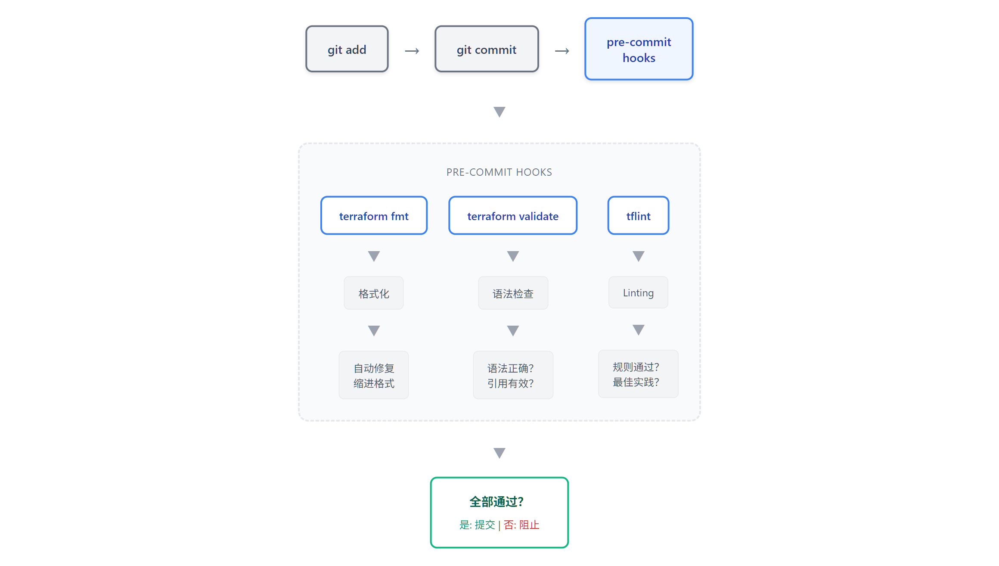
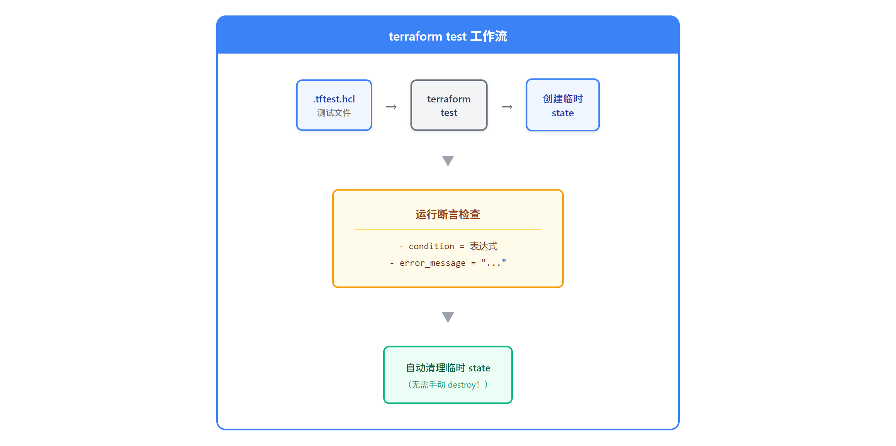
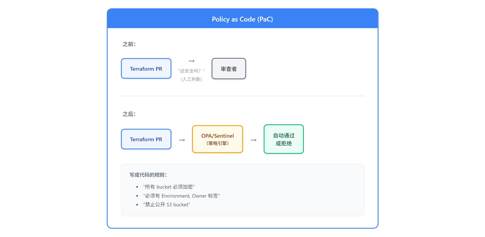

# 13 - 测试与质量保证

> **目标**：掌握 Terraform 测试工具链 - 从基础验证到 Policy as Code
> **前置**：已完成 [12 - 安全与机密管理](../12-security/)
> **时间**：45-50 分钟
> **费用**：无实际资源创建（专注测试）

---

## 将学到的内容

1. 体验 pre-commit hooks 在 `git commit` 前自动拦截错误
2. 理解 `terraform validate` 和 `terraform fmt`
3. 使用 tflint 进行 Provider 专属 linting
4. 编写和运行 `terraform test`（TF 1.6+）
5. Policy as Code 入门：OPA（Open Policy Agent）

---

## Step 1 - 快速验证环境（2 分钟）

连接到你的 Terraform Lab 实例：

```bash
aws ssm start-session --target i-你的实例ID --region ap-northeast-1
```

验证 Terraform 版本（`terraform test` 需要 1.6+）：

```bash
terraform version
```

```
Terraform v1.14.x
on linux_amd64
```

安装测试工具：

```bash
# tflint（Terraform Linter）
curl -s https://raw.githubusercontent.com/terraform-linters/tflint/master/install_linux.sh | bash

# pre-commit（Git 钩子框架）
pip3 install pre-commit

# OPA（可选，Policy as Code）
curl -L -o opa https://openpolicyagent.org/downloads/latest/opa_linux_amd64_static
chmod +x opa && sudo mv opa /usr/local/bin/
```

---

## Step 2 - 立即体验：Pre-commit 自动拦截错误（5 分钟）

> 先「尝到」自动化检查的保护，再理解原理。

### 2.1 进入示例代码目录

```bash
cd ~/cloud-atlas/iac/terraform/13-testing/code
ls -la
```

```
.
├── .pre-commit-config.yaml    # Pre-commit 钩子配置
├── .tflint.hcl                # tflint 规则配置
├── sample-module/             # 待测试的模块
│   ├── main.tf
│   ├── variables.tf
│   └── outputs.tf
├── tests/                     # terraform test 示例
│   └── s3_bucket.tftest.hcl
└── policies/                  # OPA 策略文件
    └── required_tags.rego
```

### 2.2 初始化 Pre-commit

```bash
git init  # 如果还不是 Git 仓库
pre-commit install
```

```
pre-commit installed at .git/hooks/pre-commit
```

### 2.3 故意创建一个格式错误的文件

```bash
cat > bad-example.tf << 'EOF'
resource "aws_s3_bucket" "bad" {
  bucket = "my-bucket"
    tags = {
  Name = "bad formatting"
    }
}
EOF
```

### 2.4 尝试 Commit

```bash
git add bad-example.tf
git commit -m "add bad example"
```

**Pre-commit 拦截了提交！**

```
terraform_fmt....................................................Failed
- hook id: terraform_fmt
- files were modified by this hook

terraform_validate...............................................Passed
tflint...........................................................Failed
- hook id: tflint
- exit code: 2
```

Pre-commit 自动完成了：
1. 用 `terraform fmt` 修复格式
2. 检测到 tflint 问题

**你的代码在进入仓库之前就受到了保护！**

---

## Step 3 - 发生了什么？（5 分钟）

### 3.1 Pre-commit 工作流



<details>
<summary>View ASCII source</summary>

```
                    Pre-commit Flow

  Developer                           Git Repository
      │                                     │
    1 │ Edit files                          │
      │                                     │
    2 │ git add .                           │
      │                                     │
    3 │ git commit -m "..."                 │
      │                                     │
      ▼                                     │
  ┌────────────────────────────────────┐    │
  │         Pre-commit Hooks           │    │
  │  ┌──────────────────────────────┐  │    │
  │  │ terraform fmt    [auto-fix]  │──┼──▶ Modified files
  │  │ terraform validate  [check]  │  │    │
  │  │ tflint             [check]   │  │    │
  │  │ trivy              [check]   │  │    │
  │  └──────────────────────────────┘  │    │
  │                                    │    │
  │  ┌──────────┐    ┌──────────────┐  │    │
  │  │ ✓ Passed │    │ ✗ Failed     │  │    │
  │  └────┬─────┘    └───────┬──────┘  │    │
  └───────┼──────────────────┼─────────┘    │
          │                  │              │
          ▼                  ▼              │
    Commit created     Commit blocked       │
          │                  │              │
          ▼                  │              │
  ────────┴──────────────────┴──────────────┘
```

</details>

### 3.2 质量保证分层模型

| 工具 | 检查类型 | 运行时机 | 自动修复 |
|------|----------|----------|----------|
| `terraform fmt` | 格式规范 | Pre-commit | 是（自动） |
| `terraform validate` | 语法 + 引用 | Pre-commit | 否 |
| `tflint` | Linting 规则 | Pre-commit | 部分 |
| `terraform test` | 逻辑测试 | CI/CD | 否 |
| OPA/Sentinel | Policy 检查 | CI/CD | 否 |

---

## Step 4 - 动手实验：terraform validate（5 分钟）

> 理解 Terraform 内置的验证功能。

### 4.1 验证正确的配置

```bash
cd sample-module
terraform init
terraform validate
```

```
Success! The configuration is valid.
```

### 4.2 创建一个错误的配置

```bash
cat > broken.tf << 'EOF'
resource "aws_s3_bucket" "test" {
  bucket = var.nonexistent_variable  # 未声明的变量！
}
EOF
```

```bash
terraform validate
```

```
Error: Reference to undeclared input variable

  on broken.tf line 2, in resource "aws_s3_bucket" "test":
   2:   bucket = var.nonexistent_variable

An input variable with the name "nonexistent_variable" has not been declared.
```

### 4.3 terraform validate 检查什么？

| 检查项 | 示例 |
|--------|------|
| HCL 语法 | 缺少大括号、缩进错误 |
| 变量引用 | 引用未声明的变量 |
| 资源引用 | 引用不存在的资源 |
| 类型检查 | 传入 string 但期望 number |
| Block 结构 | 缺少必需参数 |

**不检查的内容：**
- AWS API 有效性（如 bucket 名称是否合法）
- 实际资源创建能力
- IAM 权限

```bash
# 清理测试文件
rm broken.tf
```

---

## Step 5 - 动手实验：tflint（10 分钟）

> Provider 专属的 linting 规则。

### 5.1 查看 tflint 配置

```bash
cd ~/cloud-atlas/iac/terraform/13-testing/code
cat .tflint.hcl
```

```hcl
# tflint 配置文件

plugin "terraform" {
  enabled = true
  preset  = "recommended"
}

plugin "aws" {
  enabled = true
  version = "0.44.0"
  source  = "github.com/terraform-linters/tflint-ruleset-aws"
}

# 自定义规则
rule "terraform_naming_convention" {
  enabled = true
  format  = "snake_case"
}

rule "terraform_documented_variables" {
  enabled = true
}

rule "terraform_documented_outputs" {
  enabled = true
}
```

### 5.2 初始化 tflint

```bash
tflint --init
```

```
Installing "aws" plugin...
Installed "aws" (source: github.com/terraform-linters/tflint-ruleset-aws, version: 0.44.0)
```

### 5.3 运行 tflint

```bash
tflint
```

如果 sample-module 有问题：

```
1 issue(s) found:

Warning: variable "environment" should have a description (terraform_documented_variables)

  on sample-module/variables.tf line 1:
   1: variable "environment" {
```

### 5.4 AWS 专属检查

创建一个测试文件：

```bash
cat > aws-check.tf << 'EOF'
resource "aws_instance" "bad" {
  ami           = "ami-12345678"
  instance_type = "t1.micro"  # 过时的实例类型！
}
EOF
```

```bash
tflint
```

```
Warning: "t1.micro" is previous generation instance type. (aws_instance_previous_type)

  on aws-check.tf line 3:
   3:   instance_type = "t1.micro"
```

**tflint 知道 AWS 最佳实践！**

```bash
rm aws-check.tf
```

### 5.5 常用 tflint 规则

| 规则 | 说明 |
|------|------|
| `aws_instance_previous_type` | 检测过时的实例类型 |
| `aws_instance_invalid_type` | 检测无效的实例类型 |
| `aws_s3_bucket_name` | 检测无效的 bucket 名称 |
| `terraform_naming_convention` | 变量/资源命名规范 |
| `terraform_documented_*` | 缺少 description |
| `terraform_unused_declarations` | 未使用的变量 |

---

## Step 6 - 动手实验：terraform test（10 分钟）

> Terraform 1.6+ 内置测试框架。

### 6.1 理解 terraform test



<details>
<summary>View ASCII source</summary>

```
                  Terraform Test Flow

  ┌─────────────────────────────────────────────────────────┐
  │  tests/                                                 │
  │  └── s3_bucket.tftest.hcl                               │
  │      ┌─────────────────────────────────────────────┐    │
  │      │ run "test_name" {                           │    │
  │      │   command = plan | apply                    │    │
  │      │   variables { ... }                         │    │
  │      │   assert { condition = ... }                │    │
  │      │ }                                           │    │
  │      └─────────────────────────────────────────────┘    │
  └────────────────────────┬────────────────────────────────┘
                           │
                           ▼
  ┌─────────────────────────────────────────────────────────┐
  │                  terraform test                          │
  │  ┌─────────────────────────────────────────────────┐    │
  │  │ 1. Init module                                  │    │
  │  │ 2. For each "run" block:                        │    │
  │  │    ├─ Set variables                             │    │
  │  │    ├─ Execute command (plan/apply)              │    │
  │  │    └─ Evaluate assertions                       │    │
  │  │ 3. Cleanup (destroy if apply mode)              │    │
  │  └─────────────────────────────────────────────────┘    │
  └────────────────────────┬────────────────────────────────┘
                           │
                           ▼
  ┌──────────────────┐    ┌──────────────────┐
  │ ✓ All passed     │    │ ✗ Failures       │
  │   Exit code: 0   │    │   Exit code: 1   │
  └──────────────────┘    └──────────────────┘
```

</details>

### 6.2 查看测试文件

```bash
cat tests/s3_bucket.tftest.hcl
```

```hcl
# =============================================================================
# S3 Bucket 模块测试
# =============================================================================
# 使用 terraform test（TF 1.6+）内置框架

# -----------------------------------------------------------------------------
# 测试：默认值正确工作
# -----------------------------------------------------------------------------
run "default_values" {
  command = plan  # 只 plan，不创建真实资源

  assert {
    condition     = startswith(aws_s3_bucket.main.bucket, "test-bucket-")
    error_message = "Bucket name 应该以 'test-bucket-' 开头"
  }

  assert {
    condition     = aws_s3_bucket.main.tags["Environment"] == "dev"
    error_message = "默认 environment 应该是 'dev'"
  }
}

# -----------------------------------------------------------------------------
# 测试：生产环境配置
# -----------------------------------------------------------------------------
run "production_config" {
  command = plan

  variables {
    environment    = "prod"
    enable_logging = true
  }

  assert {
    condition     = aws_s3_bucket.main.tags["Environment"] == "prod"
    error_message = "Environment tag 应该是 'prod'"
  }

  assert {
    condition     = aws_s3_bucket_logging.main[0].target_bucket != ""
    error_message = "生产环境应启用 logging"
  }
}

# -----------------------------------------------------------------------------
# 测试：验证规则生效
# -----------------------------------------------------------------------------
run "invalid_environment_rejected" {
  command = plan

  variables {
    environment = "invalid"
  }

  expect_failures = [
    var.environment  # 期望这个验证失败
  ]
}
```

### 6.3 运行测试

```bash
cd ~/cloud-atlas/iac/terraform/13-testing/code/sample-module
terraform init
terraform test
```

```
tests/s3_bucket.tftest.hcl... in progress
  run "default_values"... pass
  run "production_config"... pass
  run "invalid_environment_rejected"... pass
tests/s3_bucket.tftest.hcl... tearing down
tests/s3_bucket.tftest.hcl... pass

Success! 3 passed, 0 failed.
```

### 6.4 测试文件语法

```hcl
run "test_name" {
  command = plan | apply  # plan = dry-run, apply = 创建真实资源

  variables {
    key = value  # 覆盖变量值
  }

  assert {
    condition     = <布尔表达式>
    error_message = "条件为 false 时的错误信息"
  }

  expect_failures = [
    var.xxx,     # 期望验证失败
    resource.yyy # 期望资源创建失败
  ]
}
```

### 6.5 terraform test 最佳实践

| 场景 | command | 说明 |
|------|---------|------|
| 逻辑验证 | `plan` | 快速，不创建资源 |
| 集成测试 | `apply` | 创建真实资源，自动清理 |
| 验证规则测试 | `plan` + `expect_failures` | 验证 validation 规则生效 |

---

## Step 7 - Policy as Code 入门：OPA（8 分钟）

> Policy as Code（策略即代码）：机器可执行的基础设施规则。

### 7.1 什么是 Policy as Code？



<details>
<summary>View ASCII source</summary>

```
                    Policy as Code

  ┌─────────────────────────────────────────────────────────┐
  │ Traditional: Manual Compliance Check                     │
  ├─────────────────────────────────────────────────────────┤
  │                                                          │
  │  Developer ─▶ PR ─▶ Manual Review ─▶ [Approved?] ─▶ Merge│
  │                      (Human reads                        │
  │                       policy docs)                       │
  │                                                          │
  │  ⚠️ Slow, error-prone, inconsistent                      │
  └─────────────────────────────────────────────────────────┘

  ┌─────────────────────────────────────────────────────────┐
  │ Policy as Code: Automated Enforcement                    │
  ├─────────────────────────────────────────────────────────┤
  │                                                          │
  │  Developer ─▶ PR ─▶ terraform plan ─▶ OPA/Sentinel      │
  │                          │                 │             │
  │                          ▼                 ▼             │
  │                     plan.json ──▶ Policy Evaluation      │
  │                                       │                  │
  │                          ┌────────────┴────────────┐     │
  │                          ▼                         ▼     │
  │                    ✓ Compliant              ✗ Denied     │
  │                    (Auto-merge OK)         (Block PR)    │
  │                                                          │
  │  ✓ Fast, consistent, auditable                           │
  └─────────────────────────────────────────────────────────┘
```

</details>

### 7.2 OPA vs Sentinel

| 特性 | OPA (Open Policy Agent) | Sentinel |
|------|-------------------------|----------|
| 成本 | 开源免费 | Terraform Cloud/Enterprise 专属 |
| 语言 | Rego | Sentinel Language |
| 适用范围 | 通用（K8s, Terraform, CI/CD...） | 仅 HashiCorp 产品 |
| 社区 | 大（CNCF 项目） | 限于 HCP 用户 |
| 使用场景 | 多工具统一标准化 | 深度 Terraform 集成 |

**建议**：从 OPA 开始，灵活性更高。如果使用 Terraform Cloud，可考虑 Sentinel。

### 7.3 OPA Policy 示例

```bash
cat policies/required_tags.rego
```

```rego
# =============================================================================
# OPA Policy: 必需标签
# =============================================================================
# 所有 AWS 资源必须有特定标签
# 运行: opa eval -i plan.json -d required_tags.rego "data.terraform.deny"

package terraform

import input as tfplan

# 必需标签 - 根据需要修改
required_tags := {"Environment", "Owner", "Project"}

# 拒绝规则：检查缺失的必需标签
deny[msg] {
    resource := tfplan.resource_changes[_]
    resource.type == "aws_s3_bucket"
    resource.change.actions[_] == "create"

    tags := resource.change.after.tags
    missing := required_tags - {tag | tags[tag]}
    count(missing) > 0

    msg := sprintf(
        "S3 bucket '%s' 缺少必需标签: %v",
        [resource.address, missing]
    )
}

# 拒绝规则：禁止公开 bucket
deny[msg] {
    resource := tfplan.resource_changes[_]
    resource.type == "aws_s3_bucket_public_access_block"
    resource.change.actions[_] == "create"

    config := resource.change.after
    config.block_public_acls != true

    msg := sprintf(
        "S3 bucket '%s' 必须设置 block_public_acls = true",
        [resource.address]
    )
}
```

### 7.4 运行 OPA 检查

```bash
# 生成 terraform plan JSON
cd sample-module
terraform plan -out=tfplan.binary
terraform show -json tfplan.binary > tfplan.json

# 运行 OPA 检查
opa eval -i tfplan.json -d ../policies/required_tags.rego "data.terraform.deny"
```

策略失败时的输出：

```json
{
  "result": [
    {
      "expressions": [
        {
          "value": ["S3 bucket 'aws_s3_bucket.main' 缺少必需标签: {\"Owner\", \"Project\"}"]
        }
      ]
    }
  ]
}
```

### 7.5 在 CI/CD 中集成 OPA

```yaml
# .github/workflows/terraform.yml（示例）
- name: OPA Policy Check
  run: |
    terraform show -json tfplan.binary > tfplan.json
    opa eval -i tfplan.json -d policies/ "data.terraform.deny" --fail-defined
```

---

## Step 8 - Mini Project: Pre-commit + Policy Gate（5 分钟）

> 为 Terraform 项目配置完整的质量门禁。

### 8.1 完整的 Pre-commit 配置

```bash
cat .pre-commit-config.yaml
```

```yaml
# =============================================================================
# Pre-commit Configuration for Terraform
# =============================================================================
# 安装: pip install pre-commit && pre-commit install
# 手动运行: pre-commit run --all-files

repos:
  # ---------------------------------------------------------------------------
  # Terraform 格式化和验证
  # ---------------------------------------------------------------------------
  - repo: https://github.com/antonbabenko/pre-commit-terraform
    rev: v1.97.3
    hooks:
      # 格式检查（自动修复）
      - id: terraform_fmt

      # 语法和引用验证
      - id: terraform_validate
        args:
          - --hook-config=--retry-once-with-cleanup=true

      # Linting 规则
      - id: terraform_tflint
        args:
          - --args=--config=__GIT_WORKING_DIR__/.tflint.hcl

      # 安全扫描（Trivy - tfsec 已弃用并合并到 Trivy）
      - id: terraform_trivy
        args:
          - --args=--severity HIGH,CRITICAL

      # 文档生成（可选）
      - id: terraform_docs
        args:
          - --hook-config=--path-to-file=README.md
          - --hook-config=--add-to-existing-file=true
          - --hook-config=--create-file-if-not-exist=true

  # ---------------------------------------------------------------------------
  # 通用代码质量
  # ---------------------------------------------------------------------------
  - repo: https://github.com/pre-commit/pre-commit-hooks
    rev: v6.0.0
    hooks:
      - id: trailing-whitespace
      - id: end-of-file-fixer
      - id: check-yaml
      - id: check-added-large-files
        args: ['--maxkb=500']
```

### 8.2 手动运行所有检查

```bash
pre-commit run --all-files
```

```
terraform_fmt.........................................................Passed
terraform_validate....................................................Passed
terraform_tflint......................................................Passed
terraform_trivy.......................................................Passed
trailing-whitespace...................................................Passed
end-of-file-fixer.....................................................Passed
check-yaml............................................................Passed
check-added-large-files...............................................Passed
```

### 8.3 质量检查清单

- [ ] `.pre-commit-config.yaml` 添加到仓库根目录
- [ ] `.tflint.hcl` 配置团队规则
- [ ] 执行 `pre-commit install`
- [ ] 所有团队成员安装工具
- [ ] CI/CD 也运行相同检查

---

## Step 9 - 清理（2 分钟）

```bash
cd ~/cloud-atlas/iac/terraform/13-testing/code

# 删除测试文件
rm -f bad-example.tf
rm -f sample-module/broken.tf
rm -f sample-module/tfplan.binary
rm -f sample-module/tfplan.json

# 删除本课创建的临时 git 仓库（仅限 code/ 目录内）
# ⚠️ 确保当前目录是 13-testing/code，不要在主仓库执行！
rm -rf .git
```

---

## 本课小结

| 工具 | 用途 | 使用时机 |
|------|------|----------|
| `terraform fmt` | 格式标准化 | Pre-commit（自动修复） |
| `terraform validate` | 语法 + 引用检查 | Pre-commit |
| `tflint` | Provider 专属 Linting | Pre-commit |
| `terraform test` | 逻辑验证 | CI/CD |
| OPA | Policy 执行 | CI/CD |
| Sentinel | HCP Policy 执行 | 仅 Terraform Cloud |

**质量保证流水线：**

```
开发者工作站                    CI/CD Pipeline
──────────────────────        ────────────────────────
git commit                    PR 创建
    │                             │
    ▼                             ▼
┌──────────────┐            ┌──────────────┐
│ pre-commit   │            │ terraform    │
│ ─────────────│            │ test         │
│ fmt          │            └──────┬───────┘
│ validate     │                   │
│ tflint       │                   ▼
│ trivy        │            ┌──────────────┐
└──────────────┘            │ OPA/Sentinel │
                            │ policy check │
                            └──────┬───────┘
                                   │
                                   ▼
                            ┌──────────────┐
                            │ terraform    │
                            │ plan         │
                            └──────────────┘
```

---

## 下一步

掌握了测试与质量保证，让我们在综合实战项目中把所有内容整合起来。

--> [14 - 实战项目：三层 Web 架构](../14-capstone/)

---

## 面试准备

**よくある質問**

**Q: Terraform コードの品質保証方法は？**

A: 多層アプローチ：`fmt`/`validate` で基本チェック、`tflint` で Provider 特有の Linting、`terraform test` でロジック検証、Trivy でセキュリティスキャン（tfsec は Trivy に統合済み）。ローカルで pre-commit hooks、CI/CD で同じチェック + OPA policy。

**Q: terraform test とは？**

A: TF 1.6+ の内蔵テストフレームワーク。`.tftest.hcl` ファイルでアサーションを記述。`plan` モード（Dry Run）と `apply` モード（実リソース作成＋自動クリーンアップ）をサポート。モジュールのロジックと validation ルールのテストに適している。

**Q: OPA と Sentinel の違いは？**

A: OPA はオープンソース（CNCF）、Rego 言語、あらゆるツール（Kubernetes, Terraform 等）で使用可能。Sentinel は HashiCorp 専有、Terraform Cloud との深い統合、有料機能。柔軟性/オープンソースなら OPA、Terraform Cloud/Enterprise なら Sentinel を選択。

**Q: pre-commit hooks の利点は？**

A: コードがリポジトリに入る前に問題を検出。自動修正機能（fmt）あり。CI/CD 失敗を削減。チームのコード品質を標準化。ローカル実行 = フィードバックが速い。

---

## トラブルシューティング

**よくある問題**

**pre-commit install が失敗**

```bash
# pre-commit がインストールされていることを確認
pip3 install pre-commit

# まず git repo を初期化
git init
pre-commit install
```

**tflint --init が失敗（ネットワーク問題）**

```bash
# 手動でプラグインをダウンロード
mkdir -p ~/.tflint.d/plugins
# GitHub releases からダウンロード
```

**terraform test が見つからない**

```bash
# Terraform 1.6+ が必要
terraform version

# 必要に応じてアップグレード
tfenv install 1.14.3
tfenv use 1.14.3
```

**OPA eval が空の結果を返す**

```bash
# JSON 構造がポリシーの期待と一致していることを確認
# パッケージ名がクエリと一致していることを確認
opa eval -i plan.json -d policy.rego "data.terraform.deny" --format pretty
```

---

## 职场小贴士

**日本 IT 运维现场**

- **品質ゲート = 承認フローの一部**：日本の多くの企業では、品質ゲートが承認ワークフローの一部
- **pre-commit = 事前防止**：問題のあるコードがレビュープロセスに入ることを防ぐ
- **Policy as Code = 実行可能なルール**：承認ワークフロー中の自動チェックを可能にする
- **terraform test = テスト工程との統合**：ドキュメントにテストケースをエビデンスとして含められる

**常见日语术语：**

| 日语 | 含义 |
|------|------|
| テスト | 测试 |
| 品質保証 | 质量保证 |
| 静的解析 | 静态分析 |
| ポリシーチェック | 策略检查 |
| プリコミットフック | Pre-commit hook |

---

## 延伸阅读

- [terraform test Documentation](https://developer.hashicorp.com/terraform/language/tests)
- [tflint GitHub](https://github.com/terraform-linters/tflint)
- [pre-commit-terraform](https://github.com/antonbabenko/pre-commit-terraform)
- [Open Policy Agent](https://www.openpolicyagent.org/)
- [OPA Terraform Integration](https://www.openpolicyagent.org/docs/latest/terraform/)

---

## 检查清单

完成本课后，验证你能够：

- [ ] 安装并配置 pre-commit hooks
- [ ] 运行 `terraform validate` 并理解其检查范围
- [ ] 配置和运行 tflint
- [ ] 编写并运行 `terraform test`（TF 1.6+）
- [ ] 理解 OPA 的基本概念和用法
- [ ] 解释 OPA 和 Sentinel 的区别

---

## 系列导航

← [12 · 安全管理](../12-security/) | [Home](../) | [14 · 实战项目 →](../14-capstone/)
