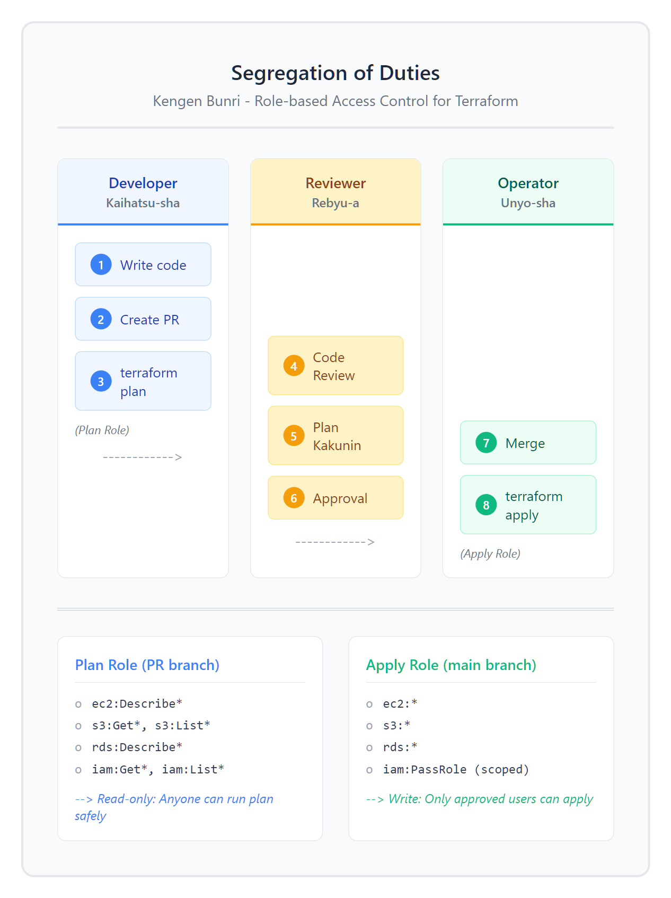
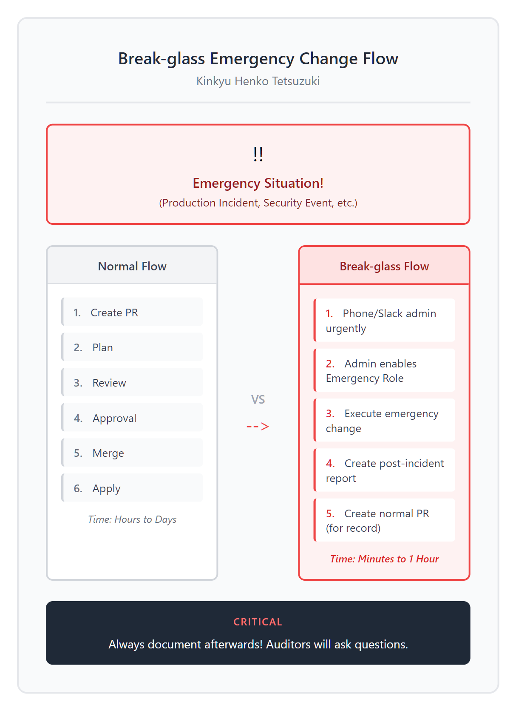

# 15 - 日本 IT：変更管理と承認フロー

> **目标**：将 Terraform 工作流映射到日本 IT 企业的変更管理（Change Management）和稟議（承认）流程
> **前置**：已完成 [14 - 实战项目](../14-capstone/) 或具备生产级 Terraform 经验
> **时间**：60-90 分钟
> **费用**：GitHub Actions 免费额度内 + IAM Role（免费）

---

## 将学到的内容

1. 理解日本 IT 企业的**変更管理**文化与流程
2. 实现 **Plan 与 Apply 的权限分离**（Segregation of Duties）
3. 使用 **OIDC + GitHub Actions** 按分支授予不同权限
4. 掌握**変更管理書**（Change Request）模板
5. 处理**変更凍結期間**（Change Freeze）：年末年始、GW、決算期末
6. 建立 **Break-glass 緊急変更**手顺

---

## 先跑起来：5 分钟理解日本变更管理

> 在动手之前，先了解日本 IT 企业的变更管理是如何运作的。

### 日本 IT 変更管理 vs 敏捷开发

在日本的 IT 企业（特别是金融、保险、制造业），变更管理非常严格：


<details>
<summary>View ASCII source</summary>

```
           Japan IT Change Management Flow (変更管理フロー)

  ┌─────────────────────────────────────────────────────────────────┐
  │                                                                 │
  │  Developer           Team Lead          Infra Manager          │
  │     │                   │                    │                  │
  │   1 │ Create PR         │                    │                  │
  │     │ (変更申請)         │                    │                  │
  │     ▼                   │                    │                  │
  │  ┌──────────┐           │                    │                  │
  │  │terraform │           │                    │                  │
  │  │  plan    │           │                    │                  │
  │  └────┬─────┘           │                    │                  │
  │       │                 │                    │                  │
  │     2 │ Plan 結果        │                    │                  │
  │       ├────────────────▶│                    │                  │
  │       │                 │ 3 コードレビュー     │                  │
  │       │                 │   (Code Review)    │                  │
  │       │                 ▼                    │                  │
  │       │           ┌──────────┐               │                  │
  │       │           │ Approve  │               │                  │
  │       │           └────┬─────┘               │                  │
  │       │                │                     │                  │
  │       │              4 │ 本番承認             │                  │
  │       │                ├────────────────────▶│                  │
  │       │                │                     │ 5 承認 or 却下    │
  │       │                │                     ▼                  │
  │       │                │              ┌──────────────┐          │
  │       │                │              │ Environment  │          │
  │       │                │              │  Approval    │          │
  │       │                │              └───────┬──────┘          │
  │       │                │                      │                 │
  │     6 │◀────────────────┴──────────────────────┘                 │
  │       │ Merge to main                                           │
  │       ▼                                                         │
  │  ┌──────────┐                                                   │
  │  │terraform │                                                   │
  │  │  apply   │                                                   │
  │  └──────────┘                                                   │
  │                                                                 │
  └─────────────────────────────────────────────────────────────────┘
```

</details>

### 快速体验：查看示例代码

```bash
# 1. 克隆示例代码（如果尚未克隆）
# GitHub（海外用户）
git clone --filter=blob:none --sparse https://github.com/shiicho/cloud-atlas ~/cloud-atlas
cd ~/cloud-atlas && git sparse-checkout set iac/terraform

# Gitee（中国大陆用户）
git clone --filter=blob:none --sparse https://gitee.com/shiicho/cloud-atlas ~/cloud-atlas
cd ~/cloud-atlas && git sparse-checkout set iac/terraform

# 2. 进入示例目录
cd ~/cloud-atlas/iac/terraform/15-jp-change-mgmt/code
```

查看文件结构：

```
code/
├── templates/
│   ├── change-request-template.md    # 変更管理書（日本語）
│   ├── approval-checklist.md         # 承認チェックリスト
│   └── emergency-change.md           # 緊急変更手順
├── iam-roles/
│   ├── plan-role.tf                  # Plan 専用 IAM Role
│   ├── apply-role.tf                 # Apply 専用 IAM Role
│   ├── trust-policy.tf               # OIDC Trust Policy
│   └── outputs.tf
└── .github/
    └── workflows/
        ├── terraform-plan.yml        # PR 時の plan（read-only）
        ├── terraform-apply.yml       # 承認後の apply
        └── change-freeze-check.yml   # 変更凍結チェック
```

---

## 発生了什么？日本変更管理解析

### 稟議制度（りんぎせいど）とは

**稟議**是日本企业特有的审批制度：

| 日本語 | 读音 | 中文意思 | Terraform 对应 |
|--------|------|----------|----------------|
| 稟議書 | りんぎしょ | 审批申请书 | PR description + plan output |
| 起票 | きひょう | 发起申请 | Create PR |
| 承認印 | しょうにんいん | 批准盖章 | GitHub Approval |
| 決裁 | けっさい | 最终批准 | Merge to main |
| 実施 | じっし | 执行 | terraform apply |

### 権限分離（けんげんぶんり）的重要性

在日本的 IT 运维现场，**権限分離**（Segregation of Duties）是基本原则：



<details>
<summary>View ASCII source</summary>

```
            Segregation of Duties (権限分離)

  ┌───────────────────────────────────────────────────────────────┐
  │ ✗ Anti-Pattern: Same Role for Plan and Apply                  │
  ├───────────────────────────────────────────────────────────────┤
  │                                                               │
  │  Developer ──▶ AdministratorAccess ──▶ terraform plan/apply   │
  │                                                               │
  │  ⚠️ Developer can modify production without approval          │
  │  ⚠️ No audit trail of who approved                            │
  │  ⚠️ Single point of failure                                   │
  │                                                               │
  └───────────────────────────────────────────────────────────────┘

  ┌───────────────────────────────────────────────────────────────┐
  │ ✓ Best Practice: Separate Roles for Plan and Apply            │
  ├───────────────────────────────────────────────────────────────┤
  │                                                               │
  │  PR (feature branch)              main branch                 │
  │       │                               │                       │
  │       ▼                               ▼                       │
  │  ┌──────────────┐                ┌──────────────┐             │
  │  │  Plan Role   │                │  Apply Role  │             │
  │  │  (ReadOnly)  │                │  (Write)     │             │
  │  └───────┬──────┘                └───────┬──────┘             │
  │          │                               │                    │
  │          ▼                               ▼                    │
  │    terraform plan              terraform apply                │
  │    (safe, no changes)          (requires approval)            │
  │                                                               │
  │  ✓ Four-eyes principle (四つ目の原則)                          │
  │  ✓ Clear audit trail                                          │
  │  ✓ Compliant with J-SOX, ISMS, ISMAP                          │
  │                                                               │
  └───────────────────────────────────────────────────────────────┘
```

</details>

**为什么需要权限分离？**

1. **防止误操作**：开发者不能直接修改生产环境
2. **审计合规**：满足 J-SOX、ISMS、ISMAP 等日本监管要求
3. **责任明确**：谁批准、谁执行，一目了然
4. **四眼原则**（四つ目の原則）：至少两人确认才能变更

---

## 核心概念

### 1. OIDC 按分支授权

使用 GitHub Actions OIDC，根据分支名授予不同权限：


<details>
<summary>View ASCII source</summary>

```
          OIDC Branch-Based Role Selection

  GitHub Actions                              AWS IAM
       │                                         │
       │  ┌─────────────────────────────────┐    │
       │  │ Pull Request (feature branch)   │    │
       │  │ sub: repo:org/repo:pull_request │    │
       │  └────────────────┬────────────────┘    │
       │                   │                     │
       │                   │ OIDC Token          │
       │                   ▼                     │
       │            ┌──────────────┐             │
       │            │ Trust Policy │             │
       │            │ Condition:   │             │
       │            │ pull_request │─────────────▶ Plan Role
       │            └──────────────┘             │  (ReadOnly)
       │                                         │
       │  ┌─────────────────────────────────┐    │
       │  │ Push to main                    │    │
       │  │ sub: repo:org/repo:ref:refs/    │    │
       │  │      heads/main                 │    │
       │  └────────────────┬────────────────┘    │
       │                   │                     │
       │                   │ OIDC Token          │
       │                   ▼                     │
       │            ┌──────────────┐             │
       │            │ Trust Policy │             │
       │            │ Condition:   │             │
       │            │ refs/heads/  │─────────────▶ Apply Role
       │            │ main         │             │  (Write)
       │            └──────────────┘             │
       │                                         │
```

</details>

### 2. 変更凍結期間（Change Freeze）

日本企业有特定的**変更凍結期間**，禁止生产变更：

| 期间 | 日期 | 原因 |
|------|------|------|
| **年末年始** | 12/28 - 1/3 | 假期无人值守 |
| **ゴールデンウィーク** | 4/29 - 5/5 | 连休期间 |
| **決算期末** | 3月末、9月末 | 财务结算，禁止影响 |
| **夏季休暇** | お盆 (8/13-16) | 部分企业 |

**CI/CD 中的实现**：

```yaml
# 変更凍結チェック
- name: Check change freeze period
  run: |
    MONTH=$(date +%m)
    DAY=$(date +%d)

    # 年末年始 (12/28 - 1/3)
    if [[ "$MONTH" == "12" && "$DAY" -ge "28" ]] || \
       [[ "$MONTH" == "01" && "$DAY" -le "03" ]]; then
      echo "::error::【変更凍結中】年末年始期間です (12/28-1/3)"
      echo "緊急変更の場合は、Break-glass 手順に従ってください。"
      exit 1
    fi

    # ゴールデンウィーク (4/29 - 5/5)
    if [[ "$MONTH" == "04" && "$DAY" -ge "29" ]] || \
       [[ "$MONTH" == "05" && "$DAY" -le "05" ]]; then
      echo "::error::【変更凍結中】ゴールデンウィーク期間です (4/29-5/5)"
      exit 1
    fi

    # 決算期末 (3/25-3/31, 9/25-9/30)
    if [[ "$MONTH" == "03" && "$DAY" -ge "25" ]] || \
       [[ "$MONTH" == "09" && "$DAY" -ge "25" ]]; then
      echo "::warning::【決算期末】変更は慎重に行ってください"
    fi

    echo "変更凍結期間外です。変更可能です。"
```

### 3. 変更管理書（Change Request）

日本企业的变更需要正式的**変更管理書**：

| 項目 | 内容 | Terraform 对应 |
|------|------|----------------|
| 変更概要 | 何を変更するか | PR title + description |
| 影響範囲 | どこに影響があるか | terraform plan output |
| 切り戻し手順 | 問題時の復旧方法 | git revert + terraform apply |
| 実施日時 | いつ実施するか | Merge timestamp |
| 実施担当 | 誰が実施するか | GitHub username (apply) |
| 承認者 | 誰が承認したか | PR approvers |

### 4. Break-glass 緊急変更

**Break-glass**（ブレークグラス）是紧急变更的特殊流程：



<details>
<summary>View ASCII source</summary>

```
           Break-glass Emergency Change Flow (緊急変更手順)

  ┌─────────────────────────────────────────────────────────────────┐
  │                     Normal Flow (通常フロー)                      │
  │                                                                 │
  │  PR ─▶ Plan ─▶ Review ─▶ Approve ─▶ Merge ─▶ Apply              │
  │                                                                 │
  │  ⛔ BLOCKED during Change Freeze (変更凍結中)                    │
  └─────────────────────────────────────────────────────────────────┘

  ┌─────────────────────────────────────────────────────────────────┐
  │                 Break-glass Flow (緊急変更フロー)                 │
  ├─────────────────────────────────────────────────────────────────┤
  │                                                                 │
  │  1. 障害発生 (Incident)                                          │
  │       │                                                         │
  │       ▼                                                         │
  │  2. 緊急連絡 (Slack/電話)                                        │
  │       │ Contact: infra-manager@company.com                      │
  │       ▼                                                         │
  │  3. 承認取得 (Verbal Approval)                                   │
  │       │ Record: Time, Approver, Reason                          │
  │       ▼                                                         │
  │  4. Emergency Role 有効化                                        │
  │       │ Manager enables temporary access                        │
  │       ▼                                                         │
  │  5. 変更実施 (terraform apply)                                   │
  │       │ With full audit logging                                 │
  │       ▼                                                         │
  │  6. 事後報告書作成                                               │
  │       │ templates/emergency-change.md                           │
  │       ▼                                                         │
  │  7. 通常 PR で記録を残す                                         │
  │       │ Document the change in Git                              │
  │       ▼                                                         │
  │  8. レビュー会議 (Post-mortem)                                   │
  │                                                                 │
  └─────────────────────────────────────────────────────────────────┘
```

</details>

---

## 動手実践：権限分離の実装

### Step 1：Plan Role の作成

> **Note**: 以下の IAM ポリシーは DynamoDB によるロック機構を想定しています。
> Terraform 1.10+ では `use_lockfile = true` による S3 原生ロックが推奨されており、
> DynamoDB は不要です。DynamoDB ロックは Terraform 1.11 で非推奨となり、将来削除予定です。

Plan Role は**読み取り専用**で、誰でも安全に `terraform plan` を実行可能：

```bash
cd ~/cloud-atlas/iac/terraform/15-jp-change-mgmt/code/iam-roles
cat plan-role.tf
```

**Plan Role の設計思想**：

```hcl
# Plan Role - 読み取り専用（開発者が使用）
resource "aws_iam_role" "terraform_plan" {
  name = "TerraformPlanRole"

  assume_role_policy = jsonencode({
    Version = "2012-10-17"
    Statement = [
      {
        Effect = "Allow"
        Principal = {
          Federated = aws_iam_openid_connect_provider.github.arn
        }
        Action = "sts:AssumeRoleWithWebIdentity"
        Condition = {
          StringLike = {
            # PR からのみ assume 可能（main ブランチ以外）
            "token.actions.githubusercontent.com:sub" = "repo:${var.github_org}/${var.github_repo}:pull_request"
          }
          StringEquals = {
            "token.actions.githubusercontent.com:aud" = "sts.amazonaws.com"
          }
        }
      }
    ]
  })

  tags = {
    Purpose     = "terraform-plan"
    Environment = "all"
    ManagedBy   = "terraform"
  }
}

# Plan Role のポリシー（読み取り専用）
resource "aws_iam_role_policy" "terraform_plan" {
  name = "TerraformPlanPolicy"
  role = aws_iam_role.terraform_plan.id

  policy = jsonencode({
    Version = "2012-10-17"
    Statement = [
      {
        Sid    = "ReadOnlyEC2"
        Effect = "Allow"
        Action = [
          "ec2:Describe*",
          "ec2:Get*"
        ]
        Resource = "*"
      },
      {
        Sid    = "ReadOnlyS3"
        Effect = "Allow"
        Action = [
          "s3:Get*",
          "s3:List*"
        ]
        Resource = "*"
      },
      {
        Sid    = "ReadOnlyRDS"
        Effect = "Allow"
        Action = [
          "rds:Describe*",
          "rds:List*"
        ]
        Resource = "*"
      },
      {
        Sid    = "ReadOnlyIAM"
        Effect = "Allow"
        Action = [
          "iam:Get*",
          "iam:List*"
        ]
        Resource = "*"
      },
      {
        Sid    = "TerraformStateRead"
        Effect = "Allow"
        Action = [
          "s3:GetObject",
          "s3:ListBucket"
        ]
        Resource = [
          "arn:aws:s3:::${var.state_bucket}",
          "arn:aws:s3:::${var.state_bucket}/*"
        ]
      },
      {
        Sid    = "TerraformLockRead"
        Effect = "Allow"
        Action = [
          "dynamodb:GetItem"
        ]
        Resource = "arn:aws:dynamodb:*:*:table/${var.lock_table}"
      }
    ]
  })
}
```

### Step 2：Apply Role の作成

Apply Role は**書き込み権限**を持ち、**main ブランチからのみ**使用可能：

```bash
cat apply-role.tf
```

```hcl
# Apply Role - 書き込み可能（承認後のみ）
resource "aws_iam_role" "terraform_apply" {
  name = "TerraformApplyRole"

  assume_role_policy = jsonencode({
    Version = "2012-10-17"
    Statement = [
      {
        Effect = "Allow"
        Principal = {
          Federated = aws_iam_openid_connect_provider.github.arn
        }
        Action = "sts:AssumeRoleWithWebIdentity"
        Condition = {
          StringEquals = {
            # main ブランチからのみ assume 可能
            "token.actions.githubusercontent.com:sub" = "repo:${var.github_org}/${var.github_repo}:ref:refs/heads/main"
            "token.actions.githubusercontent.com:aud" = "sts.amazonaws.com"
          }
        }
      }
    ]
  })

  tags = {
    Purpose     = "terraform-apply"
    Environment = "production"
    ManagedBy   = "terraform"
    Restricted  = "true"
  }
}

# Apply Role のポリシー（書き込み可能）
resource "aws_iam_role_policy" "terraform_apply" {
  name = "TerraformApplyPolicy"
  role = aws_iam_role.terraform_apply.id

  policy = jsonencode({
    Version = "2012-10-17"
    Statement = [
      {
        Sid    = "EC2FullAccess"
        Effect = "Allow"
        Action = "ec2:*"
        Resource = "*"
        Condition = {
          StringEquals = {
            # タグ付きリソースのみ操作可能
            "aws:RequestTag/ManagedBy" = "terraform"
          }
        }
      },
      {
        Sid    = "S3FullAccess"
        Effect = "Allow"
        Action = "s3:*"
        Resource = [
          "arn:aws:s3:::${var.project_prefix}-*",
          "arn:aws:s3:::${var.project_prefix}-*/*"
        ]
      },
      {
        Sid    = "RDSFullAccess"
        Effect = "Allow"
        Action = "rds:*"
        Resource = "arn:aws:rds:*:*:db:${var.project_prefix}-*"
      },
      {
        Sid    = "IAMPassRole"
        Effect = "Allow"
        Action = "iam:PassRole"
        Resource = "arn:aws:iam::*:role/${var.project_prefix}-*"
      },
      {
        Sid    = "TerraformStateWrite"
        Effect = "Allow"
        Action = [
          "s3:GetObject",
          "s3:PutObject",
          "s3:DeleteObject",
          "s3:ListBucket"
        ]
        Resource = [
          "arn:aws:s3:::${var.state_bucket}",
          "arn:aws:s3:::${var.state_bucket}/*"
        ]
      },
      {
        Sid    = "TerraformLockWrite"
        Effect = "Allow"
        Action = [
          "dynamodb:GetItem",
          "dynamodb:PutItem",
          "dynamodb:DeleteItem"
        ]
        Resource = "arn:aws:dynamodb:*:*:table/${var.lock_table}"
      }
    ]
  })
}
```

### Step 3：GitHub Actions ワークフロー

**Plan ワークフロー**（PR 時に自動実行）：

```bash
cat .github/workflows/terraform-plan.yml
```

```yaml
name: Terraform Plan

on:
  pull_request:
    branches: [main]
    paths:
      - 'terraform/**'
      - '.github/workflows/terraform-*.yml'

permissions:
  id-token: write      # OIDC トークン
  contents: read       # コード読み取り
  pull-requests: write # PR コメント

env:
  TF_VERSION: "1.14.3"
  AWS_REGION: "ap-northeast-1"

jobs:
  plan:
    runs-on: ubuntu-latest
    steps:
      - name: Checkout
        uses: actions/checkout@v6

      # 変更凍結チェック（Warning のみ、block はしない）
      - name: Check change freeze (warning)
        run: |
          MONTH=$(date +%m)
          DAY=$(date +%d)

          if [[ "$MONTH" == "12" && "$DAY" -ge "28" ]] || \
             [[ "$MONTH" == "01" && "$DAY" -le "03" ]]; then
            echo "::warning::年末年始期間中です。Apply は凍結中です。"
          fi

      # Plan Role で認証（読み取り専用）
      - name: Configure AWS credentials (Plan Role)
        uses: aws-actions/configure-aws-credentials@v4
        with:
          role-to-assume: ${{ secrets.AWS_PLAN_ROLE_ARN }}
          aws-region: ${{ env.AWS_REGION }}

      - name: Setup Terraform
        uses: hashicorp/setup-terraform@v3
        with:
          terraform_version: ${{ env.TF_VERSION }}

      - name: Terraform Init
        working-directory: terraform/
        run: terraform init

      - name: Terraform Format Check
        working-directory: terraform/
        run: terraform fmt -check -recursive

      - name: Terraform Plan
        id: plan
        working-directory: terraform/
        run: |
          terraform plan -no-color -out=tfplan 2>&1 | tee plan_output.txt
          echo "plan<<EOF" >> $GITHUB_OUTPUT
          cat plan_output.txt >> $GITHUB_OUTPUT
          echo "EOF" >> $GITHUB_OUTPUT
        continue-on-error: true

      # PR に Plan 結果をコメント
      - name: Comment Plan on PR
        uses: actions/github-script@v8
        with:
          script: |
            const output = `## Terraform Plan 結果

            ### 変更概要
            \`\`\`
            ${{ steps.plan.outputs.plan }}
            \`\`\`

            ### 承認チェックリスト
            - [ ] Plan 内容を確認しました
            - [ ] 意図しない変更がないことを確認しました
            - [ ] 影響範囲を理解しています
            - [ ] 切り戻し手順を確認しました

            ---
            *🤖 Terraform Plan by GitHub Actions*
            `;

            github.rest.issues.createComment({
              issue_number: context.issue.number,
              owner: context.repo.owner,
              repo: context.repo.repo,
              body: output
            });

      - name: Plan Status
        if: steps.plan.outcome == 'failure'
        run: exit 1
```

**Apply ワークフロー**（承認後、main マージで実行）：

```bash
cat .github/workflows/terraform-apply.yml
```

```yaml
name: Terraform Apply

on:
  push:
    branches: [main]
    paths:
      - 'terraform/**'

permissions:
  id-token: write
  contents: read

env:
  TF_VERSION: "1.14.3"
  AWS_REGION: "ap-northeast-1"

jobs:
  apply:
    runs-on: ubuntu-latest
    # GitHub Environment で承認ゲート
    environment: production

    steps:
      - name: Checkout
        uses: actions/checkout@v6

      # 変更凍結チェック（Block する）
      - name: Check change freeze period
        run: |
          MONTH=$(date +%m)
          DAY=$(date +%d)

          # 年末年始 (12/28 - 1/3)
          if [[ "$MONTH" == "12" && "$DAY" -ge "28" ]] || \
             [[ "$MONTH" == "01" && "$DAY" -le "03" ]]; then
            echo "::error::【変更凍結中】年末年始期間のため、Apply を停止しました"
            echo "緊急変更の場合は、Break-glass 手順に従ってください"
            echo "手順書: docs/emergency-change.md"
            exit 1
          fi

          # ゴールデンウィーク (4/29 - 5/5)
          if [[ "$MONTH" == "04" && "$DAY" -ge "29" ]] || \
             [[ "$MONTH" == "05" && "$DAY" -le "05" ]]; then
            echo "::error::【変更凍結中】ゴールデンウィーク期間のため、Apply を停止しました"
            exit 1
          fi

          echo "✅ 変更凍結期間外です。Apply を続行します。"

      # Apply Role で認証（書き込み可能）
      - name: Configure AWS credentials (Apply Role)
        uses: aws-actions/configure-aws-credentials@v4
        with:
          role-to-assume: ${{ secrets.AWS_APPLY_ROLE_ARN }}
          aws-region: ${{ env.AWS_REGION }}

      - name: Setup Terraform
        uses: hashicorp/setup-terraform@v3
        with:
          terraform_version: ${{ env.TF_VERSION }}

      - name: Terraform Init
        working-directory: terraform/
        run: terraform init

      - name: Terraform Apply
        working-directory: terraform/
        run: terraform apply -auto-approve

      # 変更記録を CloudWatch Logs に送信
      - name: Log change record
        run: |
          aws logs put-log-events \
            --log-group-name "/terraform/changes" \
            --log-stream-name "production" \
            --log-events timestamp=$(date +%s000),message='{"actor":"${{ github.actor }}","commit":"${{ github.sha }}","action":"apply"}'
```

### Step 4：変更管理書テンプレート

```bash
cat templates/change-request-template.md
```

変更管理書は PR description に含めます。詳細は [templates/change-request-template.md](code/templates/change-request-template.md) を参照。

---

## 職場小贴士

### 日本 IT 企業での変更管理の実態

**大手 SIer / 金融系**：

| 項目 | 現場の実態 | Terraform での対応 |
|------|-----------|-------------------|
| 変更管理票 | Excel / 社内システム | PR description + 自動リンク |
| 承認 | ハンコ / 電子承認 | GitHub Approval |
| 実施記録 | 作業報告書 | Git log + CloudTrail |
| 切り戻し | 手動復旧手順書 | `git revert` + `terraform apply` |

**スタートアップ / Web 系**：

| 項目 | 現場の実態 | Terraform での対応 |
|------|-----------|-------------------|
| 変更管理 | PR ベース | 同じ |
| 承認 | Slack + GitHub | GitHub Approval |
| 実施記録 | Git log | 同じ |
| 変更凍結 | 年末年始のみ | CI/CD でブロック |

### 面接で聞かれる質問

**Q: Terraform の変更管理はどうしていますか？**

A: PR ベースで plan 自動実行、レビュー承認後にのみ apply。IAM Role を Plan 用と Apply 用に分離し、main ブランチからのみ本番変更可能にしています。変更記録は Git と CloudTrail で保持。

**Q: 変更凍結期間はどう対応していますか？**

A: GitHub Actions で日付チェックを実装。年末年始と GW は Apply をブロック。緊急変更は Break-glass 手順で対応し、必ず事後報告書を作成します。

**Q: 権限分離の設計は？**

A: OIDC で GitHub Actions から AWS を認証。PR からは Plan Role（読み取り専用）、main ブランチからは Apply Role（書き込み可）を assume。分岐条件は IAM Trust Policy で制御。

---

## 检查清单

完成以下检查项，确认你已掌握本课内容：

- [ ] 理解日本 IT 企業の変更管理フロー（稟議→承認→実施→記録）
- [ ] Plan Role と Apply Role の権限分離を設計できる
- [ ] OIDC Trust Policy でブランチごとに権限を制御できる
- [ ] GitHub Actions で変更凍結チェックを実装できる
- [ ] 変更管理書（PR テンプレート）を作成できる
- [ ] Break-glass 緊急変更手順を理解している
- [ ] 監査に対応できる変更記録を残せる

---

## 面试准备

**Q: Terraform の変更管理はどうしていますか？**

A: PR で plan 自動実行、レビュー承認、本番は別 IAM Role で apply。変更記録は Git と CloudTrail。OIDC でブランチ別に権限分離しています。

**Q: 権限分離（Segregation of Duties）の実装方法は？**

A: GitHub Actions OIDC で、PR からは Plan Role（読み取り専用）、main ブランチからは Apply Role（書き込み可）を assume。IAM Trust Policy の Condition で制御。

**Q: 変更凍結期間の対応は？**

A: CI/CD で日付チェックを実装。年末年始・GW は Apply をブロック。緊急変更は Break-glass 手順で対応し、必ず事後報告を作成。

**Q: 監査対応は？**

A: Git コミット履歴で変更内容と承認者を追跡。CloudTrail で API 呼び出しを記録。State は S3 Versioning で履歴保持。PR テンプレートで影響範囲と切り戻し手順を記録。

---

## トラブルシューティング

### OIDC Role Assume 失敗

```
Error: Could not assume role with OIDC: Not authorized
```

**確認ポイント**：

1. Trust Policy の `sub` 条件がブランチ名と一致しているか
2. `repo:org/repo:ref:refs/heads/main` の形式が正しいか
3. PR の場合は `repo:org/repo:pull_request` を使用しているか

```bash
# GitHub Actions での sub 値を確認
- name: Debug OIDC token
  run: |
    echo "OIDC sub: ${{ github.event_name == 'pull_request' && format('repo:{0}:pull_request', github.repository) || format('repo:{0}:ref:refs/heads/{1}', github.repository, github.ref_name) }}"
```

### 変更凍結中に緊急変更が必要

**Break-glass 手順**：

1. Slack/電話で管理者に連絡
2. 緊急変更の承認を取得
3. Emergency Role を有効化（管理者が実施）
4. 変更を実施
5. 事後報告書を作成（templates/emergency-change.md）
6. 通常の PR を作成して記録を残す

### Apply Role で権限不足

```
Error: AccessDenied: User is not authorized to perform: ec2:RunInstances
```

**確認ポイント**：

1. Apply Role のポリシーにリソースが含まれているか
2. タグ条件 (`aws:RequestTag`) が正しいか
3. リソースの ARN パターンがマッチしているか

---

## 延伸阅读

- [AWS OIDC Identity Provider for GitHub Actions](https://docs.github.com/en/actions/deployment/security-hardening-your-deployments/configuring-openid-connect-in-amazon-web-services)
- [GitHub Environments for Deployment Protection](https://docs.github.com/en/actions/deployment/targeting-different-environments/using-environments-for-deployment)
- [AWS IAM Best Practices](https://docs.aws.amazon.com/IAM/latest/UserGuide/best-practices.html)
- [ITIL Change Management](https://www.atlassian.com/itsm/change-management)
- [16 - 日本 IT：監査対応とドキュメント](../16-jp-audit/) - 下一课

---

## 系列导航

← [14 · 实战项目](../14-capstone/) | [Home](../) | [16 · 監査対応 →](../16-jp-audit/)
