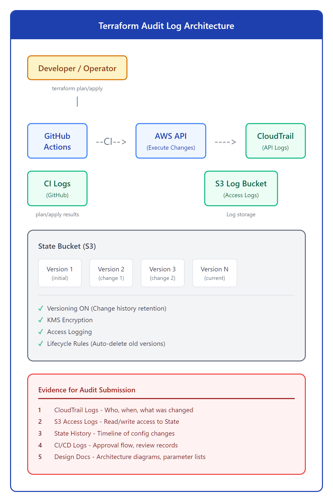
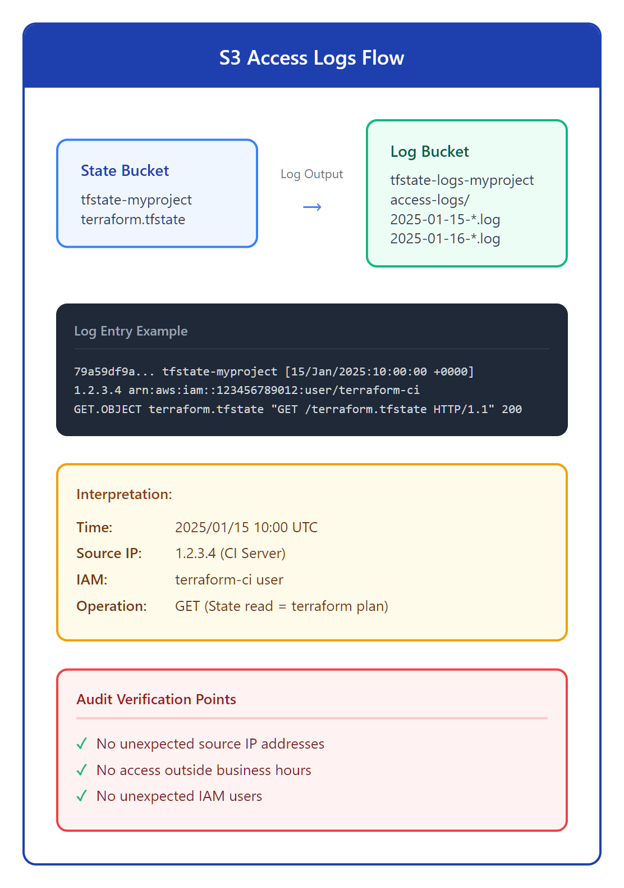
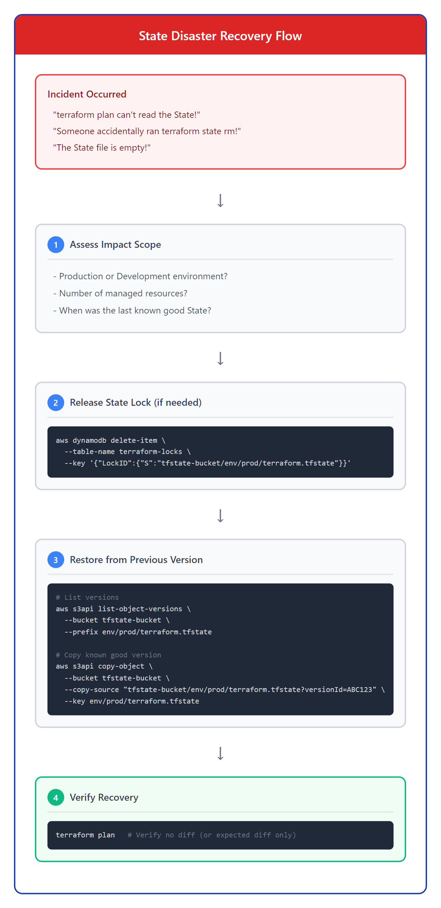

# 16 - 日本 IT：監査対応とドキュメント

> **目標**：掌握日本 IT 企業における監査対応の実践方法，包括証跡収集、設計書作成、障害復旧手順
> **前置**：已完成 [15 - 日本 IT：変更管理と承認フロー](../15-jp-change-mgmt/)
> **時間**：60-90 分
> **費用**：S3 + CloudTrail（極低成本），KMS（免費層内）

---

## 将学到的内容

1. **監査証跡（Audit Trail）** - S3 versioning、アクセスログ、CloudTrail 記録
2. **設計書テンプレート** - 日本企業標準的な構成図 + パラメータ一覧
3. **コンプライアンス対応** - ISMS/ISMAP/SOC2 要件への対応
4. **障害復旧手順** - State バックアップ・リストア・ロック解除

---

## 先跑起来：5 分钟搭建監査ログ基盤

> 先体验监査ログ收集系统，再理解为什么需要这些。

### 快速体验步骤

```bash
# 1. 克隆示例代码（如果尚未克隆）
# GitHub（海外用户）
git clone --filter=blob:none --sparse https://github.com/shiicho/cloud-atlas ~/cloud-atlas
cd ~/cloud-atlas && git sparse-checkout set iac/terraform

# Gitee（中国大陆用户）
git clone --filter=blob:none --sparse https://gitee.com/shiicho/cloud-atlas ~/cloud-atlas
cd ~/cloud-atlas && git sparse-checkout set iac/terraform

# 2. 进入示例目录
cd ~/cloud-atlas/iac/terraform/16-jp-audit/code/audit-logging-setup
```

查看文件结构：

```
code/
├── audit-logging-setup/     # 監査ログ基盤 Terraform
│   ├── main.tf              # S3 + CloudTrail 構成
│   ├── variables.tf
│   ├── outputs.tf
│   └── backend.tf
├── templates/               # 日本企業向け設計書テンプレート
│   ├── 設計書-template.md
│   ├── パラメータ一覧.md
│   └── 障害復旧手順.md
└── state-recovery/          # State 復旧スクリプト
    ├── backup.sh
    ├── restore.sh
    └── unlock.sh
```

### 部署監査ログ基盤

```bash
# 初期化
terraform init

# 確認（dry-run）
terraform plan

# 適用
terraform apply
```

**输出示例**：

```
Apply complete! Resources: 6 added, 0 changed, 0 destroyed.

Outputs:

state_bucket_arn = "arn:aws:s3:::tfstate-myproject-abc123"
cloudtrail_arn = "arn:aws:cloudtrail:ap-northeast-1:123456789012:trail/terraform-audit-trail"
log_bucket_arn = "arn:aws:s3:::tfstate-logs-myproject-abc123"
```

**恭喜！你已经搭建了符合日本 IT 监査要求的 Terraform 基盤。**

---

## 发生了什么？監査対応的全局图

### Terraform 監査ログの全体像



<details>
<summary>View ASCII source</summary>

```
              Terraform Audit Log Architecture

  ┌─────────────────────────────────────────────────────────────────┐
  │                        CI/CD Pipeline                           │
  │  ┌─────────────┐    ┌─────────────┐    ┌─────────────┐          │
  │  │   PR Plan   │───▶│   Approve   │───▶│   Apply     │          │
  │  └──────┬──────┘    └──────┬──────┘    └──────┬──────┘          │
  │         │                  │                  │                 │
  └─────────┼──────────────────┼──────────────────┼─────────────────┘
            │                  │                  │
            ▼                  ▼                  ▼
  ┌─────────────────┐  ┌─────────────────┐  ┌─────────────────┐
  │   GitHub Logs   │  │   Git History   │  │   CloudTrail    │
  │   (plan output) │  │   (approvers)   │  │   (API calls)   │
  └────────┬────────┘  └────────┬────────┘  └────────┬────────┘
           │                    │                    │
           └────────────────────┼────────────────────┘
                                ▼
                    ┌───────────────────────┐
                    │    S3 State Bucket    │
                    │  ┌─────────────────┐  │
                    │  │  Versioning ✓   │  │
                    │  │  Access Logs ✓  │  │
                    │  │  Encryption ✓   │  │
                    │  └─────────────────┘  │
                    └───────────────────────┘
                                │
                                ▼
                    ┌───────────────────────┐
                    │   監査証跡（Evidence）  │
                    │   - 変更履歴           │
                    │   - アクセス記録        │
                    │   - API 操作記録        │
                    │   - 承認フロー          │
                    └───────────────────────┘
```

</details>

### 監査要件と Terraform 対応

| 監査要件 | Terraform での対応 | 証跡（エビデンス） |
|---------|-------------------|------------------|
| **変更履歴** | S3 Versioning | State の全バージョン |
| **アクセス記録** | S3 Access Logs | 誰がいつアクセスしたか |
| **API 操作記録** | CloudTrail | apply 時の AWS API 呼び出し |
| **承認フロー** | GitHub PR + CODEOWNERS | レビュー・承認の記録 |
| **構成管理** | Git + Terraform コード | Infrastructure as Code |

---

## 核心概念

### 1. S3 Versioning for State（変更履歴保持）


<details>
<summary>View ASCII source</summary>

```
           S3 Versioning for Terraform State

  ┌─────────────────────────────────────────────────────────────┐
  │                    S3 State Bucket                          │
  │                                                             │
  │  terraform.tfstate                                          │
  │  ┌─────────────────────────────────────────────────────┐    │
  │  │                                                     │    │
  │  │  Version 1 (2025-01-10)  ← 初期構築                 │    │
  │  │    │                                                │    │
  │  │    ▼                                                │    │
  │  │  Version 2 (2025-01-12)  ← EC2 追加                 │    │
  │  │    │                                                │    │
  │  │    ▼                                                │    │
  │  │  Version 3 (2025-01-15)  ← RDS 設定変更            │    │
  │  │    │                                                │    │
  │  │    ▼                                                │    │
  │  │  Version 4 (Current)     ← 最新                    │    │
  │  │                                                     │    │
  │  └─────────────────────────────────────────────────────┘    │
  │                                                             │
  │  ✓ 全バージョンを自動保持                                   │
  │  ✓ 任意のバージョンにリストア可能                            │
  │  ✓ 監査要件を満たす変更履歴                                  │
  │                                                             │
  └─────────────────────────────────────────────────────────────┘
```

</details>

**Terraform コード（Versioning 有効化）**：

```hcl
# State バケットのバージョニング設定
resource "aws_s3_bucket_versioning" "tfstate" {
  bucket = aws_s3_bucket.tfstate.id

  versioning_configuration {
    status = "Enabled"  # 必須：全変更履歴を保持
  }
}

# ライフサイクルルール（古いバージョンを自動削除）
resource "aws_s3_bucket_lifecycle_configuration" "tfstate" {
  bucket = aws_s3_bucket.tfstate.id

  rule {
    id     = "expire-old-versions"
    status = "Enabled"

    noncurrent_version_expiration {
      noncurrent_days = 365  # 1年間保持（監査要件に応じて調整）
    }
  }
}
```

### 2. S3 Access Logs（アクセス記録）

S3 Access Logs は「誰が、いつ、State ファイルにアクセスしたか」を記録します。



<details>
<summary>View ASCII source</summary>

```
                  S3 Access Logs Flow

  ┌─────────────────────────────────────────────────────────────┐
  │                                                             │
  │   CI/CD          Developer       Admin                      │
  │     │               │              │                        │
  │     │ terraform     │ aws s3       │ aws s3api              │
  │     │ apply         │ cp           │ get-object             │
  │     ▼               ▼              ▼                        │
  │  ┌──────────────────────────────────────────────────────┐   │
  │  │                S3 State Bucket                       │   │
  │  │               (terraform.tfstate)                    │   │
  │  └───────────────────────┬──────────────────────────────┘   │
  │                          │                                  │
  │                          │ Access Logs                      │
  │                          ▼                                  │
  │  ┌──────────────────────────────────────────────────────┐   │
  │  │              S3 Access Logs Bucket                   │   │
  │  │  ┌────────────────────────────────────────────────┐  │   │
  │  │  │ Timestamp: 2025-01-15T10:00:00Z               │  │   │
  │  │  │ Requester: arn:aws:iam::123456789:role/CI     │  │   │
  │  │  │ Operation: REST.GET.OBJECT                     │  │   │
  │  │  │ Key: prod/terraform.tfstate                    │  │   │
  │  │  │ HTTP Status: 200                               │  │   │
  │  │  └────────────────────────────────────────────────┘  │   │
  │  └──────────────────────────────────────────────────────┘   │
  │                                                             │
  └─────────────────────────────────────────────────────────────┘
```

</details>

**Terraform コード（Access Logs 有効化）**：

```hcl
# ログ保存用バケット
resource "aws_s3_bucket" "logs" {
  bucket = "${var.project}-tfstate-logs-${random_id.suffix.hex}"
}

# State バケットのアクセスログ設定
resource "aws_s3_bucket_logging" "tfstate" {
  bucket = aws_s3_bucket.tfstate.id

  target_bucket = aws_s3_bucket.logs.id
  target_prefix = "access-logs/"
}
```

### 3. CloudTrail（AWS API 呼び出し記録）

CloudTrail は `terraform apply` 時の全 AWS API 呼び出しを記録します。

```hcl
# CloudTrail 設定
resource "aws_cloudtrail" "terraform" {
  name                          = "terraform-audit-trail"
  s3_bucket_name                = aws_s3_bucket.cloudtrail.id
  include_global_service_events = true
  is_multi_region_trail         = true
  enable_log_file_validation    = true  # ログ改竄検知

  event_selector {
    read_write_type           = "All"
    include_management_events = true
  }
}
```

**CloudTrail ログ例**：

```json
{
  "eventTime": "2025-01-15T10:00:00Z",
  "eventSource": "ec2.amazonaws.com",
  "eventName": "RunInstances",
  "userIdentity": {
    "arn": "arn:aws:iam::123456789012:role/TerraformApplyRole"
  },
  "sourceIPAddress": "1.2.3.4",
  "requestParameters": {
    "instanceType": "t3.micro",
    "imageId": "ami-0abcdef1234567890"
  }
}
```

---

## 核心概念：日本企業の設計書文化

### 設計書（Design Document）の位置づけ

日本 IT 企業では、設計書（せっけいしょ）は非常に重視されます。


<details>
<summary>View ASCII source</summary>

```
        Design Document Culture in Japan IT (設計書文化)

  ┌─────────────────────────────────────────────────────────────┐
  │                   Traditional Approach                      │
  │                                                             │
  │  設計書 (Word/Excel)      パラメータ一覧 (Excel)             │
  │  ┌─────────────────┐     ┌─────────────────┐                │
  │  │ ■ 基本情報       │     │ リソース│パラメータ│              │
  │  │ ■ 構成図         │     │ EC2    │t3.micro │              │
  │  │ ■ リソース一覧   │     │ RDS    │db.t3    │              │
  │  │ ■ セキュリティ   │     │ ...    │...      │              │
  │  └─────────────────┘     └─────────────────┘                │
  │        ⚠️ 手動更新、乖離リスク                               │
  └─────────────────────────────────────────────────────────────┘

  ┌─────────────────────────────────────────────────────────────┐
  │                   IaC + Auto-Generation                      │
  │                                                             │
  │  Terraform Code           terraform-docs                    │
  │  ┌─────────────────┐     ┌─────────────────┐                │
  │  │ variables.tf    │────▶│ README.md       │                │
  │  │ main.tf         │     │ (自動生成)       │                │
  │  │ outputs.tf      │     │ - Inputs        │                │
  │  └─────────────────┘     │ - Outputs       │                │
  │                          │ - Resources     │                │
  │                          └─────────────────┘                │
  │        ✓ コードと常に同期、乖離なし                          │
  └─────────────────────────────────────────────────────────────┘
```

</details>

### ISMS / ISMAP / SOC2 対応

日本企業で求められる主要なセキュリティ認証：

| 認証 | 正式名称 | 対象 | Terraform での対応 |
|-----|---------|------|-------------------|
| **ISMS** | 情報セキュリティマネジメントシステム | 日本企業全般 | ログ保持、アクセス制御、暗号化 |
| **ISMAP** | 政府情報システムのためのセキュリティ評価制度 | 政府系・準公共 | CloudTrail必須、90日以上ログ保持 |
| **SOC2** | Service Organization Control 2 | SaaS、クラウドサービス | 変更管理、監査証跡、可用性 |

**ISMAP 要件の Terraform 対応例**：

```hcl
# ISMAP 要件: 90日以上のログ保持
resource "aws_s3_bucket_lifecycle_configuration" "cloudtrail_logs" {
  bucket = aws_s3_bucket.cloudtrail.id

  rule {
    id     = "ismap-log-retention"
    status = "Enabled"

    transition {
      days          = 90
      storage_class = "GLACIER"  # 90日後は Glacier に移行
    }

    expiration {
      days = 2555  # 7年間保持（一部要件）
    }
  }
}

# ISMAP 要件: ログ改竄防止（Object Lock）
resource "aws_s3_bucket_object_lock_configuration" "cloudtrail" {
  bucket = aws_s3_bucket.cloudtrail.id

  rule {
    default_retention {
      mode = "GOVERNANCE"
      days = 90
    }
  }
}
```

---

## 動手練習：設計書テンプレート作成

### Step 1：構成図テンプレートを確認

```bash
cat ~/cloud-atlas/iac/terraform/16-jp-audit/code/templates/設計書-template.md
```

**設計書テンプレート**（code/templates/ に完全版あり）:

```markdown
# インフラ構成設計書

## 1. 基本情報
| 項目 | 内容 |
|------|------|
| プロジェクト名 | myproject |
| 環境 | production / staging / development |
| 作成日 | 2025-01-15 |
| 作成者 | インフラチーム |
| 承認者 | 〇〇課長 |

## 2. システム構成図
[ここに構成図を挿入]

## 3. リソース一覧
terraform-docs で自動生成可能

## 4. パラメータ一覧
別紙「パラメータ一覧.md」参照

## 5. セキュリティ設計
...
```

### Step 2：terraform-docs で自動生成

```bash
# terraform-docs インストール
brew install terraform-docs

# ドキュメント生成
cd ~/cloud-atlas/iac/terraform/16-jp-audit/code/audit-logging-setup
terraform-docs markdown . > README.md

# 生成結果を確認
cat README.md
```

**出力例**：

```markdown
## Requirements

| Name | Version |
|------|---------|
| terraform | >= 1.0 |
| aws | ~> 5.0 |

## Providers

| Name | Version |
|------|---------|
| aws | ~> 5.0 |

## Resources

| Name | Type |
|------|------|
| aws_s3_bucket.tfstate | resource |
| aws_s3_bucket_versioning.tfstate | resource |
...
```

---

## 動手練習：障害復旧演習

### シナリオ：State ファイル破損からの復旧

日本 IT 現場で最も恐れられる障害シナリオの一つです。



<details>
<summary>View ASCII source</summary>

```
           State Disaster Recovery Flow (障害復旧フロー)

  ┌─────────────────────────────────────────────────────────────┐
  │                    障害発生 (Incident)                       │
  │  ┌───────────────────────────────────────────────────────┐  │
  │  │ ⚠️ State ファイル破損                                  │  │
  │  │ ⚠️ terraform plan で予期しないエラー                   │  │
  │  │ ⚠️ Lock が解除できない                                 │  │
  │  └───────────────────────────────────────────────────────┘  │
  └──────────────────────────┬──────────────────────────────────┘
                             │
                             ▼
  ┌─────────────────────────────────────────────────────────────┐
  │                   Step 1: 影響範囲確認                       │
  │  $ terraform state list                                     │
  │  $ aws s3api list-object-versions --bucket tfstate-bucket   │
  └──────────────────────────┬──────────────────────────────────┘
                             │
                             ▼
  ┌─────────────────────────────────────────────────────────────┐
  │                   Step 2: 正常な Version を特定              │
  │  $ aws s3api get-object --version-id GOOD_VERSION           │
  │      --bucket tfstate-bucket state-backup.json              │
  └──────────────────────────┬──────────────────────────────────┘
                             │
                             ▼
  ┌─────────────────────────────────────────────────────────────┐
  │                   Step 3: Lock 解除（必要に応じて）          │
  │  $ terraform force-unlock LOCK_ID                           │
  └──────────────────────────┬──────────────────────────────────┘
                             │
                             ▼
  ┌─────────────────────────────────────────────────────────────┐
  │                   Step 4: リストア + 確認                    │
  │  $ aws s3 cp state-backup.json s3://bucket/terraform.tfstate│
  │  $ terraform plan  # 差分なしを確認                          │
  └──────────────────────────┬──────────────────────────────────┘
                             │
                             ▼
  ┌─────────────────────────────────────────────────────────────┐
  │                   Step 5: インシデントレポート作成            │
  │  - 発生日時、影響範囲、原因、対応内容、再発防止策            │
  └─────────────────────────────────────────────────────────────┘
```

</details>

### 復旧スクリプトを実行（演習）

```bash
# 1. まず現在の State を確認
terraform state list

# 2. バージョン一覧を確認
aws s3api list-object-versions \
  --bucket your-tfstate-bucket \
  --prefix path/to/terraform.tfstate \
  --query 'Versions[*].{VersionId:VersionId,LastModified:LastModified,Size:Size}' \
  --output table

# 3. 特定のバージョンをダウンロードして確認
aws s3api get-object \
  --bucket your-tfstate-bucket \
  --key path/to/terraform.tfstate \
  --version-id VERSION_ID_HERE \
  state-backup.json

# 4. 内容を確認
cat state-backup.json | jq '.resources | length'
```

### State Lock 解除（緊急時）

```bash
# DynamoDB のロックを確認
aws dynamodb scan \
  --table-name terraform-locks \
  --query 'Items[*].{LockID:LockID.S,Info:Info.S}'

# ロック解除（強制）
terraform force-unlock LOCK_ID_HERE

# または DynamoDB から直接削除
aws dynamodb delete-item \
  --table-name terraform-locks \
  --key '{"LockID":{"S":"your-lock-id"}}'
```

---

## 職場小貼士：監査対応の実践

### 監査員からの典型的な質問と回答例

| 監査員の質問 | 回答例 | 証跡の場所 |
|-------------|--------|-----------|
| 「いつ、誰が、この EC2 を作成しましたか？」 | 「2025/01/15 に CI/CD から terraform apply を実行しました」 | CloudTrail ログ |
| 「変更は承認されていますか？」 | 「GitHub PR で課長承認後に apply されています」 | GitHub PR 履歴 |
| 「過去の構成に戻せますか？」 | 「S3 Versioning で State 履歴を保持しています」 | S3 バージョン |
| 「設計書はありますか？」 | 「terraform-docs で自動生成しています」 | Git リポジトリ |

### ISMS 内部監査でよくある指摘事項

```
指摘事項 1: ログ保持期間が規定を満たしていない
────────────────────────────────────────────
是正: S3 Lifecycle で保持期間を 1年→3年に延長

指摘事項 2: State への直接アクセスが記録されていない
──────────────────────────────────────────────────
是正: S3 Access Logging を有効化

指摘事項 3: 緊急変更時の手順が文書化されていない
────────────────────────────────────────────────
是正: 障害復旧手順書（障害復旧手順.md）を整備
```

### 日本語面接対策

**Q: Terraform の監査対応はどうしていますか？**

A: State は S3 に保存し、Versioning で変更履歴を保持しています。CloudTrail で API ログを取得し、CI/CD の plan/apply ログも GitHub Actions で保存しています。これにより「いつ、誰が、何を変更したか」をすべて追跡可能です。設計書は terraform-docs で自動生成し、Git で管理しています。

**Q: State ファイルが破損した場合、どう対応しますか？**

A: まず S3 Versioning から過去の正常なバージョンを特定し、リストアします。DynamoDB のロックが残っている場合は force-unlock します。復旧後は terraform plan で想定外の差分がないか確認し、インシデントレポートを作成します。

---

## 検査清单

完成以下检查项，确认你已掌握本课内容：

- [ ] S3 Versioning で State の変更履歴を保持できる
- [ ] S3 Access Logs で State へのアクセスを記録できる
- [ ] CloudTrail で terraform apply の API 呼び出しを追跡できる
- [ ] 設計書テンプレートの構成を理解している
- [ ] terraform-docs で README を自動生成できる
- [ ] ISMS/ISMAP/SOC2 の基本要件を理解している
- [ ] State 障害時の復旧手順を実行できる
- [ ] State Lock の強制解除ができる

---

## 面試準備

**Q: Terraform の監査対応はどうしていますか？**

A: State は S3 versioning で履歴保持、CloudTrail で API ログ、plan/apply ログは CI で保存。ISMS 要件に応じてログ保持期間を設定し、Object Lock で改竄防止も対応可能。

**Q: State ファイルが破損した場合の対応手順は？**

A: まず影響範囲確認、次に S3 バージョンから正常な State を特定しリストア。Lock が残っていれば force-unlock。復旧後は plan で差分確認し、インシデントレポート作成。

**Q: 設計書の管理はどうしていますか？**

A: terraform-docs で自動生成した内容を Git 管理。パラメータ一覧は variables.tf から抽出可能。構成図は Terraform Graph や外部ツール（Cloudcraft など）で作成し、設計書に添付。

**Q: ISMS 監査で Terraform に関する指摘を受けたことはありますか？**

A: ログ保持期間の設定、State への直接アクセス記録、緊急変更手順の文書化などが典型的な指摘事項。Terraform の機能と AWS サービスを組み合わせて是正対応を行いました。

---

## トラブルシューティング

### State Version が見つからない

```
Error: Failed to get object version list
```

**原因**: バケットで Versioning が有効化されていない

**対策**:
```bash
# Versioning 状態を確認
aws s3api get-bucket-versioning --bucket your-bucket

# 有効化
aws s3api put-bucket-versioning \
  --bucket your-bucket \
  --versioning-configuration Status=Enabled
```

### CloudTrail ログが空

```
Error: No log files found in S3 bucket
```

**確認ポイント**:
1. CloudTrail が有効化されているか
2. S3 バケットポリシーで CloudTrail からの書き込みが許可されているか
3. ログ配信に 15分程度の遅延がある

### Lock が解除できない

```
Error: Error locking state: Error acquiring the state lock
```

**対策**:
```bash
# Lock ID を確認
terraform plan 2>&1 | grep "Lock Info"

# 強制解除
terraform force-unlock LOCK_ID

# それでも解除できない場合は DynamoDB を直接操作
aws dynamodb delete-item \
  --table-name terraform-locks \
  --key '{"LockID":{"S":"your-lock-id"}}'
```

---

## 延伸阅读

- [AWS CloudTrail User Guide](https://docs.aws.amazon.com/awscloudtrail/latest/userguide/)
- [S3 Versioning](https://docs.aws.amazon.com/AmazonS3/latest/userguide/Versioning.html)
- [terraform-docs](https://terraform-docs.io/)
- [ISMAP クラウドサービスリスト](https://www.ismap.go.jp/csm?id=cloud_service_list)
- [15 - 日本 IT：変更管理と承認フロー](../15-jp-change-mgmt/) - 前課

---

## 清理资源

> ⚠️ **本课涉及多个 AWS 资源**，请务必清理以避免费用：

```bash
cd ~/cloud-atlas/iac/terraform/16-jp-audit/code/audit-logging-setup

# 1. 清空 S3 Bucket 内容（必须先清空才能删除）
TFSTATE_BUCKET=$(terraform output -raw state_bucket_name 2>/dev/null || echo "")
LOG_BUCKET=$(terraform output -raw log_bucket_name 2>/dev/null || echo "")

if [ -n "$TFSTATE_BUCKET" ]; then
  aws s3 rm s3://$TFSTATE_BUCKET --recursive
fi

if [ -n "$LOG_BUCKET" ]; then
  aws s3 rm s3://$LOG_BUCKET --recursive
fi

# 2. 删除 Terraform 管理的资源
terraform destroy -auto-approve

# 3. 确认资源已删除
aws s3 ls | grep tfstate
aws cloudtrail describe-trails --query 'trailList[*].Name'
```

---

## 系列導航

← [15 · 変更管理](../15-jp-change-mgmt/) | [Home](../) | 🎉 Course Complete!
