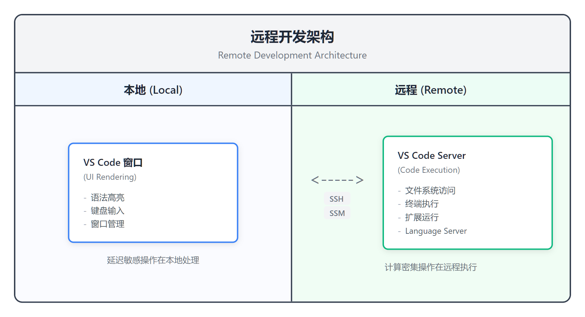
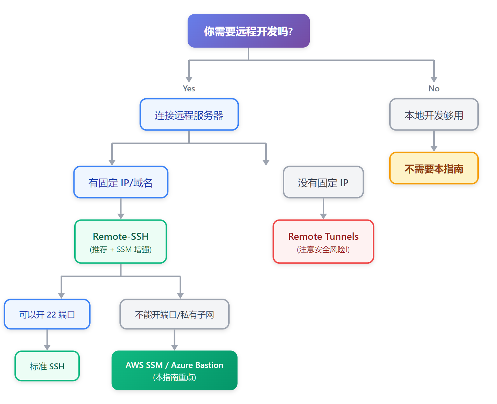
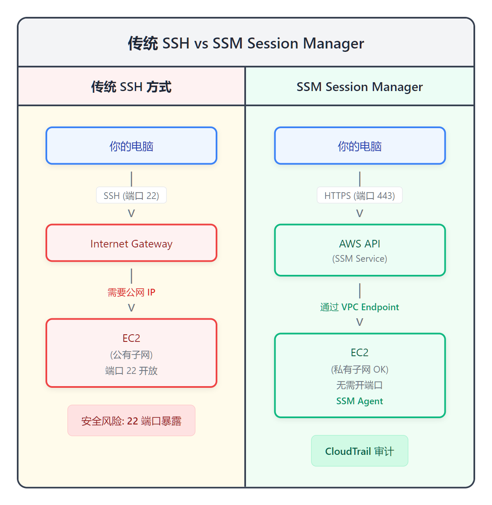

# VS Code 远程开发完全指南

> **目标**：掌握 VS Code 远程开发配置，特别是 AWS SSM 安全连接方案  
> **时间**：90 分钟（可分段阅读）  
> **费用**：EC2 实例费用（按需），其他免费  
> **难度**：入门-中级

---

## 目录

- [Part 1: 概念与选型](#part-1-概念与选型)
- [Part 2: 动手配置](#part-2-动手配置)
- [Part 3: 进阶主题](#part-3-进阶主题)
- [Part 4: 替代方案与生态](#part-4-替代方案与生态)
- [Part 5: 日本 IT 职场实践](#part-5-日本-it-职场实践)
- [附录：故障排除](#附录故障排除)

---

# Part 1: 概念与选型

## 什么是远程开发？

**传统开发**：代码在本地，运行在本地，环境也在本地。

**远程开发**：本地只有 UI（编辑器界面），代码和执行环境都在远程服务器。



<details>
<summary>View ASCII source</summary>

```
┌──────────────────────────────────────────────────────────────────────────┐
│                         远程开发架构                                      │
│                    Remote Development Architecture                       │
├───────────────────────────────┬──────────────────────────────────────────┤
│         本地 (Local)          │              远程 (Remote)                │
├───────────────────────────────┼──────────────────────────────────────────┤
│                               │                                          │
│   ┌─────────────────────┐     │     ┌─────────────────────┐              │
│   │   VS Code 窗口       │     │     │   VS Code Server    │              │
│   │   (UI Rendering)    │◀────┼────▶│   (Code Execution)  │              │
│   │                     │     │     │                     │              │
│   │   - 语法高亮        │ SSH │     │   - 文件系统访问    │              │
│   │   - 键盘输入        │ SSM │     │   - 终端执行        │              │
│   │   - 窗口管理        │     │     │   - 扩展运行        │              │
│   └─────────────────────┘     │     │   - Language Server │              │
│                               │     └─────────────────────┘              │
│   延迟敏感操作在本地处理      │     计算密集操作在远程执行              │
│                               │                                          │
└───────────────────────────────┴──────────────────────────────────────────┘
```

</details>

### 为什么需要远程开发？

| 场景 | 痛点 | 远程开发解决方案 |
|------|------|-----------------|
| **环境一致性** | "在我机器上能跑" | 团队共享相同的远程环境 |
| **本地资源受限** | M1 Mac 跑 x86 容器卡顿 | 连接到 x86 云服务器 |
| **安全合规** | 代码不能离开公司网络 | 代码存储在内网服务器 |
| **GPU 开发** | 本地没有 GPU | 连接 GPU 云实例 |
| **新人上手** | 配环境要 2 天 | 连上就能开发（10 分钟） |

### VS Code Server 工作原理

当你通过 Remote-SSH 连接时：

1. VS Code 在远程服务器安装 `VS Code Server`
2. 本地 VS Code 只负责 UI 渲染
3. 文件读写、终端命令、扩展执行都在远程
4. 通过 SSH 隧道同步状态

**关键理解**：你的本地 VS Code 是一个"瘦客户端"，真正的 IDE 功能运行在服务器上。

---

## 选型决策：VS Code Remote 家族

VS Code 提供多种远程开发方式：

| 方式 | 最佳场景 | 优点 | 缺点 |
|------|----------|------|------|
| **Remote-SSH** | 云服务器、物理机 | 灵活、通用、成熟 | 需要 SSH 访问 |
| **Remote Tunnels** | 无固定 IP 设备 | 穿透 NAT、零配置 | **安全风险** |
| **Dev Containers** | 项目环境隔离 | 环境即代码 | 需要 Docker |
| **WSL** | Windows 跑 Linux | 零网络延迟 | 仅限 Windows |
| **Codespaces** | 开源项目、原型 | 零配置、秒开 | 付费、依赖网络 |

### 决策树



<details>
<summary>View ASCII source</summary>

```
                            你需要远程开发吗？
                                   │
                    ┌──────────────┴──────────────┐
                    ▼                              ▼
            是，连接远程服务器              否，本地开发够用
                    │                              │
           ┌────────┴────────┐                     ▼
           ▼                  ▼                 不需要本指南
    有固定 IP/域名？    没有固定 IP
           │                  │
           ▼                  ▼
      Remote-SSH        Remote Tunnels
   (推荐 + SSM 增强)    (注意安全风险!)
           │
           │
    ┌──────┴──────┐
    ▼              ▼
 可以开 22 端口   不能开端口 / 私有子网
    │              │
    ▼              ▼
 标准 SSH       AWS SSM / Azure Bastion
               (本指南重点)
```

</details>

### 快速选择指南

**你应该用什么？**

- **学习 Terraform / CloudFormation** → Remote-SSH + AWS SSM
- **团队项目开发** → Dev Containers（环境统一）
- **参与开源项目** → GitHub Codespaces
- **Windows 用户跑 Linux** → WSL
- **临时访问家里电脑** → Remote Tunnels（但要注意安全！）

---

# Part 2: 动手配置

## Remote-SSH 基础配置

### Step 1 — 安装扩展

1. 打开 VS Code
2. `Ctrl+Shift+X` 打开扩展市场
3. 搜索 `Remote - SSH`
4. 点击安装（发布者：Microsoft）

> 也可以安装 `Remote Development` 扩展包，包含 SSH、Containers、WSL 全家族。

### Step 2 — 配置 SSH Config

创建或编辑 SSH 配置文件：

**Windows**: `C:\Users\你的用户名\.ssh\config`
**macOS/Linux**: `~/.ssh/config`

```ssh-config
# 基本示例
Host my-server
    HostName 203.0.113.50        # 服务器 IP 或域名
    User ec2-user                # 登录用户名
    IdentityFile ~/.ssh/my-key   # 私钥路径
    Port 22                      # SSH 端口（默认 22）
```

### Step 3 — 连接到远程主机

1. `Ctrl+Shift+P` 打开命令面板
2. 输入 `Remote-SSH: Connect to Host...`
3. 选择你配置的主机名（如 `my-server`）
4. 等待 VS Code Server 安装完成
5. 左下角状态栏变绿，显示主机名 = 连接成功！

### Step 4 — 处理首次连接提示

首次连接时，VS Code 可能提示登录 GitHub/Microsoft 账号。

**选项**：
- 登录 → 同步设置和扩展
- 跳过 → 不同步，但功能不受影响

> 日本企业内网环境通常选择跳过，避免数据外传。

---

## AWS SSM 安全连接（重点）

> 这是本指南的核心内容，也是 Terraform/CloudFormation 课程的推荐连接方式。

### 为什么用 SSM 而不是直接 SSH？

| 传统 SSH | SSM Session Manager |
|----------|---------------------|
| 需要公网 IP | 私有子网也能连 |
| 需要开放 22 端口 | 无需开放端口 |
| SSH 密钥管理麻烦 | IAM 认证 |
| 难以审计谁做了什么 | CloudTrail 完整记录 |
| 安全组规则复杂 | 简化网络配置 |



<details>
<summary>View ASCII source</summary>

```
┌─────────────────────────────────────────────────────────────────────────┐
│                     传统 SSH vs SSM Session Manager                      │
├────────────────────────────────────┬────────────────────────────────────┤
│          传统 SSH 方式              │         SSM Session Manager         │
├────────────────────────────────────┼────────────────────────────────────┤
│                                    │                                    │
│   你的电脑                          │   你的电脑                          │
│      │                             │      │                             │
│      │ SSH (端口 22)               │      │ HTTPS (端口 443)            │
│      ▼                             │      ▼                             │
│   ┌────────────────┐               │   ┌────────────────┐               │
│   │   Internet     │               │   │   AWS API      │               │
│   │   Gateway      │               │   │   (SSM Service)│               │
│   └───────┬────────┘               │   └───────┬────────┘               │
│           │                        │           │                        │
│           │ 需要公网 IP            │           │ 通过 VPC Endpoint      │
│           ▼                        │           ▼                        │
│   ┌────────────────┐               │   ┌────────────────┐               │
│   │   EC2          │               │   │   EC2          │               │
│   │   (公有子网)    │               │   │   (私有子网 OK)│               │
│   │   端口 22 开放  │               │   │   无需开端口    │               │
│   └────────────────┘               │   │   SSM Agent    │               │
│                                    │   └────────────────┘               │
│   安全风险：22 端口暴露             │   CloudTrail 审计                   │
│                                    │                                    │
└────────────────────────────────────┴────────────────────────────────────┘
```

</details>

### 前置要求

1. **AWS CLI** 已安装并配置（`aws configure`）
2. **Session Manager Plugin** 已安装
3. **EC2 实例**已配置 SSM Agent（Amazon Linux 默认包含）
4. **IAM 权限**允许 `ssm:StartSession`

### Step 1 — 安装 Session Manager Plugin

**Windows (推荐用 MSI)**：
```powershell
# 下载并安装
# https://docs.aws.amazon.com/systems-manager/latest/userguide/session-manager-working-with-install-plugin.html
# 或使用 winget
winget install Amazon.SessionManagerPlugin
```

**macOS**：
```bash
# 使用 Homebrew
brew install --cask session-manager-plugin

# 或手动下载
# https://docs.aws.amazon.com/systems-manager/latest/userguide/session-manager-working-with-install-plugin.html
```

**Linux**：
```bash
# Ubuntu/Debian
curl "https://s3.amazonaws.com/session-manager-downloads/plugin/latest/ubuntu_64bit/session-manager-plugin.deb" -o "session-manager-plugin.deb"
sudo dpkg -i session-manager-plugin.deb

# Amazon Linux / RHEL
sudo yum install -y https://s3.amazonaws.com/session-manager-downloads/plugin/latest/linux_64bit/session-manager-plugin.rpm
```

**验证安装**：
```bash
session-manager-plugin --version
# 输出: 1.2.xxx.0
```

### Step 2 — 测试 SSM 连接

```bash
# 替换为你的实例 ID
aws ssm start-session --target i-0123456789abcdef0 --region ap-northeast-1
```

成功连接会看到：
```
Starting session with SessionId: user-0abc123def456
sh-5.2$
```

输入 `exit` 退出。

### Step 3 — 配置 SSH Config（重要！平台差异）

> **Windows 和 macOS/Linux 配置不同！** 这是最常见的问题来源。

#### Windows 配置

```ssh-config
# Windows: 不使用引号！
Host i-* mi-*
    User ec2-user
    IdentityFile ~/.ssh/terraform-lab.pem
    ProxyCommand aws ssm start-session --target %h --document-name AWS-StartSSHSession --parameters portNumber=%p --region ap-northeast-1
```

#### macOS / Linux 配置

```ssh-config
# macOS/Linux: 使用引号！
Host i-* mi-*
    User ec2-user
    IdentityFile ~/.ssh/terraform-lab.pem
    ProxyCommand aws ssm start-session --target %h --document-name AWS-StartSSHSession --parameters "portNumber=%p" --region ap-northeast-1
```

**为什么有区别？**

Windows 的 OpenSSH 客户端对参数解析方式不同。在 Windows 上使用引号会导致：
```
Error parsing parameter '--parameters': Expected: '=', received: '"' for input: "portNumber=22"
```

### Step 4 — 上传 SSH 公钥到实例

SSM 提供隧道，但 VS Code Remote-SSH 仍然需要 SSH 密钥认证。

**方法 1：首次通过 SSM 登录并配置**

```bash
# 先用 SSM 登录
aws ssm start-session --target i-xxx --region ap-northeast-1

# 在实例内添加公钥
echo "ssh-ed25519 AAAA... your-email@example.com" >> ~/.ssh/authorized_keys
chmod 600 ~/.ssh/authorized_keys
```

**方法 2：使用 EC2 Instance Connect（推荐）**

```bash
# 推送临时公钥（有效期 60 秒，但足够建立连接）
aws ec2-instance-connect send-ssh-public-key \
    --instance-id i-xxx \
    --instance-os-user ec2-user \
    --ssh-public-key file://~/.ssh/id_ed25519.pub \
    --region ap-northeast-1
```

**方法 3：CloudFormation/Terraform 部署时配置**

```yaml
# CloudFormation
UserData:
  Fn::Base64: |
    #!/bin/bash
    echo "ssh-ed25519 AAAA..." >> /home/ec2-user/.ssh/authorized_keys
```

### Step 5 — VS Code 连接

1. `Ctrl+Shift+P` → `Remote-SSH: Connect to Host...`
2. 输入实例 ID：`i-0123456789abcdef0`
3. 等待连接建立
4. 左下角显示实例 ID = 成功！

> 首次连接较慢（需要安装 VS Code Server），后续连接几秒即可。

### Step 6 — 为特定实例创建别名

> ⚠️ **平台差异提醒**：以下示例为 Windows 格式。macOS/Linux 用户请在 `portNumber=%p` 两侧加引号。

<details>
<summary><strong>Windows 配置</strong></summary>

```ssh-config
# Windows - 不使用引号
Host terraform-lab
    HostName i-0123456789abcdef0
    User ec2-user
    IdentityFile ~/.ssh/terraform-lab.pem
    ProxyCommand aws ssm start-session --target %h --document-name AWS-StartSSHSession --parameters portNumber=%p --region ap-northeast-1
```

</details>

<details>
<summary><strong>macOS / Linux 配置</strong></summary>

```ssh-config
# macOS/Linux - 使用引号
Host terraform-lab
    HostName i-0123456789abcdef0
    User ec2-user
    IdentityFile ~/.ssh/terraform-lab.pem
    ProxyCommand aws ssm start-session --target %h --document-name AWS-StartSSHSession --parameters "portNumber=%p" --region ap-northeast-1
```

</details>

现在可以直接连接 `terraform-lab`：
- SSH: `ssh terraform-lab`
- VS Code: `Remote-SSH: Connect to Host...` → 选择 `terraform-lab`

---

## 其他云平台方案

### Azure Bastion

Azure 的托管堡垒机服务，类似 AWS SSM。

```ssh-config
# Azure Bastion + SSH
Host azure-vm
    HostName vm-name
    User azureuser
    ProxyCommand az network bastion ssh --name BastionName --resource-group RG --target-resource-id /subscriptions/.../vm-name --auth-type ssh-key --ssh-key ~/.ssh/id_rsa
```

### GCP IAP (Identity-Aware Proxy)

Google Cloud 的身份感知代理。

```ssh-config
# GCP IAP Tunnel
Host gcp-vm
    HostName compute-instance
    User your-username
    ProxyCommand gcloud compute start-iap-tunnel %h %p --listen-on-stdin --zone=us-central1-a
```

### 方案对比

| 云平台 | 方案 | 认证方式 | 审计 | 特点 |
|--------|------|----------|------|------|
| AWS | SSM Session Manager | IAM | CloudTrail | 最成熟，私有子网支持 |
| Azure | Bastion | Azure AD | Azure Monitor | PaaS 托管，无需管理 |
| GCP | IAP Tunnel | Google OAuth | Cloud Audit Logs | 细粒度 IAM 权限 |

---

# Part 3: 进阶主题

## Dev Containers 环境统一

> 适合团队开发，确保"在我机器上能跑"的问题不再出现。

### 什么是 Dev Container？

**一句话**：把开发环境定义为代码，用 Docker 容器运行。

```
项目目录/
├── .devcontainer/
│   ├── devcontainer.json    # 环境配置
│   └── Dockerfile           # 可选，自定义镜像
├── src/
└── ...
```

### devcontainer.json 示例

```json
{
  "name": "Terraform Development",
  "image": "mcr.microsoft.com/devcontainers/base:ubuntu",
  "features": {
    "ghcr.io/devcontainers/features/terraform:1": {},
    "ghcr.io/devcontainers/features/aws-cli:1": {}
  },
  "customizations": {
    "vscode": {
      "extensions": [
        "hashicorp.terraform",
        "ms-azuretools.vscode-docker"
      ],
      "settings": {
        "terraform.languageServer.enable": true
      }
    }
  },
  "postCreateCommand": "terraform --version && aws --version"
}
```

### AI Custom Instructions（2025 新特性）

VS Code 1.100+ 支持通过 `.instructions.md` 文件定义 AI 助手的自定义指令：

```json
{
  "customizations": {
    "vscode": {
      "settings": {
        "chat.instructionsFilesLocations": {
          ".github": true,
          ".vscode": true
        }
      }
    }
  }
}
```

创建 `.github/copilot-instructions.md` 或 `.instructions.md` 文件，AI 助手会遵循项目特定规则。

### 本地 vs Codespaces

| 维度 | 本地 Dev Container | GitHub Codespaces |
|------|-------------------|-------------------|
| 运行位置 | 你的电脑 | GitHub 云端 |
| 配置文件 | 相同的 `devcontainer.json` | 相同 |
| 启动速度 | 首次慢（拉镜像） | 秒开（预构建） |
| 费用 | 免费（自己的电脑） | 120 小时/月免费（GitHub Free 个人账户） |
| 离线 | 可以 | 不行 |

### 日本企业导入事例

| 企业 | 使用场景 | 效果 |
|------|----------|------|
| **LegalOn Technologies** | 后端开发环境 | 新人上手从 3 天 → 30 分钟 |
| **電通総研 (ISID)** | テレワーク対応 | 统一远程开发环境 |
| **Wantedly** | 全栈开发 | 3 分钟开始开发 |

---

## 安全警告与最佳实践

### Remote Tunnels APT 事件（2024 年 12 月）

> **这是真实的安全威胁，不是理论风险！**

**事件概要**：

2024 年 12 月，安全公司 SentinelOne 披露代号 "Operation Digital Eye" 的 APT 活动：

- **攻击者**：中国 APT 组织 "Stately Taurus"（又名 Mustang Panda）
- **目标**：欧洲 IT 服务提供商
- **手法**：利用 VS Code Remote Tunnels 进行间谍活动
- **隐蔽性**：流量伪装为合法 Microsoft Azure 流量

**为什么 Remote Tunnels 被武器化？**

1. 流量通过 `*.devtunnels.ms`，看起来像正常的 Microsoft 服务
2. 不需要开放入站端口
3. 可以绑定到攻击者的 GitHub/Microsoft 账号
4. 安全产品通常不会阻止 Azure 流量

**防护措施**：

```bash
# 1. 监控可疑的 VS Code 进程启动
# 特别是非用户主动启动的 code.exe / code-tunnel

# 2. 企业防火墙限制
# 阻止 *.devtunnels.ms（如果不使用 Tunnels）

# 3. 终端安全策略
# 限制普通用户安装/运行 VS Code Tunnels
```

**建议**：

| 场景 | 建议方案 |
|------|----------|
| 个人学习 | 可以用 Tunnels，但了解风险 |
| 企业环境 | **禁用 Tunnels**，使用 SSH + SSM |
| 高安全环境 | 只允许 Remote-SSH，审计所有连接 |

### SSH 密钥安全

**推荐使用 ed25519**：

```bash
# 生成 ed25519 密钥（比 RSA 更安全、更小）
ssh-keygen -t ed25519 -C "your-email@example.com"
```

**最佳实践**：

| 实践 | 原因 |
|------|------|
| 每主机独立密钥 | 单个密钥泄露不影响其他 |
| 使用密码保护私钥 | 即使文件泄露也无法直接使用 |
| 定期轮换（90 天） | 减少长期暴露风险 |
| 不要共享私钥 | 每人一套密钥 |

### 最小权限原则 IAM Policy

```json
{
  "Version": "2012-10-17",
  "Statement": [
    {
      "Effect": "Allow",
      "Action": "ssm:StartSession",
      "Resource": [
        "arn:aws:ec2:ap-northeast-1:123456789012:instance/i-specific-instance"
      ],
      "Condition": {
        "StringEquals": {
          "ssm:resourceTag/Environment": "development"
        }
      }
    }
  ]
}
```

**要点**：
- 限制到特定实例（不是 `*`）
- 使用标签条件进一步限制
- 区分环境（dev/staging/prod）

### Zero Trust 趋势

**行业数据（2024-2025）**：

- **61%** 企业已采用 Zero Trust 架构
- **82.5%** VPN 相关 CVE 增长（相比 2023）
- **趋势**：身份认证替代 IP 认证

**Zero Trust 对远程开发的影响**：

```
传统模式：在公司网络内 → 信任 → 访问资源
                ↓
Zero Trust：验证身份 → 验证设备 → 验证行为 → 最小权限访问
```

AWS SSM 天然符合 Zero Trust：
- 每次连接都需要 IAM 认证
- CloudTrail 记录所有操作
- 可以基于标签/条件限制访问

---

## 性能优化

### 网络优化

**选择最近的云区域**：

| 你的位置 | 推荐区域 | 预期延迟 |
|----------|----------|----------|
| 日本 | ap-northeast-1 (东京) | 5-10ms |
| 中国大陆 | ap-northeast-1 或 ap-east-1 | 50-100ms |
| 欧洲 | eu-central-1 | 20-50ms |

**SSH ControlMaster 复用连接**：

```ssh-config
Host *
    ControlMaster auto
    ControlPath ~/.ssh/sockets/%r@%h-%p
    ControlPersist 600
```

首次连接后，后续连接复用同一条 TCP 连接，显著加快速度。

**高延迟环境启用压缩**：

```ssh-config
Host high-latency-server
    Compression yes
```

> 低延迟环境（<50ms）不建议开压缩，CPU 开销可能超过带宽节省。

### 服务器优化

**调整 inotify 限制（Linux）**：

```bash
# 查看当前限制
cat /proc/sys/fs/inotify/max_user_watches

# 临时增加
sudo sysctl fs.inotify.max_user_watches=524288

# 永久增加
echo "fs.inotify.max_user_watches=524288" | sudo tee -a /etc/sysctl.conf
sudo sysctl -p
```

> VS Code 使用 inotify 监控文件变化，大项目容易超限。

**内存需求**：

| 场景 | 推荐内存 |
|------|----------|
| 基础开发 | 2GB+ |
| TypeScript/大型项目 | 4GB+ |
| 多用户服务器 | 8GB+ |

**Socket Mode（多用户服务器）**：

如果多人共享一台服务器：

```bash
# 启用 VS Code Server socket mode
code serve-web --socket-path /tmp/vscode-$(whoami).sock
```

### VS Code 优化

**减少远程扩展**：

只在远程安装必要扩展。每个扩展都会增加内存和 CPU 负担。

**排除大目录监控**：

```json
// .vscode/settings.json
{
  "files.watcherExclude": {
    "**/node_modules/**": true,
    "**/.terraform/**": true,
    "**/vendor/**": true
  }
}
```

### 已知问题

| 问题 | 症状 | 解决方案 |
|------|------|----------|
| 打开大文件后卡顿 | 编辑器永久无响应 | 重启 VS Code（已知 bug #185413） |
| glibc 版本不够 | VS Code Server 启动失败 | VS Code 1.99+ 需要 glibc 2.28+（见下表） |
| 频繁断开 | 网络不稳定时断连 | 调整 `ServerAliveInterval` |

**glibc 要求（VS Code 1.99+）**：

| 发行版 | 默认 glibc | 支持情况 |
|--------|-----------|----------|
| Ubuntu 20.04+ | 2.31 | 支持 |
| Amazon Linux 2023 | 2.34 | 支持 |
| RHEL/CentOS 8+ | 2.28 | 支持 |
| Amazon Linux 2 | 2.26 | **不支持**（需升级） |
| CentOS 7 | 2.17 | **不支持** |

---

# Part 4: 替代方案与生态

## AI 原生编辑器

2024-2025 年涌现了多个 AI 深度集成的代码编辑器：

| 编辑器 | 基础 | 远程支持 | 价格 | 特点 |
|--------|------|----------|------|------|
| **Cursor** | VS Code Fork | SSH/Tunnels | $20/月 | 深度 AI 集成，Tab 补全 |
| **Windsurf** | VS Code Fork | SSH/Tunnels | $15/月 | Cascade 自主 Agent |
| **Zed** | Rust 原生 | 内置远程 | 免费 | 10x 性能，协作编辑 |

**远程开发兼容性**：

- Cursor/Windsurf 基于 VS Code，SSH 配置基本通用
- Zed 有自己的远程协议，不兼容 VS Code 配置

## 云 IDE 对比

| 平台 | 托管方式 | 价格 | 特点 |
|------|----------|------|------|
| **GitHub Codespaces** | GitHub 托管 | 120h/月免费（Free 个人账户）| 零配置，与 GitHub 深度集成 |
| **DevPod** | 自托管/本地 | 免费开源 | 无供应商锁定，支持多云 |
| **Gitpod (→ Ona)** | SaaS 重构中 | TBD | 转向 AI Agent 方向 |

### DevPod 简介

DevPod 是开源的 Codespaces 替代品：

```bash
# 安装 DevPod CLI
brew install loft-sh/tap/devpod

# 使用任意 Provider（Docker/AWS/GCP/...）
devpod provider add aws

# 启动开发环境
devpod up github.com/your/repo --provider aws
```

**优势**：
- 开源免费
- 可以用自己的云账号（省钱）
- 不锁定特定平台
- 支持 VS Code、JetBrains、Vim

## 平台变动（2024-2025）

> 选择工具时需要了解其生命周期状态。

| 服务 | 状态 | 时间 | 替代方案 |
|------|------|------|----------|
| **AWS Cloud9** | 停止新用户注册 | 2024.07.25 | Codespaces / 自建环境 |
| **AWS CodeCatalyst Dev Environments** | 停止新用户 | 2024 | Codespaces / DevPod |
| **Microsoft Dev Box** | 新客户停止注册，现有客户继续 | 2025.11.01 | Windows 365 Dev |
| **Gitpod** | 重构为 Ona | 2025.09 | 等待新产品 / DevPod |

**建议**：
- 避免依赖即将废弃的服务
- 优先选择开源或主流方案
- 保持可迁移性（配置文件标准化）

---

# Part 5: 日本 IT 职场实践

## 日本术语对照表

| 日本語 | 中文 | English | 说明 |
|--------|------|---------|------|
| リモート開発 | 远程开发 | Remote Development | 本指南主题 |
| 閉域網（へいいきもう） | 闭域网/专网 | Closed Network | 企业内部网络 |
| 専用線（せんようせん） | 专线 | Dedicated Line | 最安全的连接方式 |
| テレワーク | 远程办公 | Telework | 日本常用词 |
| 在宅勤務（ざいたくきんむ） | 在家办公 | Work from Home | 正式说法 |
| オフィス回帰 | 返回办公室 | Return to Office | 2024 趋势 |
| 常駐（じょうちゅう） | 驻场 | On-site | SIer 常见 |

## 远程开发普及状况

**フルリモート求人数**（截至 2024 年底）：

| 行业 | 求人数 | 远程友好度 |
|------|--------|-----------|
| Web 系 | ~78,000 件 | 高 |
| SIer | ~12,000 件 | 项目依赖 |
| 社内 SE | ~8,000 件 | 中等 |

**趋势**：
- 2020-2022：远程急速普及（疫情驱动）
- 2023-2024：部分企业要求返回办公室（オフィス回帰）
- 2025：混合模式成为主流

## SIer vs Web 系

| 观点 | SIer | Web 系 |
|------|------|--------|
| **开发环境** | 客户指定 / 闭域网 | 自社统一 / 云端 |
| **远程可否** | 项目依赖 | 制度化、常态化 |
| **工具选定** | 需要客户承认 | 自社判断 |
| **VS Code 使用** | 可能受限 | 标准配置 |
| **远程开发场景** | 常驻先のルール次第 | 自由选择 |

**对求职者的建议**：

- **目标 Web 系**：远程开发技能是基本要求
- **目标 SIer**：了解闭域网限制，学会多种方案

## 闭域网（閉域網）

日本企业特有的高安全环境，常见于：
- 金融机构（銀行、証券）
- 政府系统（官公庁）
- 大型制造业（製造業）

### 闭域网类型

| 类型 | 安全性 | 成本 | 说明 |
|------|--------|------|------|
| **専用線** | 最高 | 高 | 物理专线，完全隔离 |
| **IP-VPN** | 高 | 中 | 运营商 VPN 网络 |
| **広域イーサネット** | 高 | 中 | L2 延伸 |
| **インターネット VPN** | 中 | 低 | 通过公网加密 |

### 闭域网环境的远程开发

**可能的方案**：

1. **VDI（仮想デスクトップ）**
   - 通过虚拟桌面访问开发环境
   - 常见：Citrix, VMware Horizon

2. **专用 VPN + Remote-SSH**
   - 先连接企业 VPN
   - 再通过内网 IP SSH 连接

3. **堡垒机（踏み台サーバー）**
   - SSH ProxyJump 跳板连接

```ssh-config
# 通过堡垒机连接
Host internal-server
    HostName 10.0.1.100
    User developer
    ProxyJump bastion.company.co.jp
```

**注意**：
- 闭域网通常禁止 Remote Tunnels
- 需要申请才能使用 VS Code
- 遵守客户的セキュリティポリシー

## 日语学习资源

| 资源 | 链接 | 说明 |
|------|------|------|
| Microsoft Learn JP | [VS Code Remote 学习路径](https://learn.microsoft.com/ja-jp/training/paths/remote-development-vs-code/) | 官方日语教程 |
| Qiita - VS Code Remote | [qiita.com/tags/vscode-remote](https://qiita.com/tags/vscode-remote) | 日本开发者社区 |
| Zenn - リモート開発 | [zenn.dev/topics/remotedevelopment](https://zenn.dev/topics/remotedevelopment) | 技术博客平台 |

---

# 附录：故障排除

详细故障排除请参考：[troubleshooting.md](./troubleshooting.md)

## 快速诊断

### Windows 引号问题（最常见）

**症状**：
```
Error parsing parameter '--parameters': Expected: '=', received: '"'
```

**原因**：Windows SSH Config 中 ProxyCommand 使用了引号

**解决**：
```ssh-config
# Windows: 不使用引号！
ProxyCommand aws ssm start-session --target %h --document-name AWS-StartSSHSession --parameters portNumber=%p --region ap-northeast-1
```

### 连接超时

**症状**：`Connection timed out`

**排查步骤**：
```bash
# 1. 检查实例是否运行
aws ec2 describe-instance-status --instance-ids i-xxx

# 2. 检查 SSM Agent 状态
aws ssm describe-instance-information --filters "Key=InstanceIds,Values=i-xxx"

# 3. 检查 IAM 权限
aws sts get-caller-identity
```

### 权限被拒

**症状**：`Permission denied (publickey)`

**解决**：SSH 公钥未配置到实例

```bash
# 通过 SSM 登录添加公钥
aws ssm start-session --target i-xxx
echo "ssh-ed25519 AAAA..." >> ~/.ssh/authorized_keys
```

---

## 避免的反模式

| 反模式 | 为什么不好 | 正确做法 |
|--------|-----------|----------|
| 使用 Remote Tunnels 却不了解风险 | APT 已武器化此功能 | 优先 SSH + SSM |
| 所有主机用同一密钥 | 单点故障，泄露影响全部 | 每主机独立密钥 |
| 忽略 glibc 版本 | VS Code 1.99+ 需要 2.28+ | 先检查系统版本 |
| 依赖即将废弃的服务 | Cloud9/CodeCatalyst 已停新用户 | 用 Codespaces/DevPod |
| SIer 项目假设能用云 IDE | 客户闭域网可能禁止 | 先确认安全要求 |

---

## 被本指南引用的课程

本指南作为参考模块，被以下课程引用：

- [Terraform 系列](../../iac/terraform/) - 实验环境连接
- CloudFormation 系列（计划中）
- Zabbix 系列（计划中）

---

## 延伸阅读

**官方文档**：
- [VS Code Remote Development](https://code.visualstudio.com/docs/remote/remote-overview)
- [AWS SSM Session Manager](https://docs.aws.amazon.com/systems-manager/latest/userguide/session-manager.html)
- [Dev Containers Specification](https://containers.dev/)

**安全研究**：
- [SentinelOne - Operation Digital Eye](https://www.sentinelone.com/labs/operation-digital-eye/)

**日本语资源**：
- [Microsoft Learn - リモート開発](https://learn.microsoft.com/ja-jp/training/paths/remote-development-vs-code/)

---

> 最后更新：2025-12-22
> Scout 来源：tech-scout（全球技术趋势）、japan-it-scout（日本市场）
